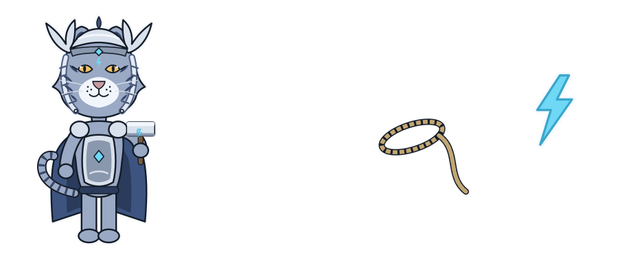

# Appendix: commands and files

## Commands

Run these from `/home/jetson/Projects/thor-thunder-tigress-platform`.

| Task | Command |
|---|---|
| Build the training set | `cargo run --release -p thor-hammer-trainer` |
| Build it into another folder | `cargo run --release -p thor-hammer-trainer -- OUTPUT_DIR` |
| Open the review page (every dataset) | `cargo run --release -p thor-tigress-reinforcer-frontend`, then <http://127.0.0.1:8787> |
| Review another file, port or flags file | `cargo run --release -p thor-tigress-reinforcer-frontend -- --port PORT --dataset NAME=FILE,FLAGS` |
| Check the teacher set | `cargo run --release -p thor-hammer-trainer --bin teacher` |
| Queue real sections to write from | `cargo run --release -p thor-hammer-trainer --bin teacher -- pick 2` |
| Make the keyring (the encrypted registry of who may chat) | `thor-tigress-serve keyring-init` |
| See who asked, approve, revoke | `thor-tigress-serve keyring requests` / `approve EMAIL` / `revoke EMAIL` / `revoke-all` |
| Run the keyring tool itself | `cargo run -p thor-tigress-keyring -- --keyring FILE --passphrase-file FILE keys` |
| Run the tests | `cargo test` |
| Lint | `cargo clippy --all-targets -- -D warnings` |
| Format | `cargo +nightly fmt` |
| Build this book | `mdbook build book` |
| Serve this book with live reload | `mdbook serve book --open` |

## Files

```text
thor-thunder-tigress-platform/
├── CLAUDE.md                 project rules and stage plan
├── Cargo.toml                workspace
├── rust-toolchain.toml       Rust 1.99.0
├── rustfmt.toml              formatting rules from rust-interview-lab
├── crates/
│   ├── thor-hammer-trainer/
│   │   └── src/
│   │       ├── main.rs        paths, walking, filtering, output
│   │       ├── readability.rs
│   │       ├── chat.rs
│   │       ├── book.rs
│   │       ├── code.rs
│   │       ├── clever_vs_readable.rs
│   │       ├── slop_flags.rs
│   │       ├── example.rs     Example, Source, SkipReason
│   │       ├── report.rs      stats.md
│   │       ├── error.rs       DataError
│   │       └── bin/
│   │           └── teacher.rs   checks the teacher set, queues sections
│   ├── thor-spark-safety-eval/       slop phrases, the five Rust rules
│   ├── thor-tigress-reinforcer-frontend/  the review page
│   ├── thor-lasso-distiller/         conversations from books
│   ├── thor-tigress-agent/           the chat page's server
│   └── thor-tigress-keyring/         the encrypted registry
│       └── src/
│           ├── crypto.rs      Argon2id, seal and open
│           ├── store.rs       records, file format, atomic write
│           ├── cli.rs         the commands
│           └── error.rs       KeyringError
├── jetson-thor/
│   ├── web/                   the chat page, About page and art
│   └── model-serving/thor-tigress-serve   settings, units, install
├── labels/                   human work, committed
│   └── slop_flags.jsonl
├── data/                     generated, not committed
│   ├── train.jsonl
│   ├── preferences.jsonl
│   ├── slop.jsonl
│   └── stats.md
└── book/                     this book
    ├── book.toml
    ├── theme/deep-ocean.css
    └── src/
```

## The theme

The book uses the Material Deep Ocean palette from the `dogeleena-neo-agentic-ide` editor configuration. The stock
purple `#C792EA` is replaced by ocean blue `#82AAFF`. The palette lives in `book/theme/deep-ocean.css` and replaces
mdBook's `navy` theme, which `book.toml` makes the default.

| Role | Colour |
|---|---|
| Background | `#0F111A` |
| Text | `#A6ACCD` |
| Headings | `#EEFFFF` |
| Accent | `#84FFFF` |
| Keywords | `#82AAFF` |
| Strings, built parts | `#C3E88D` |
| Inline code, planned parts | `#FFCB6B` |
| Numbers | `#F78C6C` |
