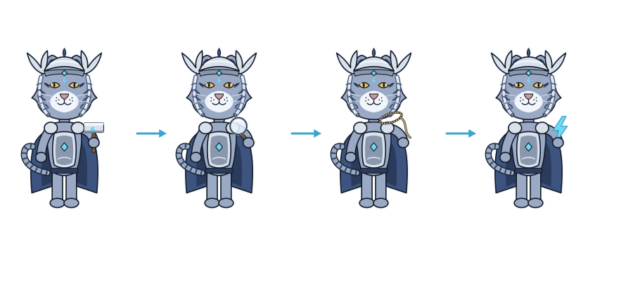
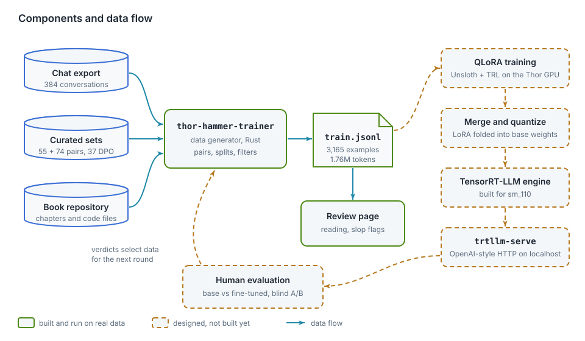
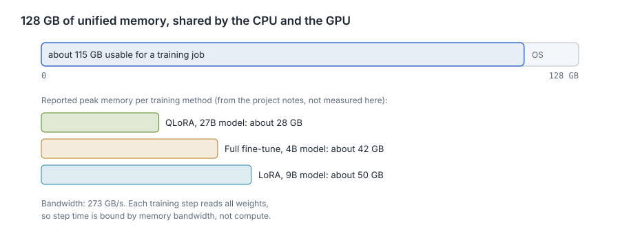
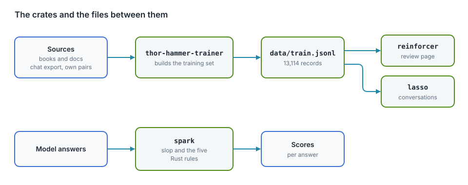

# High-level design

<div class="covers" markdown="1">

This chapter covers

- The components of the platform and the data passed between them
- The memory and bandwidth limits of the Jetson AGX Thor
- The design decisions that follow from those limits

</div>

## 1.1 Components

<figure>

<figcaption><b>Figure 1.1</b> Components and data flow. Green: built. Dashed amber: planned.</figcaption>
</figure>

| Component | Input | Output | Responsibility |
|---|---|---|---|
| `thor-hammer-trainer` | synthetic chat set, curated sets, book repository, slop flags | `train.jsonl`, `preferences.jsonl`, `slop.jsonl`, `stats.md` | convert files to instruction/response pairs, drop unusable and flagged ones |
| Review server | `train.jsonl`, `slop.jsonl` | `labels/slop_flags.jsonl` | display examples, highlight personal data, record slop flags |
| QLoRA training | `train.jsonl`, base model | adapter weights | fine-tune the model |
| Merge, quantize, build | base model, adapter | TensorRT-LLM engine | produce a servable model |
| `trtllm-serve` | engine | HTTP endpoint on localhost | answer prompts |
| Human evaluation | prompts, two endpoints | `verdicts.jsonl` | compare base and fine-tuned answers |

The components share files, not memory or APIs. `train.jsonl` is the only interface between data generation and
training. One line of it:

```json
{"id":"…","instruction":"What is a futex?","response":"A fast userspace mutex. ...","source":"chat","origin":"conversations.json#c1/1"}
```

## 1.2 Hardware limits

| Property | Value |
|---|---|
| Memory | 128 GB LPDDR5X, unified between CPU and GPU, about 115 GB usable |
| Memory bandwidth | 273 GB/s |
| CPU | 14 Arm Neoverse-V3AE cores |
| GPU | Blackwell, 2,560 CUDA cores, 96 tensor cores, compute capability sm_110 |
| Software | JetPack 7, CUDA 13, Python 3.12 |

In **unified memory**, the CPU and GPU address the same physical memory. A model loaded by the CPU is readable by
the GPU without a copy.

<figure>

<figcaption><b>Figure 1.2</b> Usable memory and reported peak memory per training method. The three budgets are from the project notes, not measured here.</figcaption>
</figure>

Consequences for the design:

- **Model size.** A 9B-parameter large language model in 16-bit precision needs about 18 GB for its weights. Full
  fine-tuning adds gradients and optimizer state, several times that. LoRA and QLoRA train small adapter matrices
  only.
- **Step time.** Each training step reads all weights. At 273 GB/s, reading 18 GB takes about 66 ms. Training is
  bound by memory bandwidth, not by compute. The 2,070 FP4 TFLOPS figure is for sparse inference and does not
  apply to training.
- **Software support.** sm_110 is a new target. There is no 4-bit training stack in Rust and no mature
  FlashAttention build for it.

## 1.3 Design decisions

| Decision | Reason |
|---|---|
| Data generation and review in Rust | plain file processing; one static binary |
| Training in Python (Unsloth, TRL) | 4-bit QLoRA is available there; Candle has no 4-bit training, and a 9B model does not fit otherwise |
| A file as the only interface between stages | either side can change independently; the file can be inspected with standard tools |
| Manual review before training | a fine-tuned model can reproduce training text verbatim, including personal data |
| Base and fine-tuned model served with the same quantization | the comparison then measures training, not quantization |
| Human judgement as the evaluation metric | correctness and clarity of an explanation cannot be checked by pattern matching |

## 1.4 Crates and machines today

<figure>

<figcaption><b>Figure 1.3</b> The crates and the files between them.</figcaption>
</figure>

| Crate | Binary | Does |
|---|---|---|
| `thor-spark-safety-eval` | `spark` | scores answers for slop phrases and the five Rust rules |
| `thor-hammer-trainer` | `thor-hammer-trainer` | builds `data/train.jsonl` from licensed sources |
| `thor-tigress-reinforcer-frontend` | `reinforcer` | review page: mark slop, flag records |
| `thor-lasso-distiller` | `lasso` | turns book sections into conversations using a teacher model |
| `thor-tigress-agent` | `thor-tigress-agent` | the Thor Tigress Cub's server: page, access key, web search, API |

## Machines

| | yahboom | thor |
|---|---|---|
| Board | Jetson Orin NX 16 GB | Jetson AGX Thor, 128 GB |
| Role | development, data builds | models, training, shared chat |

Code is edited on yahboom and copied to the Thor with `thor-sync` (chapter "Access and syncing").
