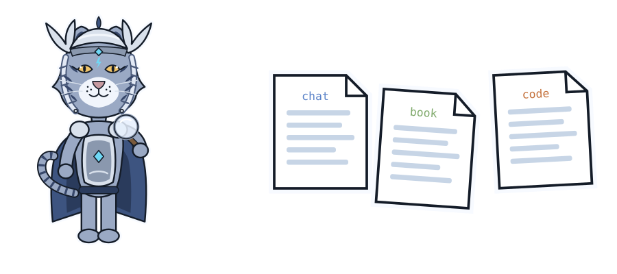

# Training data

```bash
bash train/fetch_corpus.sh          # clone the open books and docs
thor-hammer-trainer data            # build data/train.jsonl and data/stats.md
```

| Source | Records |
|---|---|
| Hand-written pairs and verified rewrites | 129 |
| Chat export | 2,217 |
| Own books and code | 790 |
| Open-source books and docs (35 sources) | 9,978 |
| **Total** | **13,114** (about 6.5M tokens) |

- **Book and doc sections are passages:** plain text with no made-up question.
  Questions get written later by a teacher model (`lasso`).
- **Licences:** only MIT, Apache-2.0, BSD, CC BY and CC0. One restrictive
  licence file rules a source out.
- **Cap:** each source gives at most 400,000 tokens, so a few large doc sites
  don't drown out the Rust books.
- **Flags:** a record flagged on the review page leaves the next build, but
  only if a person set the flag.

**Not done yet:** dropping chat answers that fail `spark`.
