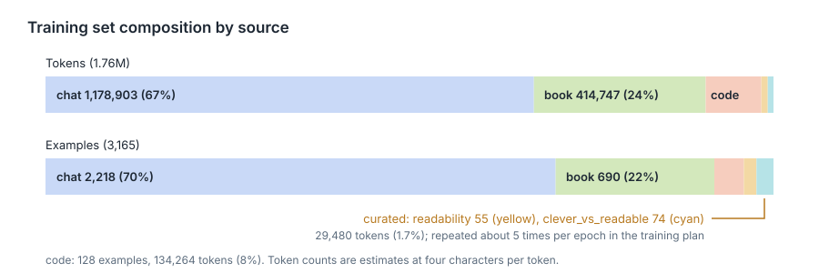

# The training data

<div class="covers" markdown="1">

This chapter covers

- The format of a training example
- The three sources and the examples each produces
- The composition of the training set
- The exclusion rules and their counts
- Personal data found in the current set

</div>

## 2.1 Example format

An **example** is one instruction and one response. The training set is stored as **JSONL**: one JSON object per
line.

| Field | Content | Used by |
|---|---|---|
| `id` | FNV-1a hash of the normalized text, 16 hex digits | review server, to attach slop flags |
| `instruction` | the request | trainer |
| `response` | the answer to learn | trainer |
| `source` | `readability`, `clever_vs_readable`, `chat`, `book` or `code` | training script, for per-source weighting |
| `origin` | source file, or conversation id and turn | reviewer, to locate the original |

## 2.2 Sources

| Source | Path | Content |
|---|---|---|
| Synthetic answer set | `edgechat/convo_datastore/work/extracted/conversations.json` | 384 conversations, 30 MB |
| Readability set | `edgechat/convo_datastore/readability_training.md` | 55 hand-written pairs |
| Clever-vs-readable set | `edgechat/convo_datastore/clever_vs_readable/` | 74 SFT records, 37 DPO pairs, verified by `build.py` |
| Book repository | `nvidia-cloud-software-engineer-interview/` | chapters, docs, source files |

The answer set is synthetic. Open-source models between roughly one and twenty billion parameters answer a fixed
prompt list, and the answers are exported as a transcript. The same models write programs that break the five
rules. The clever-vs-readable set keeps the readable rewrite as the chosen answer and the sloppy version as the
rejected one. The corrections come from the senior engineer who reviews every sample the pipeline keeps.

| Source | Instruction | Response | Contributors |
|---|---|---|---|
| `chat` | the prompt | the model's answer | 353 conversations |
| `readability` | `### Instruction` section | `### Response` section | 1 file |
| `clever_vs_readable` | user message | assistant message | 37 entries, 2 prompts each |
| `book` | generated from the section heading | the section text | 71 chapter files |
| `code` | the file's header comment | the whole file | 128 files: 107 Rust, 18 Go, 3 CUDA |

## 2.3 Composition

<figure>

<figcaption><b>Figure 2.1</b> The training set by source, in tokens and in examples.</figcaption>
</figure>

| Source | Examples | Tokens (estimate) |
|---|---|---|
| readability | 55 | 15,590 |
| clever_vs_readable | 74 | 13,890 |
| chat | 2,218 | 1,178,903 |
| book | 690 | 414,747 |
| code | 128 | 134,264 |
| total | 3,165 | 1,757,394 |

A **token** is the unit a model reads. Counts are estimated at four characters per token. The median example
is 1,494 characters. One example exceeds 8,192 tokens.

The two curated sets together are 1.7% of the tokens. Chapter 5 specifies repeating them during training.

## 2.4 Exclusion rules

| Rule | Count | Reason |
|---|---|---|
| Turn in a conversation with a safety flag | 141 | 10 conversations carry a `self_harm_risk` flag |
| Question about an image | 32 | the transcript names the image file but does not contain it |
| Empty question or answer | 21 | no content |
| Notes file | 18 | worklogs, writing guides, tables of contents, `anti_ai_slop.md` |
| Code file without a header comment | 136 | no request text |
| Example under 200 characters | 31 | too little content |
| Duplicate | 11 | identical after whitespace normalization |
| Flagged as slop | 0 | reviewer flag in `labels/slop_flags.jsonl` |

From assistant messages, only `text` blocks are kept. Thinking, tool calls and tool results are dropped.

`anti_ai_slop.md` is excluded because it consists of the phrases the model must not produce.

## 2.5 Preference pairs

A **preference pair** is one prompt with a chosen and a rejected answer. Training on such pairs (DPO, direct
preference optimization) moves the model toward the chosen style and away from the rejected one.

The clever-vs-readable set contains 37 pairs: chosen is the readable rewrite, rejected is the clever original.
Both versions of every entry compile, run and produce the same output (`verification_report.txt`: 37/37 pass).
They are written unchanged to `data/preferences.jsonl` in the conversational format of TRL's DPO trainer:

```json
{"prompt":[{"role":"system",...},{"role":"user",...}],"chosen":[{"role":"assistant",...}],"rejected":[{"role":"assistant",...}],"meta":{...}}
```

The system message of the SFT records is dropped from `train.jsonl`. It is identical in all 74 records, and the
training script supplies one system prompt per run.

## 2.6 Slop flags

A reviewer flags examples on the review page at two levels:

| Level | How | Stored as |
|---|---|---|
| Whole example | note, then **Flag whole example** | `note` |
| Sentence | select text, choose a category, **Flag selection** | one entry in `spans` |

Span categories are the sections of `anti_ai_slop.md`:

| Value | Category |
|---|---|
| `fake_importance` | fake importance |
| `dramatic_setup` | dramatic setup before something ordinary |
| `empty_depth_words` | empty depth words |
| `fake_balance_hedging` | fake balance and hedging |
| `flattery_filler_opener` | flattery and filler openers |
| `wrap_up_repeat` | wrap-ups that repeat the answer |
| `rhythm_trick` | rhythm tricks: triplets, one-word fragments, em-dash reveals |
| `other` | none of the above |

One line per flagged example in `labels/slop_flags.jsonl`:

```json
{"id":"2e6e9c9623674c82","note":"opener and sign-off","spans":[{"field":"response","text":"Great question!","category":"flattery_filler_opener"}]}
```

A span stores the selected text, not character offsets, so it stays valid if whitespace in the source changes.

On the next build, flagged examples are:

- removed from `train.jsonl` (`SkipReason::FlaggedSlop`)
- written to `data/slop.jsonl` with the note and spans, as a set of negative examples
- counted per span category in `stats.md`

`labels/` is outside the generated `data/` folder and is committed. Flags stay attached as long as the example
text, and therefore its `id`, does not change.

## 2.7 Personal data in the current set

The review server highlights 20 examples. Most matches are placeholders in code, such as `user@example.com`. The rest:

| Item | Occurrences |
|---|---|
| The author's email address | chat answers |
| The author's phone number | 5 spellings |
| An employer contact address | chat answer |

These must be removed or redacted before Stage 2. Names and personal details have no fixed pattern and are not
flagged; the chat source requires reading.

## 2.8 The current build

```bash
bash train/fetch_corpus.sh          # clone the open books and docs
thor-hammer-trainer data            # build data/train.jsonl and data/stats.md
```

| Source | Records |
|---|---|
| Hand-written pairs and verified rewrites | 129 |
| Chat export | 2,217 |
| Own books and code | 790 |
| Open-source books and docs (35 sources) | 9,978 |
| **Total** | **13,114** (about 6.5M tokens) |

- **Book and doc sections are passages:** plain text with no made-up question.
  Questions get written later by a teacher model (`lasso`).
- **Licences:** only MIT, Apache-2.0, BSD, CC BY and CC0. One restrictive
  licence file rules a source out.
- **Cap:** each source gives at most 400,000 tokens, so a few large doc sites
  don't drown out the Rust books.
- **Flags:** a record flagged on the review page leaves the next build, but
  only if a person set the flag.

**Not done yet:** dropping chat answers that fail `spark`.
