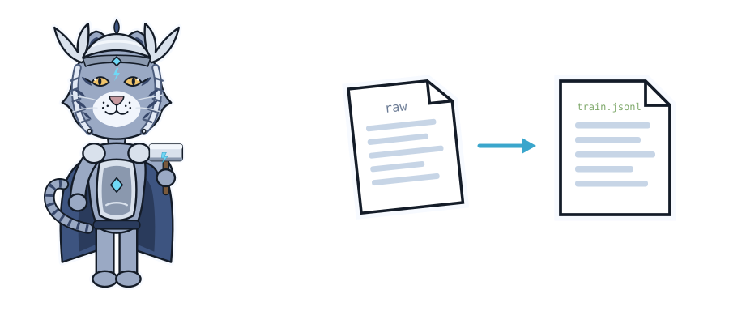
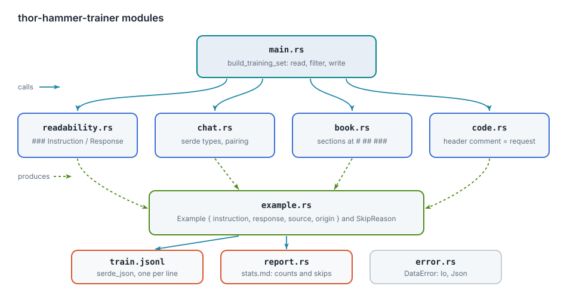
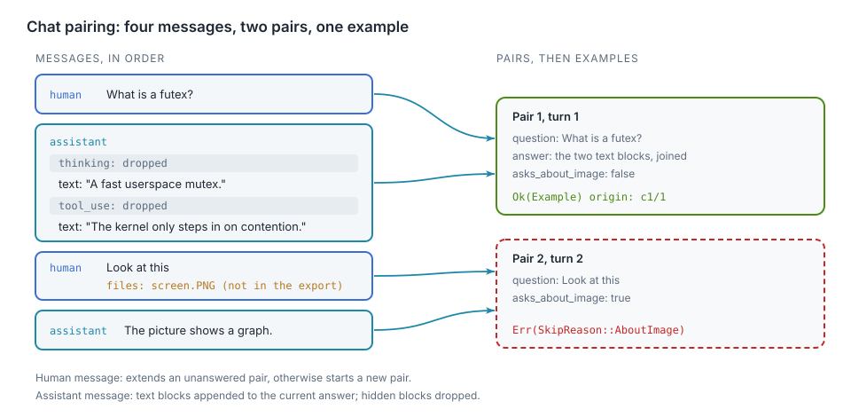
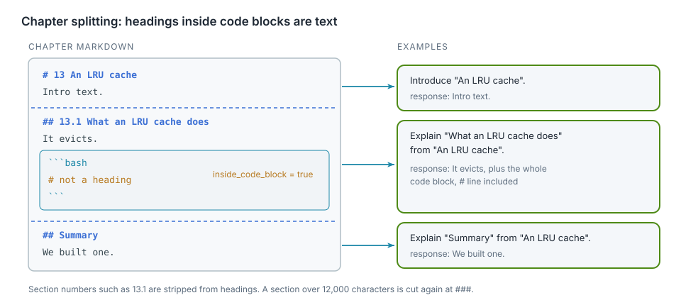

# Low-level design: the data generator

<div class="covers" markdown="1">

This chapter covers

- The modules of `thor-hammer-trainer` and their shared types
- The chat pairing algorithm
- The chapter splitting algorithm
- Source files, filtering, output and tests

</div>

`thor-hammer-trainer` is a Rust binary of about 1,300 lines, tests and doc comments included. A full build of the
training set takes under 0.3 s.

## 3.1 Modules

<figure>

<figcaption><b>Figure 3.1</b> Module calls and the types they produce.</figcaption>
</figure>

| Module | Responsibility |
|---|---|
| `main.rs` | input paths, directory walk, filtering, output |
| `readability.rs` | parses `### Instruction` / `### Response` entries |
| `chat.rs` | deserializes the synthetic chat transcript, pairs prompts with answers |
| `book.rs` | splits a markdown chapter into sections |
| `code.rs` | turns a source file with a header comment into an example |
| `clever_vs_readable.rs` | reads the SFT records and the DPO preference pairs |
| `slop_flags.rs` | reads reviewer flags, separates flagged examples |
| `example.rs` | `Example`, `Source`, `SkipReason` |
| `report.rs` | writes `stats.md` |
| `error.rs` | `DataError` |

Readers do not depend on each other. A new source is one new module and one call in `main.rs`.

## 3.2 Shared types

`Example` is one line of `train.jsonl` and derives `Serialize`:

```rust
#[derive(Debug, Clone, PartialEq, Eq, Serialize)]
pub struct Example {
    pub instruction: String,
    pub response: String,
    pub source: Source,
    pub origin: String,
}
```

`SkipReason` records why an input was excluded. Readers push reasons into a `Vec<SkipReason>`; `report.rs`
counts them.

```rust
pub enum SkipReason {
    SafetyFlag,
    AboutImage,
    EmptyTurn,
    NotesFile,
    NoHeaderComment,
    TooShort,
    Duplicate,
}
```

`DataError` covers failures that stop the build: I/O errors and invalid JSON.

## 3.3 Chat pairing

The transcript is deserialized with serde into types that declare only the fields the generator reads. Message
content blocks are distinguished by their `type` field:

```rust
#[derive(Deserialize)]
#[serde(tag = "type", rename_all = "snake_case")]
enum Content {
    Text { text: String },
    Flag {},
    #[serde(other)]
    Hidden,
}
```

`#[serde(other)]` maps every unlisted block type, including `thinking`, `tool_use` and `tool_result`, to
`Hidden`. Hidden blocks are never read.

<figure>

<figcaption><b>Figure 3.2</b> Messages to pairs, pairs to examples or skip reasons.</figcaption>
</figure>

Pairing is one pass over the messages with one `match` on the sender and the state of the last pair:

```rust
fn question_answer_pairs(messages: &[Message]) -> Vec<QuestionAnswer> {
    let mut pairs: Vec<QuestionAnswer> = Vec::new();
    for message in messages {
        match (&message.sender, pairs.last_mut()) {
            (Sender::Human, Some(open_pair)) if !open_pair.is_answered() => {
                open_pair.add_question(message)
            }
            (Sender::Human, Some(..) | None) => pairs.push(QuestionAnswer::asked_in(message)),
            (Sender::Assistant, Some(current_pair)) => current_pair.add_answer(message),
            (Sender::Assistant, None) => {}
        }
    }
    pairs
}
```

| Sender | Last pair | Action |
|---|---|---|
| human | exists, unanswered | append to its question |
| human | answered, or none | start a new pair |
| assistant | exists | append to its answer |
| assistant | none | ignore |

A pair becomes an example or a skip reason:

| Condition | Result |
|---|---|
| question or answer empty | `SkipReason::EmptyTurn` |
| question has an image file and no text attachment | `SkipReason::AboutImage` |
| otherwise | `Example` |

A conversation containing a `Flag` block is excluded before pairing results are used, with one
`SkipReason::SafetyFlag` per turn.

## 3.4 Chapter splitting

<figure>

<figcaption><b>Figure 3.3</b> A chapter split at its headings. The <code>#</code> line inside the code block is not a heading.</figcaption>
</figure>

Shell listings in the corpus contain `# comment` lines. The splitter tracks code fences and classifies each line:

```rust
fn line_kind<'a>(line: &'a str, heading_markers: &[&str], inside_code_block: bool) -> LineKind<'a> {
    let is_code_fence =
        line.trim_start().starts_with("```") || line.trim_start().starts_with("~~~");
    let heading = heading_markers
        .iter()
        .find_map(|marker| line.strip_prefix(marker));
    match (is_code_fence, inside_code_block, heading) {
        (true, ..) => LineKind::CodeFence,
        (false, false, Some(heading)) => LineKind::Heading(heading),
        (false, true, ..) | (false, false, None) => LineKind::Text,
    }
}
```

**Split depth.** Chapters are split at `#` and `##`. A section over 12,000 characters (about 3,000 tokens) is
split again at `###`. Measured on the corpus: 4 of 674 `##` sections exceed the limit, and no `###` subsection
of those 4 does. No deeper splitting is implemented.

**Instruction text.** Section numbers such as `13.1` are removed from the heading, then:

```rust
fn instruction(chapter: &str, heading: &str) -> String {
    match heading {
        introduction if introduction == chapter => format!("Introduce \"{chapter}\"."),
        question if question.ends_with('?') => format!("{question} (Context: {chapter}.)"),
        topic => format!("Explain \"{topic}\" from \"{chapter}\"."),
    }
}
```

WARNING: All 690 book instructions follow these three templates. A model can learn the template wording. Stage 3
is planned to replace them with questions written by a teacher model.

## 3.5 Source files

```rust
const LANGUAGES: [Language; 4] = [
    Language { extension: "rs", name: "Rust", code_block_tag: "rust", header_marker: "//!" },
    Language { extension: "go", name: "Go", code_block_tag: "go", header_marker: "//" },
    Language { extension: "cu", name: "CUDA", code_block_tag: "cuda", header_marker: "//" },
    Language { extension: "py", name: "Python", code_block_tag: "python", header_marker: "#" },
];
```

The leading comment lines, without markers, form the instruction `Write a <language> program for this: <header>`.
The file in a code block forms the response. Files without a header comment produce
`SkipReason::NoHeaderComment`.

## 3.6 Directory walk

`classify` maps each path to a `CorpusFile`:

| Variant | Paths | Handling |
|---|---|---|
| `Directory` | folders | recurse |
| `Chapter` | `.md` files not in the notes list | `book.rs` |
| `Notes` | `README.md`, `SUMMARY.md`, `WORKLOG.md`, `anti_ai_slop.md` and others | `SkipReason::NotesFile` |
| `Code` | `.rs`, `.go`, `.cu`, `.py` | `code.rs` |
| `Ignored` | hidden files, `target`, `node_modules`, `frames`, `out`, the drafts folder | none |

## 3.7 Filtering and output

```rust
fn rejection(example: &Example, seen_texts: &mut HashSet<String>) -> Option<SkipReason> {
    if example.char_count() < MIN_EXAMPLE_CHARS {
        return Some(SkipReason::TooShort);
    }
    let is_first_copy = seen_texts.insert(example.dedup_key());
    match is_first_copy {
        true => None,
        false => Some(SkipReason::Duplicate),
    }
}
```

- Minimum length: 200 characters, instruction and response combined.
- Duplicate key: instruction and response with whitespace runs collapsed to one space.
- Order of reading: readability, chat, book, code. The first copy of a duplicate is kept.

Output: `train.jsonl` via `serde_json::to_string` per example; `stats.md` with per-source counts, the number of
examples over 8,192 tokens, and one line per `SkipReason`.

## 3.8 Clever-vs-readable set

SFT records are deserialized into typed messages; the user and assistant contents become the example:

```rust
let (Some(instruction), Some(response)) = (record.content_of(Role::User), record.content_of(Role::Assistant))
else {
    skip_reasons.push(SkipReason::EmptyTurn);
    continue;
};
```

DPO records are deserialized into `PreferencePair` to validate their shape and serialized unchanged to
`preferences.jsonl`.

## 3.9 Example ids and slop flags

`Example::id` is the FNV-1a 64-bit hash of `dedup_key`, printed as 16 hex digits. FNV-1a is used instead of
`std::collections::hash_map::DefaultHasher` for one reason: its output is fixed by definition. The standard hasher
may change between Rust releases, which would detach every stored flag.

`train.jsonl` lines are written from a wrapper that adds the id to the example:

```rust
#[derive(Serialize)]
struct TrainingRecord<'a> {
    id: String,
    #[serde(flatten)]
    example: &'a Example,
}
```

After filtering, `slop_flags::separate_flagged` splits the examples by whether their id has a flag. Flagged ones
go to `slop.jsonl` as `{id, note, spans, instruction, response, source, origin}`.

Span categories are a closed enum, deserialized with serde:

```rust
#[derive(Debug, Clone, Copy, PartialEq, Eq, Hash, Deserialize, Serialize)]
#[serde(rename_all = "snake_case")]
pub enum SlopCategory {
    FakeImportance,
    DramaticSetup,
    EmptyDepthWords,
    FakeBalanceHedging,
    FlatteryFillerOpener,
    WrapUpRepeat,
    RhythmTrick,
    Other,
}
```

A flags file with an unknown category fails the build with a JSON error instead of being counted under a wrong
name. `slop_flags::span_counts` counts spans per category for `stats.md`.

## 3.10 Verification

| Check | Result |
|---|---|
| `cargo build` | no warnings, Rust 1.99.0 |
| `cargo clippy --all-targets -- -D warnings` | clean |
| `cargo test` | 17 tests pass |
| Project rules | no `unwrap`/`expect`, hand-written error enum, doc comments on all items, no comments in function bodies, no index loops |

Tests cover:

- hidden blocks dropped
- image question skipped
- flagged conversation skipped
- a heading inside a code block
- an oversized section split
- readability comment removal
- short and duplicate filtering
- path classification
- clever-vs-readable parsing
- preference pair round trip
- flagged example separation with span counts
- flags without spans
- an unknown span category rejected
- a missing flags file
