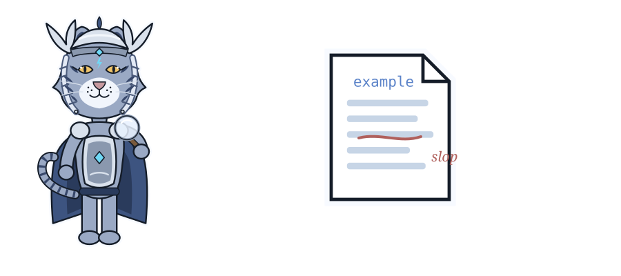
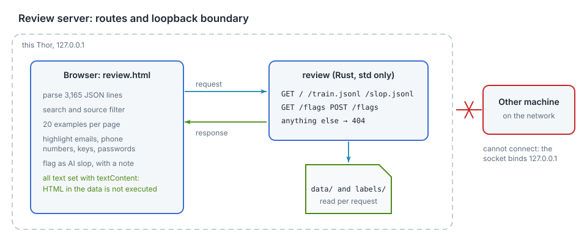

# Low-level design: the review server

<div class="covers" markdown="1">

This chapter covers

- Routes and request handling
- Rendering data as text
- Binding to the loopback address
- Personal-data patterns and their limits
- Slop flags

</div>

The review server is a binary in `thor-hammer-trainer` (`src/bin/review.rs`, about 400 lines). It uses the standard
library plus serde for flags, and one HTML page with inline JavaScript.

## 4.1 Routes

<figure>

<figcaption><b>Figure 4.1</b> Routes and the loopback boundary.</figcaption>
</figure>

| Request | Response |
|---|---|
| `GET /` | `review.html`, embedded with `include_str!` |
| `GET /train.jsonl` | the training file, read from disk per request |
| `GET /slop.jsonl` | examples removed as slop, so they stay visible and can be unflagged |
| `GET /flags` | `labels/slop_flags.jsonl`, empty if absent |
| `POST /flags` | `{id, note, spans, flagged}`: replace or clear one example's flag; the file is rewritten |
| any other path | `404 Not Found` |

The browser parses the file and performs search, source filtering, paging (20 examples per page) and
highlighting. The server performs no processing.

```rust
let response = match (request.method.as_str(), request.path.as_str()) {
    ("GET", "/") => Response::ok("text/html; charset=utf-8", REVIEW_PAGE.as_bytes().to_vec()),
    ("GET", "/train.jsonl") => {
        let training_data =
            fs::read(&files.training).map_err(io_error("reading the training file"))?;
        Response::ok("application/x-ndjson; charset=utf-8", training_data)
    }
    ("GET", "/slop.jsonl") => Response::ok(
        "application/x-ndjson; charset=utf-8",
        read_optional_file(&files.removed_as_slop)?,
    ),
    ("GET", "/flags") => Response::ok(
        "application/x-ndjson; charset=utf-8",
        read_optional_file(&files.flags)?,
    ),
    ("POST", "/flags") => change_flag(&request, &files.flags),
    (method, path) => {
        eprintln!("review: no route for {method} {path}");
        Response::error("404 Not Found", "not found")
    }
};
```

For each connection the server:

1. reads the request line
2. reads the headers, keeping `Content-Length` and `Content-Type`
3. reads the body up to 64 KiB
4. writes the response
5. closes the connection

Request headers are consumed before writing, because closing a socket with unread input can cause the kernel to send
a reset. Connections are handled sequentially.

## 4.2 Text rendering

Examples contain HTML, such as quoted web pages and `<figure>` tags from the books. The page creates elements
with `document.createElement` and assigns content with `textContent`. Markup in the data is displayed, not
executed.

## 4.3 Loopback binding

The listener binds `127.0.0.1`. Connections from other hosts are refused by the kernel.

## 4.4 Personal-data patterns

| Pattern | Matches |
|---|---|
| email | `name@domain.tld` |
| phone number | digit groups with separators, such as `+1 206 555 0100` |
| API key | prefixes `sk-`, `ghp_`, `github_pat_`, `AKIA`, `xox`, `hf_` |
| private key | `-----BEGIN ... PRIVATE KEY-----` |
| password | `password=...`, `pwd: ...` |
| bearer token | `Bearer` followed by 20 or more token characters |

Matches are highlighted. A checkbox limits the list to examples with matches: 20 of 3,165 on the current set.

Limit: names, health details and private events have no fixed format and are not matched.

## 4.5 Slop flags

Each example card ends with a curation panel:

| Control | Effect |
|---|---|
| select text in the instruction or response | the selection is shown in the panel |
| category menu, **Flag selection** | adds a span with that category; the example becomes flagged |
| span list, **remove** | removes one span |
| note, **Flag whole example** / **Save note** | flags the example or updates its note |
| **Unflag** | removes the flag and all its spans |

Marked spans are highlighted in the text with a wavy underline; the category is shown on hover. A checkbox limits
the list to flagged examples, and the summary line counts flagged examples and marked sentences.

The selection is captured on `mouseup` inside an instruction or response section. It is stored with the example id
and field, because clicking the button can clear the browser selection.

Each change sends the complete flag for one example:

```json
{"id": "2e6e9c9623674c82", "note": "opener and sign-off", "flagged": true,
 "spans": [{"field": "response", "text": "Great question!", "category": "flattery_filler_opener"}]}
```

The server deserializes the body into typed structs; an unknown category returns `400 Bad Request`.

`POST /flags` is accepted only with `Content-Type: application/json`. A web page on another origin can send that
content type only after a CORS preflight. The server does not answer the preflight, so other sites open in the same
browser cannot write flags. A `text/plain` request returns `415 Unsupported Media Type`.

Flags take effect on the next run of the generator, which moves flagged examples from `train.jsonl` to
`slop.jsonl`.
