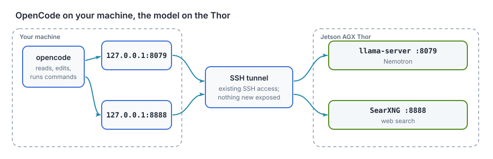

# Local models

## edgechat (local-copilot-codebuddy)

Terminal chat that runs the model inside the program with llama.cpp. On the
Thor:

```bash
edgechat            # pick a model from ~/models
```

| Model | File | Context | Speed (measured) |
|---|---|---|---|
| Nemotron 3 Nano 30B-A3B, Q8_0 | `~/models/gguf/Nemotron-3-Nano-30B-A3B/` | 1M tokens | 52 tok/s |
| Qwen3.6-27B, Q4_K_M | linked from Ollama's copy | 256K tokens | 12 tok/s |

- It uses each model's full context unless `--kv-cache-tokens` caps it.
- It sends no built-in prompt. Your rules file
  `~/.config/local-copilot-codebuddy/rules.md` goes into every chat as written.
- To add a model, put a ChatML `.gguf` file under `~/models/gguf/`.

## SSH tunnel from your machine

Any machine that can `ssh thor` (chapter "Access and syncing") can reach the
Thor's services without the public address: SSH forwards ports on your
machine to the same ports on the Thor. This is what the local agents below
use, and it works the same on Linux, macOS and Windows (OpenSSH).

| Local address | On the Thor |
|---|---|
| `127.0.0.1:8079` | llama-server (Nemotron), OpenAI and Anthropic APIs |
| `127.0.0.1:8080` | `thor-tigress-agent`: the chat page and the API with key check, web search and thinking translation |
| `127.0.0.1:8888` | SearXNG |

Nothing new is opened on the network: the tunnel rides on your SSH login.
Machines without SSH access use the public address instead (chapter "Bring
your own agent").

**Any OS, for the current session:**

```bash
ssh -fN -o ExitOnForwardFailure=yes \
  -L 127.0.0.1:8079:127.0.0.1:8079 -L 127.0.0.1:8080:127.0.0.1:8080 -L 127.0.0.1:8888:127.0.0.1:8888 thor
```

**Linux, kept up across reboots** as a user service,
`~/.config/systemd/user/thor-model-tunnel.service`:

```ini
[Unit]
Description=SSH tunnel to the Thor: Nemotron (8079), SearXNG (8888), front server (8080)
After=network-online.target

[Service]
ExecStart=/usr/bin/ssh -o ControlMaster=no -o ControlPath=none -o BatchMode=yes -o ServerAliveInterval=30 -o ExitOnForwardFailure=yes -N -L 127.0.0.1:8079:127.0.0.1:8079 -L 127.0.0.1:8888:127.0.0.1:8888 -L 127.0.0.1:8080:127.0.0.1:8080 thor
Restart=always
RestartSec=5

[Install]
WantedBy=default.target
```

```bash
systemctl --user enable --now thor-model-tunnel
```

**macOS:** the one-line `ssh -fN …` above, or an alias that opens it when
needed, as in the OpenCode setup below. A launchd agent would keep it up
across reboots; that has not been set up or tested here.

Check it:

```bash
curl -s 127.0.0.1:8079/health    # {"status":"ok"}
curl -s 127.0.0.1:8080/health    # {"status":"ok"}
```

Tested on a Jetson Orin NX running Ubuntu (yahboom), with the Linux service.

## Coding agent: OpenCode

[OpenCode](https://opencode.ai) is a terminal coding agent: it reads and edits
files and runs commands on the machine you use, and calls Nemotron on the Thor
for the model. Your code stays on your machine; only model calls reach the
Thor.

<figure>

<figcaption><b>Figure 8.1</b> OpenCode on your machine, the model on the Thor.</figcaption>
</figure>

It uses the SSH tunnel from the section above.

OpenCode was tried on a Jetson Orin NX dev machine (yahboom) on 2026-10-05 and removed the same day. In the
sessions there, Nemotron's tool calls often came back as plain text instead of
calls, so files it reported as written did not exist, and with a project-level
`CLAUDE.md` in the folder it refused multi-file work. openbatrangs (below)
replaced it. The setup is kept here for anyone who wants to try it.

### Setup on Linux

```bash
curl -fsSL https://opencode.ai/install | bash        # installs to ~/.opencode/bin
mkdir -p ~/.config/thor-chat
(umask 077; ssh thor cat .config/thor-chat/api-key > ~/.config/thor-chat/api-key)
```

`~/.config/opencode/opencode.json`:

```json
{
  "$schema": "https://opencode.ai/config.json",
  "model": "thor/nemotron",
  "provider": {
    "thor": {
      "npm": "@ai-sdk/openai-compatible",
      "name": "Thor",
      "options": {
        "baseURL": "http://127.0.0.1:8079/v1",
        "apiKey": "{file:~/.config/thor-chat/api-key}"
      },
      "models": {
        "nemotron": {
          "name": "Nemotron 3 Nano (Thor)",
          "options": { "chat_template_kwargs": { "enable_thinking": false } }
        },
        "nemotron-think": { "name": "Nemotron 3 Nano (Thor, thinking)" }
      }
    }
  },
  "agent": { "plan": { "model": "thor/nemotron-think" } },
  "mcp": {
    "searxng": {
      "type": "local",
      "command": ["npx", "-y", "mcp-searxng@2.5.0"],
      "environment": { "SEARXNG_URL": "http://127.0.0.1:8888" },
      "enabled": true
    }
  }
}
```

- **Build mode** uses `nemotron` with thinking off, so it acts.
- **Plan mode** (Tab) uses `nemotron-think`, so it reasons before proposing.
- **Web search** comes from the SearXNG instance on the Thor through the
  `mcp-searxng` plugin (an npm package, run locally by `npx`): tools
  `searxng_web_search` and `web_url_read`, which reads a page as text.

`enable_thinking: false` matters: Nemotron thinks by default, and on a large
task it spent a whole turn reasoning (11,504 characters) and stopped without
calling a single tool. With thinking off it goes straight to reading, writing
and running. The web chat's think toggle is not affected.


### Setup on macOS

```bash
curl -fsSL https://opencode.ai/install | bash
mkdir -p ~/.config/opencode ~/.config/thor-chat
# write ~/.config/opencode/opencode.json as in the Linux setup above
(umask 077; ssh thor cat .config/thor-chat/api-key > ~/.config/thor-chat/api-key)
echo 'alias opencode="(nc -z 127.0.0.1 8079 || ssh -fN -L 8079:127.0.0.1:8079 -L 8888:127.0.0.1:8888 thor) && command opencode"' >> ~/.zshrc
```

The alias opens the tunnel when it is not already up.

### Use

```bash
cd ~/Projects/some-project
opencode                           # interactive
opencode run "add a unit test"     # one task, then exit
```

Check the tunnel: `curl -s 127.0.0.1:8079/health` (must print `{"status":"ok"}`).

Each running session uses one of the Thor's chat slots while it generates.
After a new access key (`thor-tigress-serve key` on the Thor), copy it again with the
`ssh thor cat …` line above.

## Ollama

```bash
ollama run qwen3.6:27b --verbose    # "eval rate" is tokens/s
ollama ps                           # must show 100% GPU
ollama stop qwen3.6:27b             # free its memory
```

## Coding agent: openbatrangs with Nemotron

[openbatrangs](https://github.com/arpanpathak/openbatrangs) is a terminal
coding agent: it writes files and runs commands in the current folder, one
action per step, until the task is done. `--thor` points it at Nemotron's
llama-server instead of Ollama.

```bash
ssh thor
mkdir -p ~/some-project && cd ~/some-project
openbatrangs --thor                  # interactive; /models lists the served model
openbatrangs --thor "create a cargo project named dsa with a stack and a queue, with tests, then run cargo test"
```

| Option | Effect |
|---|---|
| `--thor` | llama-server at `127.0.0.1:8079/v1`, key from `~/.config/thor-chat/api-key` |
| `--openai-url URL --api-key-file PATH` | any other OpenAI-compatible server |
| `--no-think` | thinking off (on by default; reasoning is shown dimmed after 💭) |
| `--max-steps N` | step limit, default 40 |

The same command works on any machine with the SSH tunnel (above), since
`--thor` means `127.0.0.1:8079`. Without the tunnel, use the public address
(chapter "Bring your own agent"). Install anywhere with Rust:
`cargo install --git https://github.com/arpanpathak/openbatrangs --locked`.

Measured on 2026-10-05, from a Jetson Orin NX (yahboom) through the SSH tunnel, thinking on, task: "a cargo project with
a stack, a queue, a singly linked list, binary search and quicksort, each with
unit tests, then run cargo test and fix anything that fails":

| Steps | Time | Result |
|---|---|---|
| 14 of 40 | 293 s | 5 modules; fixed two rounds of compile errors itself; 14 tests pass |

Each step is 10–20 s of generation at about 53 tok/s. A run takes one of the
four chat slots, so it competes with web chat users while it works.

Two bugs that made it look like it was overthinking:

- Commands ran with a relative `TMPDIR`, so `cd dsa && cargo test` failed in
  the doc-test step every time. The model saw a failing test and kept
  rewriting working code until it ran out of steps. Sandbox paths are now
  absolute.
- Through the SSH tunnel, a reused idle connection failed between steps
  ("connection closed before message completed"). The client no longer keeps
  idle connections to this server.

## Memory

The CPU and GPU share 128 GB. The web chat (chapter "Web chat: Thor Tigress Cub") keeps Nemotron loaded:
about 58 GB at 4 people × 1M context. Stop it before loading a second large
model or training: `systemctl --user stop thor-chat`.
