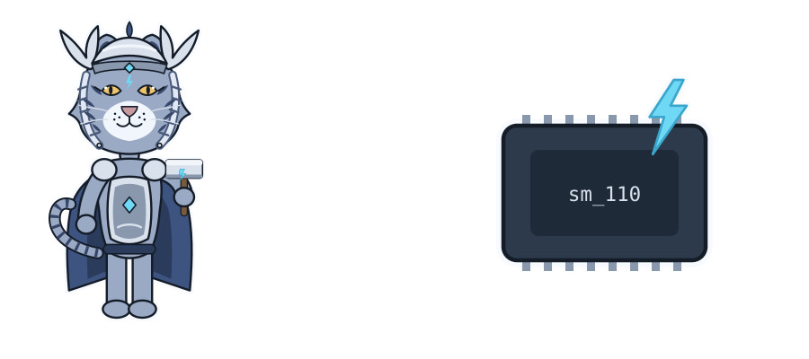

# Local models

## edgechat (local-copilot-codebuddy)

Terminal chat that runs the model inside the program with llama.cpp. On the
Thor:

```bash
edgechat            # pick a model from ~/models
```

| Model | File | Context | Speed (measured) |
|---|---|---|---|
| Nemotron 3 Nano 30B-A3B, Q8_0 | `~/models/gguf/Nemotron-3-Nano-30B-A3B/` | 1M tokens | 52 tok/s |
| Qwen3.6-27B, Q4_K_M | linked from Ollama's copy | 256K tokens | 12 tok/s |

- It uses each model's full context unless `--kv-cache-tokens` caps it.
- It sends no built-in prompt. Your rules file
  `~/.config/local-copilot-codebuddy/rules.md` goes into every chat as written.
- To add a model, put a ChatML `.gguf` file under `~/models/gguf/`.

## Ollama

```bash
ollama run qwen3.6:27b --verbose    # "eval rate" is tokens/s
ollama ps                           # must show 100% GPU
ollama stop qwen3.6:27b             # free its memory
```

## openbatrangs

The agentic CLI runs against Ollama. It's on hold: it works for small tasks,
but needs more work.

## Memory

The CPU and GPU share 128 GB. The web chat (chapter 6) keeps Nemotron loaded:
about 58 GB at 4 people × 1M context. Stop it before loading a second large
model or training: `systemctl --user stop thor-chat`.
