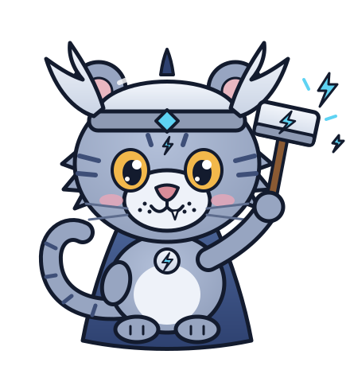
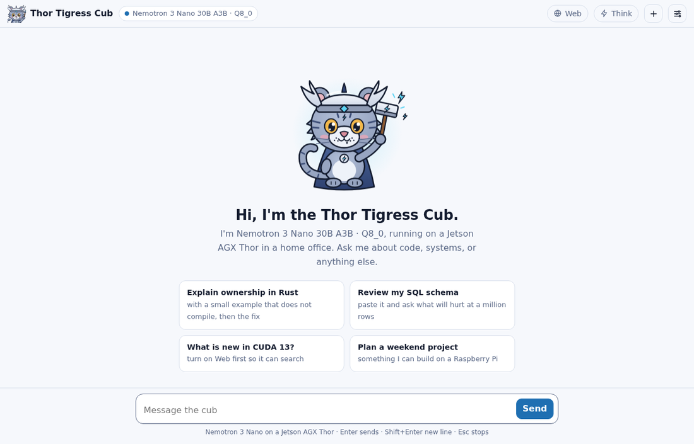
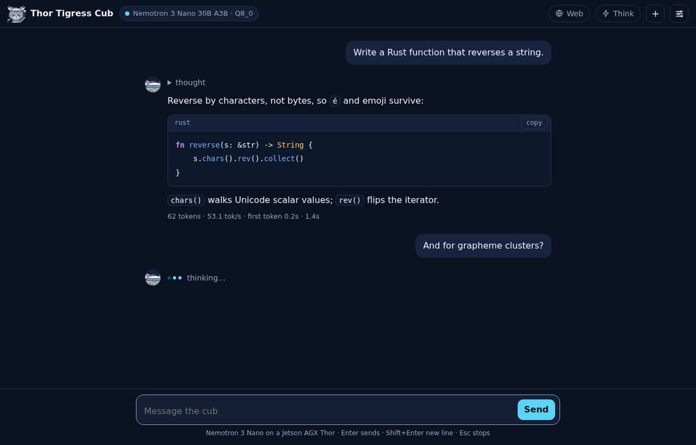
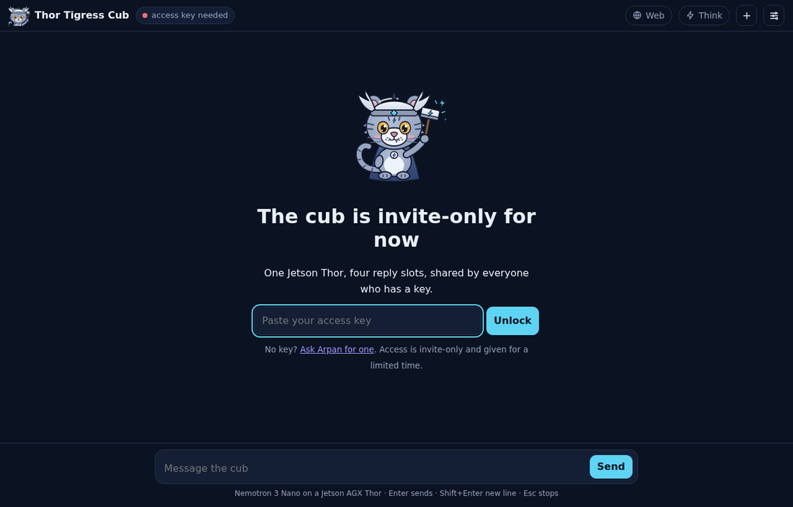
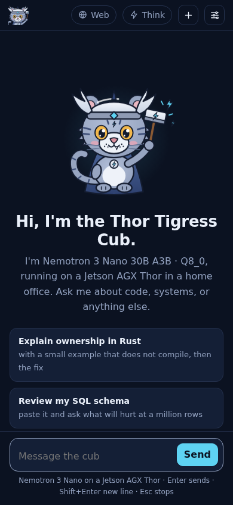
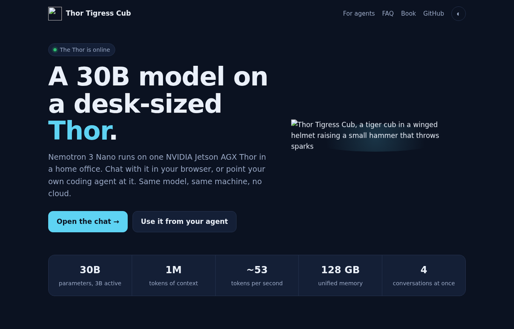
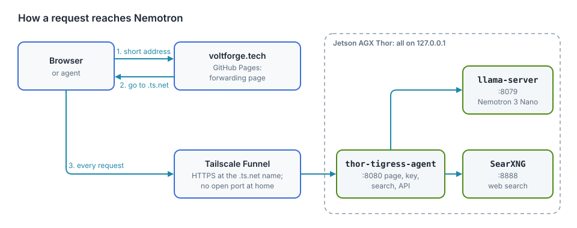

# Web chat: Thor Tigress Cub

The Thor Tigress Cub is the browser face of the Thor: a chat page that talks to
Nemotron 3 Nano on the Jetson AGX Thor, can search
the web before it answers,
and can show its reasoning. It is one HTML file in front of one small Rust
server, and everything it calls runs on the Thor.

The Thor serves the page itself, at `https://<thor>.<tailnet>.ts.net`
through Tailscale Funnel. `https://voltforge.tech/thor-tigress-cub` is a
short address whose one-file page on GitHub Pages sends the browser there
(chapter "Bring your own domain"); there is no other copy of the chat.

<div class="covers">

This chapter covers

- what the page does, screen by screen
- how the page, the Rust server, llama-server and SearXNG fit together
- starting it on the Thor, sharing it, and handing out access keys
- changing the page or the server without cutting anyone off
- what goes wrong and how to tell

</div>

## A tour of the page

### Welcome

<figure>

<figcaption><b>Figure 9.1</b> The first screen, in the light Cub theme.</figcaption>
</figure>

A new conversation opens on the cub, a greeting that names the model the
server reports, and four suggested prompts. Clicking a suggestion puts it in the
message box so it can be edited before sending; nothing is sent until you press
Enter.

The header holds, from left to right:

- **Thor Tigress Cub** and the model picker. The dot is the server's state:
  green when `/v1/models` answers, red when the key is missing or the server
  can't be reached. The picker lists what `/v1/models` returns, remembers the
  choice in the browser, and sends it as `model` with every message. With one
  model served it is greyed out. See "Two models" below.
- **Web**: lets the model search before it answers (below).
- **Think**: lets the model reason before it answers (below).
- **+** starts a new conversation; the old one is discarded.
- The sliders icon opens Settings.

### A conversation

<figure>

<figcaption><b>Figure 9.2</b> A reply with folded reasoning, highlighted code and the stats line, and the next reply starting.</figcaption>
</figure>

Replies stream in as Nemotron writes them. Until the first word arrives, the
cub's avatar sits next to three hopping dots and "thinking…" (or "searching
and thinking…" with Web on), so a slow start never looks like a dead page.

Code blocks are highlighted for Rust, Python, Go, C and C++, CUDA,
JavaScript and TypeScript, shell, TOML, JSON and YAML, and each has a **copy**
button. The page builds the formatted reply from DOM nodes only, so nothing
the model writes is ever run as HTML.

Under each finished reply, the stats line reports what the server measured:

| Part | Meaning |
|---|---|
| `62 tokens` | tokens generated for this reply |
| `53.1 tok/s` | generation speed; about 53 with one reply running |
| `first token 0.2s` | time spent reading your conversation before the first word |
| `1.4s` | the whole reply, as your browser saw it |

Esc stops a reply; the part already written stays.

### Think

With **Think** on, Nemotron writes its reasoning first, and the page folds it
under a "thinking…" line, which becomes "thought" when the answer starts.
Click it to read the reasoning.

Thinking helps with code, maths and anything with several steps, and costs
time: the reasoning is generated at the same ~53 tokens/s as the answer, so
1,000 tokens of reasoning is about 19 seconds before the first word of the
answer. For quick questions, leave it off. The switch is remembered in your
browser.

### Web

With **Web** on, the server gives Nemotron a `web_search` tool. The model
decides whether to search; each search goes to SearXNG on the Thor, which
queries several search engines and returns titles, links and snippets. The
model gets up to three rounds of searching, then has to answer. The page lists every
query and source above the answer under "searched: …".

Search hands the model **snippets only**; it does not open the pages. Check
the sources before trusting a detail.

### Invite screen

<figure>

<figcaption><b>Figure 9.3</b> What someone without a key sees.</figcaption>
</figure>

When the server refuses the page (no key, or an old one), the page says so
instead of failing silently: paste a key and press **Unlock**, or follow the
link to ask for one. The key is kept in the browser, and can be changed later
in Settings.

### On a phone

<figure>

<figcaption><b>Figure 9.4</b> The same page on a 390-pixel-wide phone.</figcaption>
</figure>

On narrow screens the name steps aside and the model picker shrinks, so the
switches and the message box keep their room.

### About page

<figure>

<figcaption><b>Figure 9.5</b> The About page at <code>/about.html</code>, for people who arrive from a shared link.</figcaption>
</figure>

`/about.html` explains the project to someone who hasn't seen it: the model
and machine, the measured numbers, what the chat and the API can do, how a
reply travels, how to get access, and a short FAQ. Its badge turns to "The
Thor is online" when `/health` answers. The **About** link in the chat's
header opens it.

### Settings

| Setting | Effect |
|---|---|
| Theme | **Cub** (default; light or dark following your device), Paper, Night, Material Deep Ocean, GitHub Light, Solarized Light and Dark, Nord, Dracula, One Dark, Gruvbox Dark, Monokai |
| Access key | sent as `Authorization: Bearer <key>` with every request |
| System prompt | sent first in every conversation; empty sends none |
| Temperature | empty uses the model's default |

Conversations, settings and the key live in your browser's local storage,
nowhere else. Another browser or device starts empty.

| Key | Does |
|---|---|
| Enter | send |
| Shift+Enter | new line |
| Esc | stop the reply |

## How it fits together

<figure>

<figcaption><b>Figure 9.6</b> How a request reaches Nemotron.</figcaption>
</figure>

| Part | Where | What it does |
|---|---|---|
| `jetson-thor/web/index.html` | this repository | the whole page: markup, styles, the cub, the script; no build step |
| `thor-tigress-agent` | `crates/thor-tigress-agent` | serves the page, checks the key, runs the web-search loop, passes `/v1/*` to llama-server |
| `llama-server` | `~/.local/src/llama.cpp` on the Thor | router mode: Nemotron 3 Nano 30B-A3B Q8_0, four replies at a time, 1M tokens each; more models can be added (chapter "Model serving") |
| SearXNG | `~/.local/src/searxng`, user service `searxng` | meta search engine with JSON output |
| Tailscale Funnel | the Thor | HTTPS at a `.ts.net` address; no ports open on the home router |

All three programs listen on `127.0.0.1` only. Funnel is the only way in from
outside, and it reaches port 8080 alone.

`thor-tigress-agent` speaks just enough HTTP for this job, one thread per
connection:

| Request | Answer |
|---|---|
| `GET /`, `/thor-tigress-cub/` | the page (no key needed) |
| `GET /about.html`, `/cub.svg`, `/cub.png` | the About page and the art; a fixed list, nothing else in the folder is served |
| `GET /health` | `{"status":"ok"}` (no key needed) |
| `GET /v1/models` | the served models, from llama-server |
| `POST /v1/chat/completions` | streamed through; with `thor_web_search: true`, the search loop; without `stream: true`, plain JSON |
| `POST /v1/messages` | Anthropic's API, for Claude Code (chapter "Bring your own agent") |
| `OPTIONS *` | CORS preflight, so pages and tools on other sites may call the API with a key |

Every response carries `Access-Control-Allow-Origin: *`. That is safe here
because access depends on a key the caller must send, not on cookies another
site could borrow (chapter "Security").

## Start it on the Thor

```bash
cd ~/Projects/thor-thunder-tigress-platform
cargo install --path crates/thor-tigress-agent
cd jetson-thor/model-serving
./serve.sh install       # thor-chat and thor-tigress-agent services, start at boot
./serve.sh logs          # follow both logs
```

`serve.sh install` writes two systemd user services: `thor-chat`
(llama-server) and `thor-tigress-agent` (the page and API). Settings go in
`~/.config/thor-chat/env`, then `./serve.sh install` again:

| Setting | Default | Notes |
|---|---|---|
| `USERS` | 4 | replies generated at once; a fifth waits |
| `CONTEXT` | 1,048,576 | tokens per reply; memory for all four is reserved at start (57.8 GB measured); what this costs and how to change it: chapter "Memory, context and slots" |
| `MODEL` | Nemotron 3 Nano 30B-A3B Q8_0 | any GGUF with a chat template |
| `LIGHTNING` | Nemotron 3.5 Lightning 30B-A3B Q8_0 | the second model |
| `LIGHTNING_USERS` / `LIGHTNING_CONTEXT` | 1 / 262,144 | its own replies at once and tokens per reply |
| `PORT` / `MODEL_PORT` / `SEARCH_PORT` | 8080 / 8079 / 8888 | |

SearXNG runs as the `searxng` user service from `~/.local/src/searxng`, with
settings in `~/.config/searxng/settings.yml` (JSON output on).

## Two models

`serve.sh run` starts llama-server in router mode. It writes
`~/.config/thor-chat/models.ini` with one section per model and routes each
request by its `model` field. Loading, unloading and adding models are in
chapter "Model serving".

| Model id (what the picker shows) | Also answers to | At start | Replies at once | Tokens per reply |
|---|---|---|---|---|
| `NVIDIA-Nemotron-3-Nano-30B-A3B-Q8_0` | `nemotron`, `nemotron-think`, the GGUF path | loaded | 4 | 1,048,576 |
| `NVIDIA-Nemotron-3.5-Lightning-30B-A3B-Q8_0` | `lightning` | switched off (`LIGHTNING=none`): not listed, not loaded | 1 | 262,144 |

Any other name is refused with `400`, and so is a request without `model`.
Before router mode the name was ignored.

Measured on 2026-10-06, both loaded:

| | Nano | Lightning |
|---|---|---|
| generation, same Rust prompt, thinking off, 600 tokens | 53.5 tok/s | 52.5 tok/s |
| short reply through the agent | 48.0 tok/s | 49.1 tok/s |

Both models were loaded 32 seconds after a restart, with 26 GB of memory
still available. Lightning has since been switched off (its answers were
disappointing): it is out of memory and off the list, so the picker shows the
Nano alone, greyed out.

Lightning gets one reply at 256K tokens because both models at four replies
of 1M tokens do not fit in the Thor's 122 GB. That was tried: memory ran out
on the first reply, the OOM killer stopped `thor-chat`, and the chat was down
for three minutes. While someone else is talking to Lightning, a second
Lightning message waits; the Nano's four slots are separate.

## Share it

Install Tailscale on the Thor once:

```bash
curl -fsSL https://tailscale.com/install.sh | sh
sudo tailscale up --ssh
```

Then pick one:

| | Command | Who can open it |
|---|---|---|
| Private | `sudo tailscale serve --bg 8080` | devices on your tailnet; share the Thor from the Tailscale admin console |
| Public | `./serve.sh key`, then `sudo tailscale funnel --bg 8080` | anyone with the link; the model only for those with the key |

A new public address can take a few minutes to resolve everywhere. For a
shorter address on your own domain, see chapter "Bring your own domain".

## Access keys

```bash
./serve.sh key && systemctl --user restart thor-chat thor-tigress-agent    # new key
cat ~/.config/thor-chat/api-key                                            # show it
```

There is one key, shared by everyone you invite. A new key locks everyone
out until they paste the new one on the invite screen. Per-person sign-in
with GitHub is the next step for this server (chapter "Security").

## Change the page or the server

The page is read from disk on every request, so editing
`jetson-thor/web/index.html` in your clone is enough: `thor-sync` copies it to
the Thor and the next page load has it. No restart. (Editing it on the Thor
directly works too.)

A change to `thor-tigress-agent` needs a build and a restart. A restart cuts
off any reply being written, so wait until none is:

```bash
ssh thor 'cd ~/Projects/thor-thunder-tigress-platform &&
  cargo install --path crates/thor-tigress-agent --locked &&
  K=$(cat ~/.config/thor-chat/api-key) &&
  until [ "$(curl -s "127.0.0.1:8079/slots?model=nemotron" -H "Authorization: Bearer $K" |
             python3 -c "import sys,json;print(sum(s[\"is_processing\"] for s in json.load(sys.stdin)))")" = 0 ];
  do sleep 2; done &&
  systemctl --user restart thor-tigress-agent'
```

## When something is wrong

| You see | Likely cause | Check |
|---|---|---|
| Red dot, "server not reachable" | Funnel off, the Thor asleep, or `thor-tigress-agent` stopped | `curl https://<thor>.<tailnet>.ts.net/health` |
| Invite screen with a key pasted | the key was changed | `cat ~/.config/thor-chat/api-key` on the Thor |
| Replies slower than ~53 tok/s | other people are chatting; four replies share the memory bandwidth | `./serve.sh models`, then `curl "127.0.0.1:8079/slots?model=nemotron"` on the Thor (add `-H "Authorization: Bearer $K"`) |
| A long wait before anything | all four slots busy, or a long conversation being read | the same |
| "searched" missing with Web on | the model chose not to search, or SearXNG is down | `systemctl --user status searxng` |
| Error under a reply | the message from the server, shown as is | `./serve.sh logs` |

## Not done yet

- One shared key; no per-person limits or sign-in.
- Search reads snippets, not pages; reading pages is designed in chapter
  "Tool calling (planned)".
- Conversations stay in one browser; there is no account to sync them.
