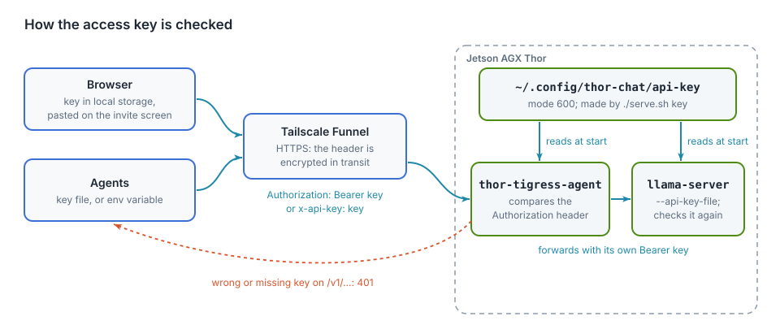

# Security

The Thor sits on a home network and is reachable from the internet. This
chapter lists what is exposed, what protects it, and what is still missing.

## What is exposed

Tailscale Funnel forwards one port, 8080, to `thor-tigress-agent`. llama-server
(8079) and SearXNG (8888) listen on `127.0.0.1` only. SSH is reachable on the
home network and the tailnet, never from the internet. Tested through the
public address on 2026-10-05:

| Path | Without the key | With the key |
|---|---|---|
| the page (`/`), `/health` | open; nothing sensitive | open |
| `OPTIONS` on any path (CORS preflight) | headers only | headers only |
| `/v1/models`, `/v1/chat/completions`, `/v1/messages` | `401` | answered |
| other `/v1/…` paths, e.g. `/v1/embeddings` | `401` | `404`, not passed through |
| llama-server's own `/tokenize`, `/slots`, `/props`, `/metrics` | `404` | `404`, not passed through |
| anything else on the Thor | not reachable | not reachable |

`https://voltforge.tech/thor-tigress-cub` is a one-file forwarding page on
GitHub Pages, served over HTTPS, that sends the browser to the `.ts.net`
address; GitHub never sees a key or a message. The `.ts.net` name resolves
to Tailscale's Funnel relays, not to your home: the home IP address is not
published anywhere (chapter "Bring your own domain" lists every address).
The Thor serves a fixed list of files (the page, the About page, the art);
everything else in the folder answers `404`. `thor-tigress-serve` lives in another
folder, `jetson-thor/model-serving/`.

## How the key is checked

<figure>

<figcaption><b>Figure 12.1</b> How the access key is checked.</figcaption>
</figure>

1. `thor-tigress-serve key` writes 24 random bytes from the operating system
   (`os.urandom`), as 48 hex characters, to `~/.config/thor-chat/api-key`
   (mode 600, readable only by the Thor's user).
2. Both programs read that file when they start: `thor-tigress-agent`
   (`--key-file`) and llama-server (`--api-key-file`). A new key needs a
   restart of both.
3. Visitors paste the key on the invite screen; the page keeps it in the
   browser's local storage for that address and sends
   `Authorization: Bearer <key>` with every `/v1/` request. Agents send the
   same header from a key file or an environment variable; Claude Code may
   send `x-api-key: <key>` instead, which `thor-tigress-agent` treats the same.
4. Funnel carries the request over HTTPS, so the header is encrypted until it
   reaches the Thor.
5. `thor-tigress-agent` compares the header with `Bearer <key>`. For any path
   under `/v1/` that doesn't match, it answers `401` and stops. The page,
   `/health`, the About page and the art need no key.
6. A matching request is passed to llama-server on `127.0.0.1:8079` with the
   agent's own `Authorization` header, and llama-server checks the key again.
   Even a program on the Thor that bypasses `thor-tigress-agent` needs it.

## Why `Access-Control-Allow-Origin: *` is safe here

Every response from `thor-tigress-agent` lets any site read it, so pages and
tools hosted elsewhere can call the API. Browsers only attach credentials they hold on
their own, such as cookies, and this server uses none. The key travels in a
header that a page must set itself, so a site can only call the model with a
key it already has. A leaked key is the risk; CORS doesn't add one.

## The access key

There is one key, shared by everyone invited. It is stored on the Thor in
`~/.config/thor-chat/api-key` (mode 600), and in each visitor's browser after
they paste it.

- **Don't put it in chats, repositories or screenshots.** If it leaks, make a
  new one: `thor-tigress-serve key && systemctl --user restart thor-chat thor-tigress-agent`.
  Everyone then needs the new key.
- **Give it out for a limited time.** Changing the key is how access ends.
- **Anyone with the key can keep the GPU busy.** There are no per-person
  limits yet. Four replies run at once; a fifth waits.

## Keep it that way

- **Update llama.cpp and Tailscale now and then.** The remaining risk is a bug
  in a program that runs as your user.
- **Prefer private (`tailscale serve`) for people you know.** Public
  (`funnel`) lets anyone with the link see the page and try keys.
- **Read the logs after sharing widely.** `thor-tigress-serve logs` on the Thor shows
  the requests, including each refused one.

What to do when the key leaks, when someone abuses the chat, or when the
public name has to change, step by step, and the list of known gaps: chapter
"Operations: recovery and hardening".

## Next: sign-in with GitHub

The shared key is the weak point: it can't be taken back from one person, and
it says nothing about who uses what. The next version of `thor-tigress-agent`
(async Rust, planned) replaces it:

| Now | Next |
|---|---|
| one shared key | sign in with GitHub; a personal key per person for agents |
| no limits | a daily token allowance per person, and a fair queue for the four slots |
| a new key locks everyone out | block or allow one person |
| no record of who | usage counted per person |
