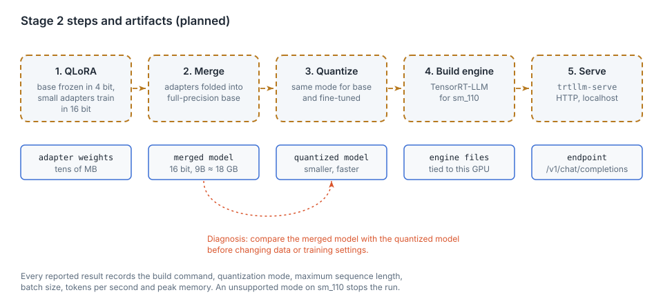

# Training and serving on Thor (planned)

This chapter covers

- Definitions: fine-tuning, LoRA, QLoRA, quantization
- The five steps from `train.jsonl` to an HTTP endpoint
- Per-source weighting
- Run requirements and the diagnosis order

Status: design only. No code exists for this chapter.

## 5.1 Definitions

**Fine-tuning**: continued training of an existing large language model, the **base model**, on new examples.

**LoRA** (low-rank adaptation): the base weights are frozen. For selected weight matrices, two small matrices are
trained, and their product is added to the layer output. For a 4096 × 4096 weight and rank 16, the adapter has
2 × 4096 × 16 = 131,072 trainable parameters. The full matrix has 16.8 million.

**QLoRA**: LoRA with the frozen base stored in 4-bit precision. Adapters train in 16-bit. The frozen weights of a
9B model take about 5 GB instead of about 18 GB.

**Quantization**: storing weights with fewer bits. It reduces memory and increases speed at some cost in
accuracy, which depends on the method and the model and must be measured.

## 5.2 Steps

<figure>

<figcaption><b>Figure 5.1</b> Stage 2 steps and artifacts.</figcaption>
</figure>

| Step | Tool | Input | Output |
|---|---|---|---|
| 1. Train | Python, Unsloth, TRL | `train.jsonl`, base model in 4-bit | adapter weights |
| 2. Merge | Python | base model in 16-bit, adapter | merged model, about 18 GB for 9B |
| 3. Quantize | TensorRT-LLM tooling | merged model | quantized model |
| 4. Build | TensorRT-LLM | quantized model | engine for sm_110 |
| 5. Serve | `trtllm-serve` | engine | OpenAI-compatible endpoint on localhost |

The base model used for comparison goes through steps 3 to 5 with identical settings.

## 5.3 Per-source weighting and preference training

The curated sets (`readability`, `clever_vs_readable`) are 1.7% of the tokens. The training script repeats them
about five times per epoch, raising their share to about 8%. Repetition increases the risk of verbatim
memorization; the evaluation prompt list includes prompts similar to, but not copied from, these sets.

After supervised fine-tuning on `train.jsonl`, an optional DPO pass trains on `preferences.jsonl`: 37 pairs of
readable (chosen) and clever (rejected) code. Examples flagged as slop (`slop.jsonl`) are candidates for further
rejected answers once a chosen rewrite exists for each.

## 5.4 Run requirements

- Confirm the TensorRT-LLM version or container that supports sm_110, JetPack 7 and CUDA 13 before any build.
- If a model or quantization mode is unsupported on sm_110, stop and report. No fallback to another engine.
- Record with every result: build command, quantization mode, maximum sequence length, batch size, tokens per
  second, peak memory.

## 5.5 Diagnosis order

If the fine-tuned model scores worse than expected:

1. Compare the merged 16-bit model with the quantized model (dashed path in figure 5.1).
2. If the merged model is good and the quantized one is not, change the quantization.
3. Only then change the data or the training settings.

## 5.6 Open parameters

| Parameter | Constraint |
|---|---|
| Base model | to choose: a ~27–35B model that fits the Thor, e.g. Qwen3.6 or Nemotron 3 Nano |
| Maximum sequence length | one example exceeds 8,192 tokens; longer context costs memory per step |
| Serving quantization mode | limited to modes TensorRT-LLM supports on sm_110 |
