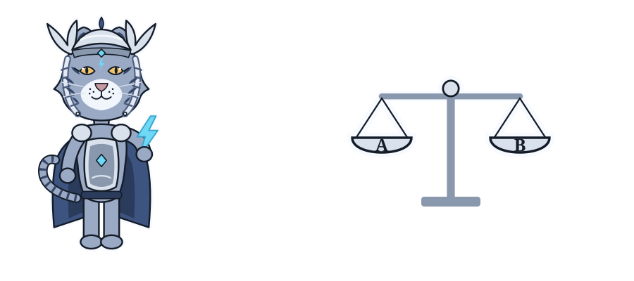
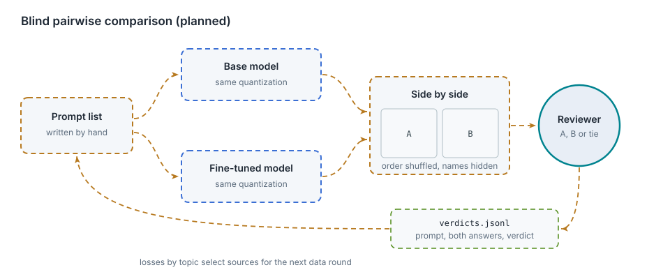

# Human evaluation (planned)

This chapter covers

- The blind comparison procedure
- The verdict file format
- Use of the results

Status: design only. No code exists for this chapter.

## 6.1 Procedure

<figure>

<figcaption><b>Figure 6.1</b> Blind pairwise comparison.</figcaption>
</figure>

1. A prompt list is written by hand. It contains prompts per book topic, prompts similar to the readability
   set, and prompts on topics absent from the data.
2. Each prompt is sent to both endpoints with identical generation settings.
3. The two answers are displayed as A and B. Order is randomized per prompt; model names are hidden.
4. The reviewer selects A, B or tie.

The comparison page follows the review page: localhost only, text rendering only.

## 6.2 Verdict format

One JSON object per prompt in `verdicts.jsonl`:

| Field | Content |
|---|---|
| `prompt` | the prompt text |
| `answer_a`, `answer_b` | the two answers as displayed |
| `a_model` | `base` or `fine_tuned` |
| `verdict` | `a`, `b` or `tie` |

## 6.3 Use of the results

- **Win rate**: share of non-tie verdicts won by the fine-tuned model.
- **Losses by topic**: prompts lost by the fine-tuned model, grouped by topic, select which sources to extend in
  the next data round.
