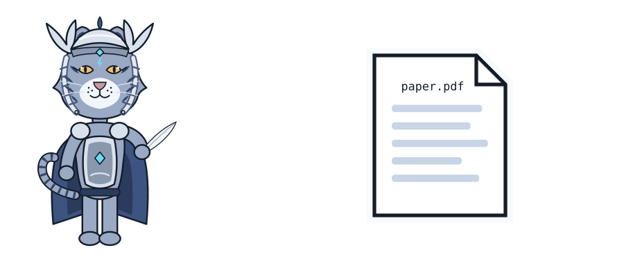

# Writing the papers (planned)

This chapter covers

- Three reports the project can produce, and what each needs before it can be written
- The claims each report may make, and the evidence each claim requires
- Data provenance, terms of use and privacy
- A reproducibility checklist and the structure of each report

Status: plan only. No report has been written.

## 8.1 Scope

The project has one author, one main reviewer, one machine and evaluation sets of about 100 items per category.
That supports technical reports and workshop papers. A main-conference paper would need several raters, larger
held-out sets and stronger baselines. The reports below are sized to the evidence the project can collect.

| Report | Question | Needs first | Venue |
|---|---|---|---|
| 1. Dataset and curation | How was a personal corpus turned into training data, and what did human slop labelling add? | Stage 1 (done), a few hundred slop flags | arXiv technical report; data-centric ML workshop |
| 2. Fine-tuning results | Does QLoRA on this data improve rule compliance, honesty and slop density without losing general ability or safety? | Stage 2, chapter 10 evaluation | arXiv; workshop paper |
| 3. Training and serving on Jetson AGX Thor | What memory, throughput and step time does QLoRA training and TensorRT-LLM serving reach on sm_110 unified memory? | Stage 2 measurements | systems or efficient-ML workshop; engineering blog |

Report 1 can be written first: its material exists now.

## 8.2 Claims and evidence

A claim may appear in a report only if its evidence row is met.

| Claim | Evidence required |
|---|---|
| "Fine-tuning improved X" | paired test significant at 0.05 and the effect interval excludes 0, on frozen held-out items with \\(O(e) = 0\\) |
| "Fine-tuning did not hurt Y" | the interval of the difference lies within a margin stated before the run (for example 3 points) |
| "Readers preferred the fine-tuned model" | win rate interval above 0.5 and second-rater \\(\kappa \geq 0.6\\) |
| "The model is safer / no less safe" | \\(S_h\\) and \\(S_o\\) intervals compared with the base model; \\(L = 0\\) |
| "Training on Thor reaches N tokens/s" | median and interquartile range over a stated workload, with the manifest |
| "Human slop labels improve the data" | the same training run with and without flagged examples, compared on \\(D\\) and \\(W\\) |

Results that did not improve are reported with the same detail as those that did.

## 8.3 Provenance, terms and privacy

| Issue | Consequence |
|---|---|
| Most training text is synthetic output from open-source models | Each model carries its own license and terms. Check the license of every model in the one to twenty billion parameter range before publishing a model, a dataset or results based on it. |
| The data contains personal information (chapter 3) | The raw dataset is not published. A report publishes the method, statistics, the evaluation set and per-item scores. |
| Book sections are the author's own work | May be published by the author; the license of the book repository applies. |
| Public benchmarks | Cite source and version; follow each benchmark's license. |

## 8.4 Reproducibility checklist

Before a report is submitted, every item is true:

- [ ] git commit of the code for every run is stated
- [ ] `runs/<run_id>/` for every cited number is committed: manifest, answers, scores, summary
- [ ] `eval/held_out.jsonl` hash matches the manifests
- [ ] `overlap_report.md` shows no unresolved overlap
- [ ] hardware, JetPack, CUDA, TensorRT-LLM and driver versions are listed
- [ ] training hyperparameters, seeds and data mix (including readability repetition) are listed
- [ ] every rate has \\(n\\) and a 95% interval
- [ ] negative and null results are included
- [ ] limitations section names: one author, one main rater, corpus size, synthetic data from open-source models

## 8.5 Report structure

All three reports use the same outline, written to the standard of `WRITING_GUIDE.md` and `anti_ai_slop.md`.

| Section | Content |
|---|---|
| Abstract | question, method, main numbers with intervals, one sentence on limits |
| 1. Introduction | the problem and the contribution, in that order |
| 2. Related work | prior work the report builds on or differs from |
| 3. Data or setup | sources, filtering, hardware, settings |
| 4. Method | what was done, precisely enough to repeat |
| 5. Results | tables with intervals; figures where a table is harder to read |
| 6. Analysis | where the effect comes from; failure cases with examples |
| 7. Limitations | what the results do not show |
| 8. Ethics and data | provenance, terms, privacy |
| Appendix | prompts, full per-category tables, manifests |

### Report 1: dataset and curation

Contributions:

- the pipeline of chapters 2 and 3
- the two-level slop labelling done on the review page, with its category taxonomy
- statistics of the corpus and of the human labels: spans per category, examples flagged per source
- agreement between two labellers on a shared sample

### Report 2: fine-tuning results

Contributions:

- base, prompted-base and fine-tuned models compared on every metric of chapter 10
- the effect of SFT alone and SFT plus DPO on the clever-vs-readable pairs
- ablations: without the readability repetition, and without removing the human-flagged examples

### Report 3: Jetson AGX Thor

Contributions:

- measured peak memory and step time for QLoRA at several model sizes and sequence lengths
- serving throughput for each supported quantization mode on sm_110
- the software versions and workarounds needed, including the CUDA 12 library requirement in `CLAUDE.md`
