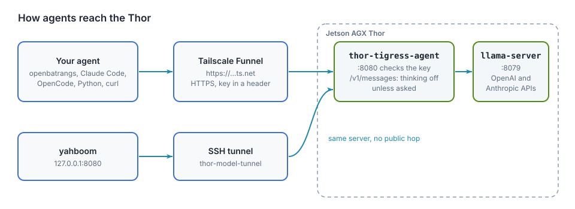

# Bring your own agent

Nemotron on the Thor is an API anyone with a key can call. Point the coding
agent you already use at it: Claude Code, openbatrangs, OpenCode, or anything
that speaks the OpenAI or Anthropic API.

| | |
|---|---|
| Address | `https://arpanpathak.taildb9a39.ts.net` |
| Models | Nemotron 3 Nano 30B-A3B, Q8_0, 1M-token context (`nemotron`); Qwen3.6-35B-A3B NVFP4 on TensorRT Edge-LLM, 32K-token context (`Qwen3.6-35B-A3B-NVFP4`); others can be loaded with `thor-tigress-serve` (chapter "Model serving") |
| Speed | about 53 tokens/s per reply; thinks before answering unless told not to (below) |
| OpenAI API | `/v1/models`, `/v1/chat/completions` |
| Anthropic API | `/v1/messages` (Claude Code) |
| Key | `Authorization: Bearer <key>` or `x-api-key: <key>` |

## Thinking on or off, per tool

Nemotron can reason before it answers. Reasoning is generated at the same
~53 tokens/s as the answer, so it costs seconds per step: helpful on hard
steps, wasted on easy ones. Each tool switches it differently:

| Tool | Thinking off | Thinking on | Default |
|---|---|---|---|
| Web chat | **Think** switch off | **Think** switch on | off |
| openbatrangs | `--no-think` | (nothing) | on |
| Claude Code | `claude-thor` (sets `MAX_THINKING_TOKENS=0`) | `claude-thor-think` | Claude Code asks for it |
| OpenCode | the `nemotron` model | the `nemotron-think` model; plan mode uses it | as configured |
| OpenAI SDKs, curl | `"chat_template_kwargs": {"enable_thinking": false}` | leave it out | on |
| Anthropic API (`/v1/messages`) | leave `thinking` out, or `"type": "disabled"` | `"thinking": {"type": "enabled"}` or `"adaptive"` | off |

llama-server ignores the Anthropic `thinking` field, so `thor-tigress-agent`
translates it: a `/v1/messages` request that doesn't ask for thinking gets
`enable_thinking: false`. Through the OpenAI path, Nemotron's own default
(thinking on) applies unless the request says otherwise.

## Get a key

Ask on the [invite screen](https://voltforge.tech/thor-tigress-cub/): give a
name and an email, then send a message on [LinkedIn](https://www.linkedin.com/in/arpan-pathak-272341424/)
or [X](https://x.com/arpanpathak1996). The author approves by hand and sends
back a key of your own. A key can be withdrawn at any time, after which
requests get `401`; no other key is affected.

Save it where the tools below look for it:

```bash
mkdir -p ~/.config/thor-chat
(umask 077; printf '%s\n' 'PASTE-THE-KEY' > ~/.config/thor-chat/api-key)
```

Before you start:

- The Thor serves four replies at a time, shared by everyone, including the
  web chat. When all four are busy, your request waits.
- Prompts and code you send are processed on the author's machine. Don't send
  secrets.
- There is no uptime promise. It is a developer kit on a home network.

## Check it works

```bash
K=$(cat ~/.config/thor-chat/api-key)
curl -s https://arpanpathak.taildb9a39.ts.net/v1/models -H "Authorization: Bearer $K"
```

It lists two models. `401` means the key is wrong or no longer valid.

Every request must name a model. `nemotron` and `nemotron-think` go to the
Nano, and the full id from `/v1/models` works too. Another model loaded with
`thor-tigress-serve` answers to its id. A missing or unknown name gets `400`
(chapter "Model serving").

## Claude Code

Claude Code speaks the Anthropic API, and both servers answer it: llama-server
and TensorRT Edge-LLM each serve `/v1/messages`. The agent on `:8080` picks the
engine from the model name, exactly as it does for the chat page, so a model on
either engine can be chosen. Two shell functions switch Claude Code to the Thor
only while they run; plain `claude` keeps using your Claude account.

`thor-models` lists what the agent is serving, and `-m` picks one. On Linux
`~/.bashrc`, on macOS `~/.zshrc`:

```bash
cat >> ~/.bashrc <<'EOF'

# Claude Code on the Thor through the agent on :8080. thor-models lists the
# models; claude-thor -m MODEL picks one. claude-thor is the thinking-off one.
THOR_URL=${THOR_URL:-http://127.0.0.1:8080}
THOR_MODEL=${THOR_MODEL:-nemotron}
THOR_CONTEXT=${THOR_CONTEXT:-65536}

thor-models() {
  local key out
  key=$(cat ~/.config/thor-chat/api-key 2>/dev/null)
  if ! out=$(curl -sf -m 15 -H "Authorization: Bearer $key" "$THOR_URL/v1/models" 2>/dev/null); then
    echo "cannot reach $THOR_URL" >&2
    echo "  start the tunnel:  ssh -L 8080:localhost:8080 thor" >&2
    echo "  or a public url:   export THOR_URL=https://arpanpathak.taildb9a39.ts.net" >&2
    return 1
  fi
  printf '%s' "$out" | python3 -c 'import json,sys
for m in json.load(sys.stdin)["data"]:
    print("  %-42s %s" % (m["id"], m.get("owned_by", "")))'
}

_claude_thor() {
  local model="$THOR_MODEL"
  case "${1:-}" in
    -m|--model) model="$2"; shift 2 ;;
    --model=*)  model="${1#--model=}"; shift ;;
  esac
  CLAUDE_CONFIG_DIR="$HOME/.claude-thor" \
  ANTHROPIC_BASE_URL="$THOR_URL" \
  ANTHROPIC_AUTH_TOKEN="$(cat ~/.config/thor-chat/api-key)" \
  ANTHROPIC_MODEL="$model" \
  ANTHROPIC_DEFAULT_OPUS_MODEL="$model" \
  ANTHROPIC_DEFAULT_SONNET_MODEL="$model" \
  ANTHROPIC_DEFAULT_HAIKU_MODEL="$model" \
  CLAUDE_CODE_MAX_CONTEXT_TOKENS="$THOR_CONTEXT" \
  claude "$@"
}

claude-thor()       { ( MAX_THINKING_TOKENS=0; _claude_thor "$@" ); }
claude-thor-think() { _claude_thor "$@"; }
EOF
source ~/.bashrc
thor-models
```

Then `claude-thor` for the default, or a model by name:

```bash
claude-thor -m Nemotron-3-Nano-30B-A3B-NVFP4     # the Nano on TensorRT Edge-LLM
claude-thor -m Qwen3.6-35B-A3B-NVFP4             # Qwen, also on Edge-LLM
claude-thor -m nemotron-think                    # the Nano on llama.cpp, thinking on
```

On a machine with the SSH tunnel (chapter "Local models"), `THOR_URL` stays
`http://127.0.0.1:8080` and skips the public hop. It must be 8080, not 8079:
only `thor-tigress-agent` turns Claude Code's `thinking` field into the chat
template setting, and only the agent knows which engine serves which model.

| Variable | Why |
|---|---|
| `CLAUDE_CONFIG_DIR=$HOME/.claude-thor` | its own settings, history and memory; without it both commands share `~/.claude`, so a setting changed in one applies to the other and `/resume` lists both |
| `ANTHROPIC_AUTH_TOKEN` | the key, sent as `Authorization: Bearer` |
| `ANTHROPIC_*_MODEL` | the model `-m` chose; every slot goes to it, and any name the agent serves is accepted |
| `CLAUDE_CODE_MAX_CONTEXT_TOKENS` | the real window; Claude Code assumes 200K for a model it doesn't know, and only compacts when it thinks it is near the limit |
| `MAX_THINKING_TOKENS=0` | Claude Code then sends no `thinking` field, so the Thor turns thinking off |
| `THOR_URL` | the agent: `:8080` through the tunnel, else the public address |
| `THOR_CONTEXT` | `65536` for a model on an engine, whose input length is half its `EDGE_CONTEXT`; `131072` for llama.cpp, whose `CONTEXT` is the per-reply window |

One limit is worth knowing before it bites. An engine refuses a request longer
than its `--max-input-len` with `413 EDGELLM_INPUT_TOO_LONG`, and Claude Code's
own system prompt and tool list are about 19,000 tokens before you type
anything. So an engine has to be built with more room than that: `EDGE_CONTEXT`
of at least `65536`, which is 32,768 tokens of input. llama.cpp has no such
wall; its context is the model's own, cut by `CONTEXT` per reply.

Two warnings are expected on the first run in `~/.claude-thor`: claude.ai
connectors are off, and the model name is not in Claude Code's own list. Neither
changes what works.

Measured on 2026-10-05 (Claude Code 2.1.290, from a Jetson Orin NX on Linux
through the public address, same prompt: "create a cargo project named dsa with a stack module
with unit tests, then run cargo test"):

| | Time | Tokens generated | Result |
|---|---|---|---|
| `claude-thor-think` | 207 s | about 11,000 | created the crate and the stack module; ran the tests |
| `claude-thor` | 75 s | about 900 | ignored the task and wrote a CLAUDE.md template instead |

A smaller task ("create hello.rs, compile it with rustc and run it") worked
in 29 s with thinking on. The honest summary: Claude Code's instructions are
long and written for Claude; Nemotron needs its reasoning to follow them, and
is then slow. For agent work on the Thor, openbatrangs (below) is the better
fit: its prompt is short, and a larger version of the same task (five
modules with tests) took 14 steps and 293 s, with all 14 tests passing.

To check requests reach the Thor, watch the server while it works:
`ssh thor 'journalctl --user -fu thor-chat'`.

## openbatrangs

[openbatrangs](https://github.com/arpanpathak/openbatrangs) is a terminal
coding agent that edits files and runs commands in the current folder. It
needs Rust (`curl https://sh.rustup.rs -sSf | sh`).

Linux and macOS (Intel or Apple silicon):

```bash
xcode-select --install       # macOS only: C compiler for the TLS library
cargo install --git https://github.com/arpanpathak/openbatrangs --locked
cd ~/some-project
openbatrangs --openai-url https://arpanpathak.taildb9a39.ts.net/v1 \
             --api-key-file ~/.config/thor-chat/api-key
```

To avoid typing that each time:

```bash
echo 'alias obr="openbatrangs --openai-url https://arpanpathak.taildb9a39.ts.net/v1 --api-key-file ~/.config/thor-chat/api-key"' >> ~/.zshrc   # ~/.bashrc on Linux
```

`--no-think` turns thinking off for faster steps; `--max-steps` raises the
limit of 40. The GPU panel is empty on a Mac, since it reads `tegrastats` or
`nvidia-smi`. The macOS build is checked on Linux, except for the TLS
library's C code, which needs Apple's compiler; it has not yet been run on a
Mac. On the Thor itself, and on any machine with the SSH tunnel,
`openbatrangs --thor` is enough
(chapter "Local models").

## OpenCode and other OpenAI clients

Anything with an OpenAI-compatible setting takes the base URL
`https://arpanpathak.taildb9a39.ts.net/v1` and the key. For OpenCode, use
the config in chapter "Local models" with that `baseURL`. Keep
`"chat_template_kwargs": { "enable_thinking": false }` on the build model:
with thinking on, OpenCode got long reasoning and no tool calls.

Python:

```python
from pathlib import Path
from openai import OpenAI

client = OpenAI(
    base_url="https://arpanpathak.taildb9a39.ts.net/v1",
    api_key=Path("~/.config/thor-chat/api-key").expanduser().read_text().strip(),
)
reply = client.chat.completions.create(
    model="nemotron",
    messages=[{"role": "user", "content": "Write a Rust function that reverses a string."}],
    extra_body={"chat_template_kwargs": {"enable_thinking": False}},
)
print(reply.choices[0].message.content)
```

Leave out `extra_body` to let it think first.

## How it is wired

<figure>

<figcaption><b>Figure 10.1</b> How agents reach the Thor.</figcaption>
</figure>

| Path | What `thor-tigress-agent` does |
|---|---|
| `/v1/models` | passes it to llama-server |
| `/v1/chat/completions` | streams it through; answers plain JSON when the request doesn't ask for streaming (the OpenAI SDKs' default) |
| `/v1/messages` | passes it to llama-server's Anthropic API, turning thinking off unless the request asks for it |
| `/v1/messages/count_tokens` | passes it through |

It accepts the key as `Authorization: Bearer` or `x-api-key`, and allows
calls from other sites (CORS), so a page hosted elsewhere can use the API with
a key. Everything else about exposure is in chapter "Security".
