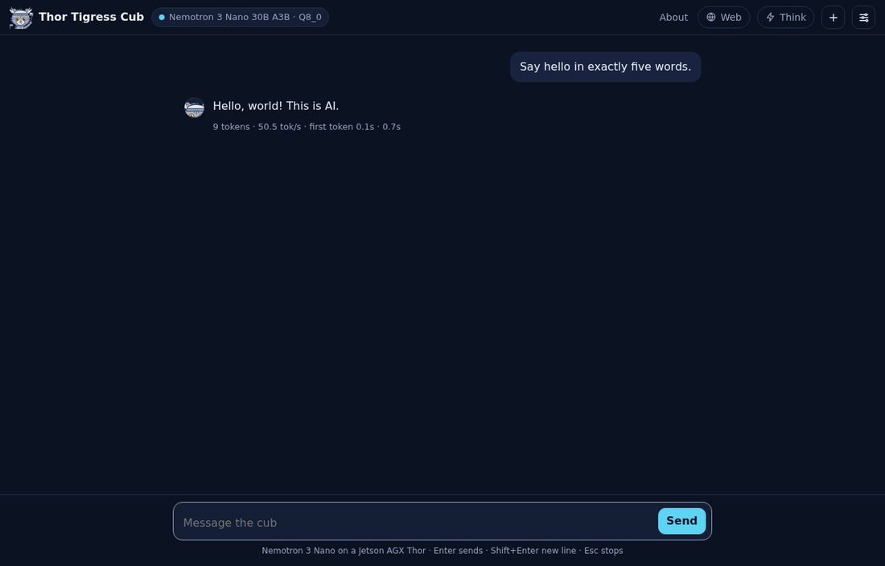

# Bring your own domain

The Thor is reachable at a Tailscale address such as
`https://arpanpathak.taildb9a39.ts.net`. It works, but it is long and says
nothing. This chapter puts the chat at an address you own:
**`https://voltforge.tech/thor-tigress-cub/`**, with a domain bought from
Namecheap, without opening a port at home and without any service in between
other than GitHub Pages and Tailscale.

<div class="covers">

This chapter covers

- why a custom domain can't point at the Thor directly, and the design that works
- moving the domain's DNS to Namecheap and pointing it at GitHub Pages
- the `voltforge.tech` repository and the build script that fills it
- checking every step, and what to do when one fails

</div>

## The idea

Tailscale Funnel only serves names under `.ts.net`; a domain of your own can't
be attached to it. So the domain serves the **page**, and the page calls the
**Thor** for every reply:

```text
voltforge.tech/thor-tigress-cub/      GitHub Pages: the page and the art
        │
        │ the page's script calls
        ▼
arpanpathak.taildb9a39.ts.net/v1/…    Tailscale Funnel
        ▼
thor-tigress-agent ─► llama-server ─► Nemotron, on the Thor
```

| Part | Holds | Costs |
|---|---|---|
| Namecheap | the domain and, from now on, its DNS records | the domain |
| GitHub Pages | the page, the About page, the art; no data, no keys | free |
| Tailscale Funnel | the HTTPS address of the Thor | free |
| The Thor | the model, the search engine, the key check | electricity |

The address bar shows `voltforge.tech` the whole time, because the page never
moves; only its requests go to the Thor. Your home IP address is never
published: GitHub serves the page, Tailscale relays the requests.

The other ways to do it, and why they were not picked:

| Way | Address bar | Why not |
|---|---|---|
| Namecheap URL redirect to the `.ts.net` address | changes to `.ts.net` | the domain is only a shortcut |
| Port forward on the router, Caddy on the Thor | `voltforge.tech` | publishes the home IP; needs a public IPv4, which many home connections don't have |
| A small rented server with Caddy, over Tailscale to the Thor | `voltforge.tech` | about $4–6 a month, and one more machine to keep updated |
| **GitHub Pages for the page, Funnel for the API** | **`voltforge.tech`** | chosen: free, nothing exposed at home |

## What the page needs from the Thor

Two things make the split work, both already in this repository:

1. **The page knows where the Thor is.** `jetson-thor/web/index.html`
   reads its server address from a tag:

   ```html
   <meta name="thor-api" content="">
   ```

   Empty means "the server this page came from", which is right on the Thor.
   The build script below fills in the Thor's public address for the copy on
   GitHub Pages.

2. **The Thor accepts requests from another site.** Browsers block a page on
   `voltforge.tech` from reading answers from `…ts.net` unless the server
   allows it (CORS). `thor-tigress-agent` answers the browser's preflight
   (`OPTIONS`) and adds `Access-Control-Allow-Origin: *` to every response.
   That is safe here because every model call needs the access key in a
   header; a site can't use a visitor's key without having it.

Check the second from any machine:

```bash
curl -si -X OPTIONS https://arpanpathak.taildb9a39.ts.net/v1/chat/completions \
  -H "Origin: https://voltforge.tech" -H "Access-Control-Request-Method: POST" | grep -i access-control
```

It prints the four `access-control-…` headers.

## Step 1: give the domain's DNS back to Namecheap

voltforge.tech currently uses another provider's nameservers. Records added in
Namecheap's Advanced DNS do nothing until Namecheap answers for the domain.

1. Sign in at namecheap.com → **Domain List** → **Manage** next to
   `voltforge.tech`.
2. **Nameservers** → choose **Namecheap BasicDNS** → the green tick to save.
3. Wait. Usually under an hour, at most 48 hours.

Check:

```bash
curl -s "https://dns.google/resolve?name=voltforge.tech&type=NS" | python3 -m json.tool | grep data
```

Done when it lists `dns1.registrar-servers.com` and `dns2.registrar-servers.com`.

## Step 2: point the domain at GitHub Pages

In Namecheap: **Manage** → **Advanced DNS** → **Host Records**. Delete the
parking records Namecheap adds by default (a `CNAME` for `www` to
`parkingpage.namecheap.com` and a `URL Redirect` for `@`), then add:

| Type | Host | Value |
|---|---|---|
| A Record | `@` | `185.199.108.153` |
| A Record | `@` | `185.199.109.153` |
| A Record | `@` | `185.199.110.153` |
| A Record | `@` | `185.199.111.153` |
| AAAA Record | `@` | `2606:50c0:8000::153` |
| AAAA Record | `@` | `2606:50c0:8001::153` |
| AAAA Record | `@` | `2606:50c0:8002::153` |
| AAAA Record | `@` | `2606:50c0:8003::153` |
| CNAME Record | `www` | `arpanpathak.github.io.` |

These are GitHub Pages' published addresses. Leave TTL on Automatic.

## Step 3: prove to GitHub that the domain is yours

This stops anyone else from claiming `voltforge.tech` on GitHub Pages if your
site is ever switched off.

1. GitHub → your picture → **Settings** → **Pages** → **Add a domain** →
   `voltforge.tech`.
2. GitHub shows a TXT record: host `_github-pages-challenge-arpanpathak`, and
   a value. Add it in Namecheap's Advanced DNS as a **TXT Record** with that
   host and value.
3. Back on GitHub, **Verify**. It can take a few minutes.

## Step 4: the `voltforge.tech` repository

The site lives in its own repository, so the domain doesn't touch your
portfolio at `arpanpathak.github.io` or this book's address. Its content is
generated:

```bash
cd ~/Projects
gh repo create arpanpathak/voltforge.tech --public --description "voltforge.tech: Thor Tigress Cub and more"
gh repo clone arpanpathak/voltforge.tech
~/Projects/thor-thunder-tigress-platform/jetson-thor/site/build.sh ~/Projects/voltforge.tech
cd ~/Projects/voltforge.tech
git add -A && git commit -m "Thor Tigress Cub at /thor-tigress-cub/" && git push -u origin main
```

`build.sh` writes:

| File | What |
|---|---|
| `CNAME` | `voltforge.tech`; tells GitHub Pages the domain |
| `index.html` | forwards `voltforge.tech/` to `/thor-tigress-cub/` |
| `thor-tigress-cub/index.html` | the chat page, with `thor-api` set to the Thor's public address |
| `thor-tigress-cub/about.html` | the About page: what it is, the numbers, how to get access |
| `thor-tigress-cub/cub.svg`, `cub.png` | the art; the PNG is the preview image when the link is shared |

`THOR_API=https://other.address/ ./build.sh DIR` builds for a different
server.

Turn on Pages for it:

```bash
gh api -X POST repos/arpanpathak/voltforge.tech/pages -f "source[branch]=main" -f "source[path]=/"
gh api -X PUT  repos/arpanpathak/voltforge.tech/pages -f cname=voltforge.tech
```

Or in the browser: the repository → **Settings** → **Pages** → Source
**Deploy from a branch**, `main`, `/ (root)` → Custom domain `voltforge.tech`
→ **Save**.

## Step 5: HTTPS

GitHub requests a certificate for `voltforge.tech` once the DNS from step 2
answers. That takes from a few minutes to an hour. Then:

```bash
gh api -X PUT repos/arpanpathak/voltforge.tech/pages -F https_enforced=true
```

or tick **Enforce HTTPS** on the Pages settings page.

## Check it

```bash
curl -sI https://voltforge.tech/ | head -3                     # 200, the forwarding page
curl -s  https://voltforge.tech/thor-tigress-cub/ | grep -o '<meta name="thor-api"[^>]*>'
curl -s  https://arpanpathak.taildb9a39.ts.net/health          # {"status":"ok"}
```

Then open `https://voltforge.tech/thor-tigress-cub/` in a browser:

<figure>

<figcaption><b>Figure 8.1</b> The GitHub Pages copy, tested from another address against the real Thor: 9 tokens at 50.5 tok/s, 0.7 s.</figcaption>
</figure>

Without a key it shows the invite screen; with one, the model chip names
Nemotron and replies stream as on the Thor's own address. The About page at
`/thor-tigress-cub/about.html` turns its badge to "The Thor is online" when
`/health` answers.

<figure>

<figcaption><b>Figure 8.2</b> The About page, for people who arrive from a shared link.</figcaption>
</figure>

## Updating the site

The chat page has one source, `jetson-thor/web/index.html`. After changing it:

```bash
~/Projects/thor-thunder-tigress-platform/jetson-thor/site/build.sh ~/Projects/voltforge.tech
cd ~/Projects/voltforge.tech && git add -A && git commit -m "Update the chat page" && git push
```

GitHub Pages publishes within a minute or two. The Thor's own copy needs no
step: it reads the same file.

## When a step fails

| Symptom | Cause | Fix |
|---|---|---|
| NS check still shows the old nameservers | change not saved, or not spread yet | re-check step 1; wait |
| `voltforge.tech` shows a Namecheap parking page | parking records still there | delete them (step 2) |
| GitHub: "Domain's DNS record could not be retrieved" | DNS not spread yet | wait, then **Check again** |
| "Enforce HTTPS" greyed out | certificate not issued yet | wait up to an hour after DNS works |
| Page loads, red dot "server not reachable" | the Thor or Funnel is down, or CORS missing | the `/health` and `OPTIONS` checks above |
| Page loads, browser console says "blocked by CORS policy" | `thor-tigress-agent` older than the CORS change | rebuild and restart it (chapter "Web chat") |

## What else the domain can carry

Each folder in the `voltforge.tech` repository is a path on the domain, so
other projects can live beside the cub (`voltforge.tech/<name>/`) without new
DNS records. A subdomain such as `chat.voltforge.tech` would need its own
repository with its own `CNAME` file and a `CNAME` record in Namecheap.
