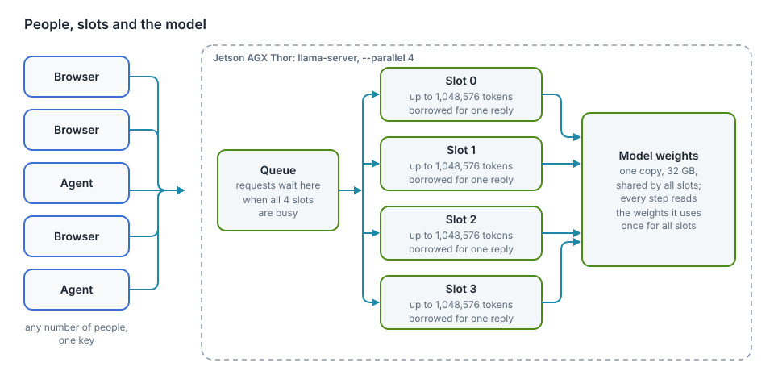
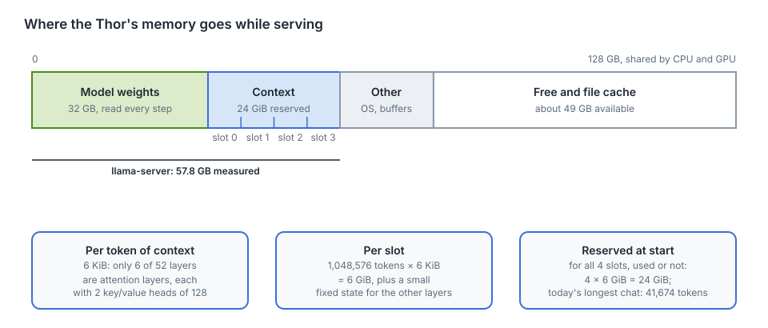
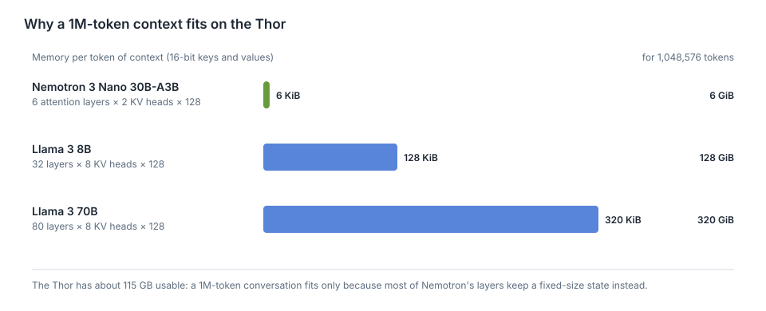

# Memory, context and slots

"1M context, 4 users" sounds like four people with a million tokens each.
In practice dozens of people chat with the same key, and the longest
conversation so far used 4% of a million tokens. This chapter explains what
those numbers mean, where the Thor's memory actually goes, how to change the
settings and what each change costs, and the limits that no setting can move.

<div class="covers">

This chapter covers

- three numbers people mix up: context window, slots, and users
- where the 128 GB goes, measured, and why a 1M-token context fits at all
- what is used right now
- every setting that changes memory or speed, with its effect
- the ceilings: memory, bandwidth, and the time it takes to read a long prompt

</div>

## Three numbers people mix up

| Term | What it is here | Set by |
|---|---|---|
| **Context window** | the most tokens one request can hold: the whole conversation sent in, plus the reply being written. 1,048,576 for each slot. | `CONTEXT`, the model's limit (1,048,576) |
| **Slot** | a place in llama-server where one reply is generated. 4 slots means 4 replies can be written at the same moment. | `USERS` (llama-server's `--parallel`) |
| **Users** | people with the key. Unlimited: the key is not a session, and a slot is not owned by anyone. | who you give the key to |

A token is a piece of a word: about 4 characters of English, a little less for
code.

## How people share four slots

<figure>

<figcaption><b>Figure 14.1</b> People, slots and the model.</figcaption>
</figure>

- **A conversation lives in the browser,** not on the Thor. Every message sends
  the whole history again.
- **A request borrows a free slot** for the time it takes to write one reply,
  then gives it back. The next message may land in a different slot.
- **When all four are busy,** a new request waits in the queue until one
  frees up. Nothing is refused for being busy.
- **A slot keeps the last conversation it read** (llama-server's prompt cache).
  If the same conversation comes back to the same slot, the part already read
  isn't read again, which shortens the wait before the first word.
- **All slots share one copy of the model.** Four slots don't mean four models
  in memory.

So "4 users" really means "4 replies at the same instant". Twenty people
chatting are rarely all waiting for a reply at the same moment; most of the
time they are reading or typing.

## Where the memory goes

<figure>

<figcaption><b>Figure 14.2</b> The Thor's memory while serving, from the measurements below.</figcaption>
</figure>

The Thor's CPU and GPU share 128 GB. Measured while serving on 2026-10-06:

| Part | Size | How we know |
|---|---|---|
| model weights | 32 GB | size of `NVIDIA-Nemotron-3-Nano-30B-A3B-Q8_0.gguf` |
| context for 4 slots × 1,048,576 tokens | 24 GiB | computed from the model file, below |
| llama-server in total | 57.8 GB | measured on the GPU when it started with 4 × 1M |
| everything in use on the Thor | 73 GB | `free -g` |
| available | 49 GB | `free -g` |

### What a token of context costs

To write the next token, the model looks back at every token before it. Layers
that do this by *attention* keep two small vectors per token, a key and a
value, for every token in the conversation: the **KV cache**. Its size grows
with the conversation.

Nemotron 3 Nano is a *hybrid*. Its file lists 52 layers, and only **6** of
them are attention layers, each with **2** key/value heads of size **128**.
The other layers are Mamba layers, which summarise everything read so far in a
state of fixed size, however long the conversation gets. So, with keys and
values stored as 16-bit numbers:

```text
6 layers × 2 (key and value) × 2 heads × 128 numbers × 2 bytes = 6,144 bytes = 6 KiB per token
6 KiB × 1,048,576 tokens = 6 GiB per slot
6 GiB × 4 slots          = 24 GiB
```

24 GiB plus the 32 GB of weights is about 56 GB; the measured 57.8 GB includes
llama-server's working buffers and the Mamba states, which are small and fixed
per slot.

### Why this is unusual

<figure>

<figcaption><b>Figure 14.3</b> Memory per token of context, from each model's published layer counts.</figcaption>
</figure>

A model built only from attention layers keeps keys and values in every layer.
Llama 3 8B, for example, has 32 layers with 8 key/value heads of 128: 128 KiB
per token, so one 1M-token conversation would need 128 GiB, more than the
Thor has. Nemotron's hybrid design is the reason a million tokens per slot fits
four times over.

### Reserved, not used

llama-server reserves the memory for every slot's full context **when it
starts**, whether anyone uses it or not. This avoids running out halfway
through a long conversation, at the cost of holding memory most chats never
touch. That's why the 24 GiB shows up even when the chat is idle.

## What is used right now

The size of the last request each slot handled, read from llama-server's
`/slots` on 2026-10-06:

| Slot | Tokens in its last request | Share of 1,048,576 |
|---|---|---|
| 0 | 2,597 | 0.25% |
| 1 | 5,670 | 0.5% |
| 2 | 20,970 | 2% |
| 3 | 41,674 | 4% |

Check it yourself on the Thor:

```bash
K=$(cat ~/.config/thor-chat/api-key)
curl -s "127.0.0.1:8079/slots?model=nemotron" -H "Authorization: Bearer $K" |
  python3 -c "import sys,json;[print(s['id'],s['n_ctx'],s['is_processing'],s.get('n_prompt_tokens')) for s in json.load(sys.stdin)]"
```

Conversations grow faster than they look: every message sends the whole
history again, a pasted file counts in full, and with **Think** on the
reasoning is kept in the history too (llama-server's "reasoning preserve",
on by default for this model).

## Tuning

All settings live in `~/.config/thor-chat/env` on the Thor; the file doesn't
exist yet, so the defaults apply. After a change:

```bash
thor-tigress-serve install                       # rewrites the service with the new settings and restarts it
journalctl --user -u thor-chat -n 20     # "n_slots = …, n_ctx_slot = …" and "model loaded"
```

A restart cuts replies in progress; do it when the slots are idle (chapter
"Web chat: Thor Tigress Cub").

### The settings and what they do

| Setting | Changes | Memory | Speed and users | Tested here |
|---|---|---|---|---|
| `USERS=N` (`--parallel`) | replies written at once | context memory × N/4 | more people answered without waiting; when many write at once, each reply gets slower and the total rises (bandwidth is shared) | 4 only; the benchmark in chapter "Reports" measures more |
| `CONTEXT=N` | longest conversation per slot | linear in N: 6 KiB per token per slot | none for short chats; a conversation longer than N is refused | 1,048,576 only |
| KV cache in 8 bits (`--cache-type-k q8_0 --cache-type-v q8_0`, needs flash attention, which is on) | how keys and values are stored | halves context memory: 3 KiB per token | usually a very small change in quality | no |
| `--kv-unified` | all slots share one pool of context memory | same total | one long conversation can use memory others aren't using | no |
| `--no-reasoning-preserve` | drops old reasoning from the history | none | conversations with **Think** on grow more slowly | no |
| a smaller model file (e.g. 4-bit instead of 8-bit) | the weights | 32 GB → about 18 GB | faster: fewer bytes read per token; somewhat lower quality | no |

`thor-tigress-serve` passes `USERS`, `CONTEXT` and `MODEL`. The other flags
would go in the default model's section, in the `presets` function of
`jetson-thor/model-serving/thor-tigress-serve`.

### Same memory, different shapes

Context memory is `USERS × CONTEXT × 6 KiB`. With the 24 GiB used today, the
same memory can be cut differently:

| `USERS` | `CONTEXT` | Context memory | Good for |
|---|---|---|---|
| 4 | 1,048,576 | 24 GiB | a few people, very long documents (today) |
| 8 | 524,288 | 24 GiB | |
| 16 | 262,144 | 24 GiB | a busy chat; 262K tokens is still about 600 pages |
| 32 | 131,072 | 24 GiB | many short chats at once |

More slots don't make a single reply faster; they let more replies run at
once. Whether that helps depends on how many people are waiting at the same
moment, which `/slots` shows.

## The ceilings

Three limits stay whatever the settings.

### 1. Memory: how much context fits

About 115 GB is usable. Take away 32 GB of weights and roughly 10 GB for the
operating system and buffers, and about **70 GB** is left for context:

| KV cache | Per token | Context that fits in 70 GB |
|---|---|---|
| 16-bit (today) | 6 KiB | about 11 million tokens in total, across all slots |
| 8-bit | 3 KiB | about 23 million tokens |

That is the total over all slots: 11 slots of 1M, or 44 of 256K. One
conversation can't exceed the model's own limit of 1,048,576 tokens.

### 2. Bandwidth: how fast tokens come out

Writing each token reads the weights it uses from memory. Nemotron 3 Nano
activates about 3.5 billion parameters per token, about 3.7 GB at 8 bits. At
273 GB/s:

```text
273 GB/s ÷ 3.7 GB per token ≈ 74 tokens/s at most for one reply; measured 53
```

When several replies run together, one read of the weights serves all of
them, so the total rises while each reply slows down. Chapter "Reports" has the
estimates (about 220 tokens/s in total at 16 replies) and the benchmark that
will measure them.

Long conversations add a second read: at every step, the attention layers read
the keys and values of every token so far, 6 KiB each. At 100,000 tokens of
context that is 0.6 GiB per step on top of 3.7 GB of weights; at 1M tokens,
6 GiB. **Estimate, not measured:** a reply deep into a 1M-token conversation
would come out at about 273 ÷ (3.7 + 6.4) ≈ 27 tokens/s at best, half the
speed of a short chat.

### 3. Reading time: how long before the first word

Before writing anything, the model reads the whole conversation. Measured on
the Thor on 2026-10-06, for prompts of 2,000 to 10,000 tokens: about **1,050
to 1,100 tokens per second** (10,100 tokens in 9.1 s). At that rate:

| Conversation | Reading time before the first word (estimate) |
|---|---|
| 10,000 tokens | about 9 s (measured) |
| 100,000 tokens | about 1.5 minutes |
| 1,048,576 tokens | about 16 minutes, and likely more, since reading slows as the context grows |

The prompt cache helps here: if the conversation returns to the slot that
already read it, only the new message is read. A different slot, or a full
queue that moved it, means reading it all again.

So a 1M-token context is real, and useful for one long document or a large
codebase read once and then questioned. It is not something every chat should
fill.

## What this means in practice

- Give the key to as many people as you like; four of them can be answered at
  the same instant, the rest wait seconds, not minutes, for normal chats.
- If people wait often, raise `USERS` and lower `CONTEXT` to keep memory the
  same (the table above).
- If the Thor needs memory for something else, such as training, lower
  `USERS × CONTEXT`, or stop the chat: `systemctl --user stop thor-chat`.
- Very long pastes are slow to start, whatever the setting.
