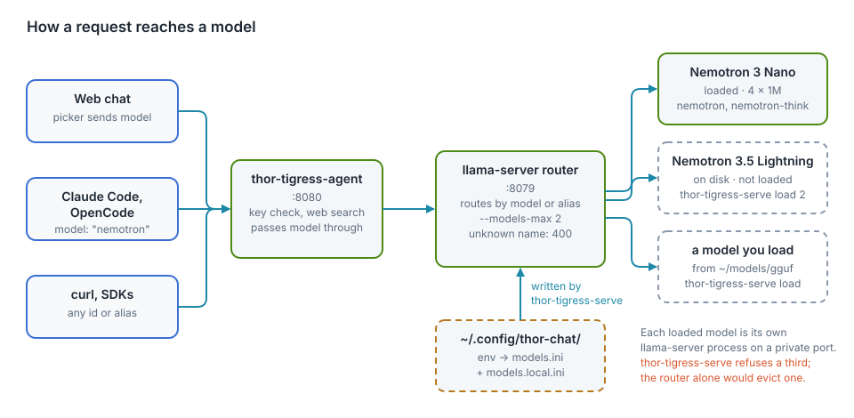
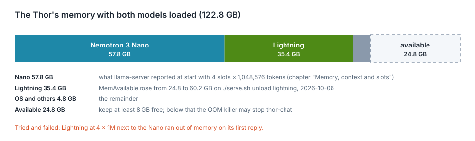

# Model serving

One command manages the models on the Thor: `thor-tigress-serve`. It shows
the models in a numbered list. You type a key and what to do with it: load,
unload, or download.

<div class="covers">

This chapter covers

- the list, and the three actions
- trying a new model from Hugging Face, start to finish
- the checks that keep the chat from running out of memory
- settings, and changing the default model
- what runs underneath
- the memory budget, measured, and models worth trying
- what goes wrong and how to tell

</div>

## The list

On the Thor (`ssh thor`):

```text
$ thor-tigress-serve

Thor: 59.4 GB free of 122.8 GB · keeps 8 GB free · at most 2 models loaded

  key  model                                          state                 size
  1    Nemotron 3 Nano 30B A3B · Q8_0                 loaded             33.6 GB  default (nemotron)
  2    Nemotron 3.5 Lightning 30B A3B · Q8_0          on disk            35.0 GB
  3    Qwen3.6 27B · Q4_K_M                           on disk            16.8 GB

Type a key and an action: "2 load", "1 unload", "5 download". Enter alone quits.
>
```

| State | Meaning | Actions |
|---|---|---|
| `loaded` | in memory; the web chat's picker offers it | `unload` |
| `on disk` | a GGUF file under `~/models/gguf/`, not in memory, not offered by the chat | `load` |
| `on Hugging Face` | shown by `thor-tigress-serve list-latest`; not downloaded yet | `download` |

The default model (the Nano) is always key 1. Every GGUF under
`~/models/gguf/` shows up without any setup, so Nemotron 3.5 Lightning is
one `2 load` away. It was unloaded on 2026-10-06 because its answers were
disappointing.

`l`, `u` and `d` work as short forms. After each action the list is shown
again; Enter alone quits.

## Try a new model, start to finish

This is the run of 2026-10-06, with the smallest model in the list, to test
the command. The model was deleted afterwards.

**1. See what is new.** `list-latest` adds the newest chat models from the
unsloth and ggml-org GGUF collections on Hugging Face:

```text
$ thor-tigress-serve list-latest
asking Hugging Face for the newest models…
  …
  4    Clef · Q8_0                                    on Hugging Face    28.7 GB  2026-10-02 · apache-2.0 · ggml-org/Clef-GGUF
  5    Clef Flash · Q8_0                              on Hugging Face     9.7 GB  2026-10-02 · apache-2.0 · ggml-org/Clef-Flash-GGUF
  …
  9    GLM 4.5 Air · Q4_K_M                           on Hugging Face    63.6 GB  2026-08-25 · mit · ggml-org/GLM-4.5-Air-GGUF
  …
  12   LFM2.5 VL 3B · Q8_0                            on Hugging Face     2.9 GB  2026-08-12 · other · unsloth/LFM2.5-VL-3B-GGUF
```

Each line shows the date the GGUF was published, the licence and the
repository. The list is already filtered:

- **Chat models only.** Embedding, image and video models are left out.
- **Architectures this llama.cpp can run.** They are read from
  `~/.local/src/llama.cpp/src/llama-arch.cpp`.
- **Models that fit the Thor alone.** Anything bigger is left out.
- **One quant per model.** The best of Q8_0, Q6_K, Q5_K_M, Q4_K_M and
  MXFP4 that fits in the memory free right now; if none fits, the smallest.
  A model that fits only without the Nano says "fits only after unloading
  the default".

**2. Download.** `12 download` saves it to
`~/models/gguf/LFM2.5-VL-3B/` with curl. An interrupted download resumes
when you run the same action again. The Thor downloads at about 69 MB/s.

```text
> 12 download
downloading LFM2.5-VL-3B-Q8_0.gguf into /home/arpanpathak/models/gguf/LFM2.5-VL-3B
downloaded 2.9 GB; it is now on disk, type its key and load to try it
```

**3. Load.** It is now `on disk`, with a new key:

```text
> 2 load
loaded in 2 s; sending one token to commit its memory
ready: 54.8 GB free
```

The web chat's picker offers it from now on, and so does the API under its
id (`LFM2.5-VL-3B-Q8_0`). A reply through the agent ran at 70 tok/s.

**4. Unload.** It leaves memory and the chat's list, and is `on disk` again:

```text
> 1 unload
unloaded: 4.6 GB freed, 59.4 GB free
off the chat page's list; still on disk
```

**5. Delete it** when you are done with it: `rm -r ~/models/gguf/LFM2.5-VL-3B`.

## The checks

Running out of memory takes the whole chat down (see "What went wrong once"
below), so `load` checks before and while it loads:

| Check | When | Measured on 2026-10-06 |
|---|---|---|
| no more than `MODELS_MAX` loaded | before | "not loaded: 1 loaded already, the most at once is 1 (MODELS_MAX); unload one first" |
| file size + 2 GB fits while keeping `MIN_FREE_GB` free | before | with `MIN_FREE_GB=200`: "not loaded: needs about 5 GB, only 0 GB can be used while keeping 200 GB free" |
| free memory stays above `MIN_FREE_GB` | while loading, every second | undoes the load |
| the same, while the model writes one token | after loading | undoes the load |

The last check exists because the Thor commits memory when it is first
used. A model can look loaded with memory to spare and still run out on its
first reply.

The first check matters because llama-server, when asked to load one model
too many, silently unloads the one used least recently. That can be the
Nano, everyone's default. `thor-tigress-serve` refuses instead.

Unloading the default asks first:

```text
> 1 unload
This is the default model: the chat stops answering until it is loaded again. Unload? [y/N]
```

These checks can't catch everything. A model given a long context can still
grow past the limit later, when a long conversation fills it. Models loaded
from disk get one reply at a time and 64K tokens of context for that reason.

## Settings

In `~/.config/thor-chat/env`, one `KEY=value` per line. The file is empty
on the Thor today, so the defaults apply.

| Setting | Default | What it does |
|---|---|---|
| `MODEL` | `~/models/gguf/Nemotron-3-Nano-30B-A3B/NVIDIA-Nemotron-3-Nano-30B-A3B-Q8_0.gguf` | the default model, always key 1, loaded at start, also called `nemotron` and `nemotron-think` |
| `USERS` | 4 | the default model's replies at once |
| `CONTEXT` | 1,048,576 | the default model's tokens per reply |
| `MODELS_MAX` | 2 | models in memory at once |
| `MIN_FREE_GB` | 8 | memory `load` keeps free |
| `PORT`, `MODEL_PORT`, `SEARCH_PORT` | 8080, 8079, 8888 | the page and API, llama-server, SearXNG |

A change to `MODEL`, `USERS`, `CONTEXT` or `MODELS_MAX` takes effect when
`thor-chat` restarts. That cuts off every reply being written, so wait until
nobody is mid-reply:

```bash
K=$(cat ~/.config/thor-chat/api-key)
until [ "$(curl -s "127.0.0.1:8079/slots?model=nemotron" -H "Authorization: Bearer $K" |
           python3 -c "import sys,json;print(sum(s['is_processing'] for s in json.load(sys.stdin)))")" = 0 ]; do sleep 2; done
systemctl --user restart thor-chat
```

To make another model the default, point `MODEL` at its file and restart.
The aliases `nemotron` and `nemotron-think` follow `MODEL`, so Claude Code
and OpenCode keep working; they get the new model under the old name.

## The other commands

| Command | What it does |
|---|---|
| `thor-tigress-serve install` | writes the two services (`thor-chat`, `thor-tigress-agent`), starts them at boot, and puts `thor-tigress-serve` in `~/.local/bin` |
| `thor-tigress-serve uninstall` | stops and removes both services |
| `thor-tigress-serve key` | writes a new access key; restart both services to use it |
| `thor-tigress-serve logs` | follows both logs |

The services run `thor-tigress-serve run` and `thor-tigress-serve agent`;
you don't run those by hand. On a fresh Thor, the first install is run from
the repository: `jetson-thor/model-serving/thor-tigress-serve install`.

## What runs

<figure>

<figcaption><b>Figure 7.1</b> How a request reaches a model.</figcaption>
</figure>

| Part | What it is |
|---|---|
| `thor-chat` | systemd user service: `thor-tigress-serve run`, llama-server in router mode on `127.0.0.1:8079` |
| one llama-server per loaded model | started by the router on a private port |
| `thor-tigress-agent` | systemd user service: `thor-tigress-serve agent`, the page, key check, web search and API on `:8080`; passes `model` through unchanged |
| `~/.config/thor-chat/models.ini` | the router's list of models; written by `thor-tigress-serve`, don't edit it |
| `~/.config/thor-chat/models.local.ini` | the models loaded from disk; written by `load`, emptied by `unload` |
| `jetson-thor/model-serving/thor-tigress-serve` | the command: one Python file, standard library only |

The router's rules, from llama.cpp's source
(`tools/server/server-models.cpp`, commit `8216c84`):

- **Names.** Every request names a model by id or alias. A missing name gets
  `400 model name is missing from the request`. An unknown one gets
  `400 model 'x' not found`.
- **Autoload.** A request for a listed model that isn't loaded loads it.
- **Limit.** Past `--models-max`, it unloads the least recently used model.
- **Reload.** `GET /models?reload=1` re-reads `models.ini`. A running model
  whose section is unchanged keeps running.

## The memory budget

<figure>

<figcaption><b>Figure 7.2</b> Where the memory went with both Nemotrons loaded, 2026-10-06.</figcaption>
</figure>

| Part | Size | How we know |
|---|---|---|
| Nemotron 3 Nano, 4 × 1,048,576 | 57.8 GB | llama-server's own report at start (chapter "Memory, context and slots") |
| Nemotron 3.5 Lightning, 1 × 262,144 | 35.4 GB | free memory before and after unloading it |
| OS, agent, SearXNG | 4.8 GB | the remainder |
| free with the Nano alone | about 59 to 60 GB | the list's header |

A process's own size (RSS) is no use here: the CPU and GPU share one
memory, and RSS leaves out the GPU buffers. The Nano's process shows 2.3 GB
while it costs 57.8 GB. What a model costs is the change in free memory when
it loads, which `load` and `unload` print.

### Estimate a model before downloading it

```text
memory ≈ file size + context + about 2 GB
```

What context costs per token depends on the architecture:

- **Hybrid Mamba models** (Nemotron 3 Nano, Lightning, Nemotron 3 Super)
  keep a full key/value cache for a few attention layers only. A million
  tokens costs a few GB per slot, which is why the Nano holds 4 × 1M.
- **Models with mostly sliding-window or linear attention** (gpt-oss, the
  `qwen35` architecture, whose llama.cpp code loads gated delta net layers,
  and Gemma 4) are cheap per token on most layers.
- **Dense models with full attention on every layer** (Devstral Small 2)
  can cost more for the context than for the weights at long context.

### Estimate its speed

Generating one token reads every **active** weight once, and the Thor reads
memory at 273 GB/s. The Nano reads about 3.4 GB per token (3.2B active ×
about 1.06 bytes at Q8_0) and makes 53.5 tok/s, about two thirds of the
273 / 3.4 ≈ 80 limit. So:

```text
tok/s ≈ 180 / (active parameters in billions × bytes per parameter)
bytes per parameter: Q8_0 ≈ 1.06, Q6_K ≈ 0.82, Q4_K_M ≈ 0.60, MXFP4 ≈ 0.53, IQ2 ≈ 0.30
```

This is an estimate calibrated on one model. A dense 27B model at Q8_0
reads 29 GB per token, so about 6 tok/s. That's why the fast models below
are mixtures of experts with few active parameters.

## Models worth trying

As of 2026-10-06. Sizes come from Hugging Face's file listings (unsloth GGUFs
unless noted), and every architecture was found in the Thor's llama.cpp.
**Speeds are estimates** from the formula above; only the Nemotrons were
measured. "Fits": **A** next to the Nano with 16 GB to spare, **B** next to
the Nano (about 50 GB), **C** alone. `list-latest` shows what is new since.

### About 30B total, about 3B active

| Model | Total / active | Context | Licence | Quant, size | Fits | tok/s |
|---|---|---|---|---|---|---|
| Nemotron 3 Nano (the default) | 30B / 3B | 1M | NVIDIA Nemotron Open Model License | Q8_0, 33.6 GB | loaded | 53.5 measured |
| Nemotron 3.5 Lightning (on disk) | 30B / 3B | 1M | OpenMDW-1.1 | Q8_0, 35.0 GB | B | 52.5 measured |
| Qwen3.6-35B-A3B | 34.7B / 3B | 256K | Apache-2.0 | Q8_0, 36.9 GB; Q4_K_XL, 22.4 GB | B | 55 (Q8_0) |
| gpt-oss-20b (OpenAI; ggml-org GGUF) | 20.9B / 3.6B | 128K | Apache-2.0 | MXFP4, 12.1 GB | A | 90 |

### Dense, 12B to 27B: strong per parameter, slow here

| Model | Params | Context | Licence | Quant, size | Fits | tok/s |
|---|---|---|---|---|---|---|
| Qwen3.8-27B | 27.3B | 256K | Apache-2.0 | Q8_0, 29.0 GB; Q4_K_M, 16.5 GB | B | 6 (Q8_0), 11 (Q4_K_M) |
| Devstral Small 2 (Mistral) | 23.6B | 384K | Apache-2.0 | Q8_0, 25.1 GB; Q4_K_M, 14.3 GB | B; Q4_K_M: A | 7 (Q8_0), 13 (Q4_K_M) |
| Gemma 4 12B | 11.9B | 256K | Apache-2.0 | Q8_0, 13.1 GB | A | 14 |

### Large mixtures of experts: alone, or next to the Nano at low quants

| Model | Total / active | Context | Licence | Quant, size | Fits | tok/s |
|---|---|---|---|---|---|---|
| Qwen3-Coder-Next | 80B / 3B | 256K | Apache-2.0 | Q4_K_M, 48.5 GB; Q8_0, 84.8 GB | Q4_K_M: B, barely; Q8_0: C | 100 (Q4_K_M), 55 (Q8_0) |
| gpt-oss-120b (OpenAI; ggml-org GGUF) | 116.8B / 5.1B | 128K | Apache-2.0 | MXFP4, 63.4 GB | C | 65 |
| Mistral Small 4 | 119B / 6B | 1M | Apache-2.0 | Q4_K_M, 73.8 GB | C | 50 |
| Nemotron 3 Super | 120.7B / 12B | 1M | NVIDIA Nemotron Open Model License | Q4_K_M, 82.5 GB | C | 25 |
| Qwen3.8-Flash-Next | 125B / 6B (+51B n-gram embedding) | 256K | Qwen Community 1.0 | UD-Q2_K_XL, 78.9 GB | C | 65; 2-bit loses quality |
| DeepSeek-V4-Flash-0731 | 284B / not stated in the GGUF card | 1M | MIT | UD-IQ1_M, 86.9 GB | C | not estimated; 1-bit loses a lot |
| GLM-5.3-Flash | 320B / 18B | 1M | MIT | UD-IQ1_M, 97.6 GB | C, barely | 33; 1-bit loses a lot |

### Too big for 128 GB at any quant

| Model | Total | Smallest GGUF |
|---|---|---|
| GLM-5.3 | 754B | UD-IQ1_M, 228.5 GB |
| Kimi K3 | 2.78T | UD-IQ1_M, 648.9 GB |

The models in `list-latest` are the ones unsloth and ggml-org publish. A
model from another repository can be tried by putting its GGUF under
`~/models/gguf/<name>/`; it then shows as `on disk`.

Benchmark claims come from the model makers and from roundups such as
[Thunder Compute's October 2026 list](https://www.thundercompute.com/blog/best-open-source-llms)
and [vdf.ai's local coding comparison](https://vdf.ai/blog/best-local-llm-for-coding/).
Nothing here was measured on our tasks.

## A newer llama.cpp

`list-latest` leaves out models whose architecture this llama.cpp doesn't
know. To get them, rebuild it. This wasn't run while writing this chapter,
and it rebuilds the binary every model uses:

```bash
cd ~/.local/src/llama.cpp
git pull
cmake --build build --config Release -j 14 --target llama-server
```

Then restart `thor-chat` with the wait-for-idle loop above, and update the
commit in chapter "Operations".

## What goes wrong

| You see | Cause | Do |
|---|---|---|
| `400 model name is missing from the request` | a client sends no `model` | send `nemotron` or an id from the list |
| `400 model 'x' not found` | a name that is no id or alias, or a model that is only on disk | load it first |
| `failed to load; see: journalctl …` | bad file, unknown architecture, or out of memory | `journalctl --user -u thor-chat -n 50` |
| `thor-chat … oom-kill` in the journal | memory ran out; the router and all models restart | load fewer or smaller models |
| the first reply from a model takes 15 to 30 s | someone asked for a listed model that wasn't loaded, so it loaded first | normal |
| `the model server said: …` | `thor-chat` isn't running or is restarting | `systemctl --user status thor-chat` |

## What went wrong once

On 2026-10-06, Lightning was first tried with the Nano's settings (4 × 1M)
next to the live Nano. Both loaded and memory still looked fine. On the first
reply it ran out, and the kernel's OOM killer stopped `thor-chat`. systemd
restarted it on a script that loaded both at 4 × 1M again, so it kept
failing. The chat was down from 20:49 to 20:52.

The checks in `load` (the memory floor, the one-token warm-up, refusing
instead of evicting) and the small default context for models loaded from
disk come from that.
