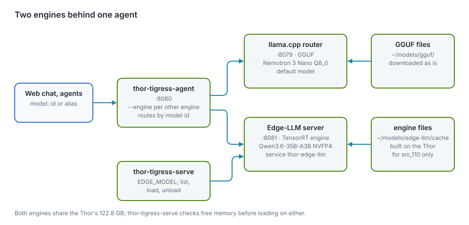
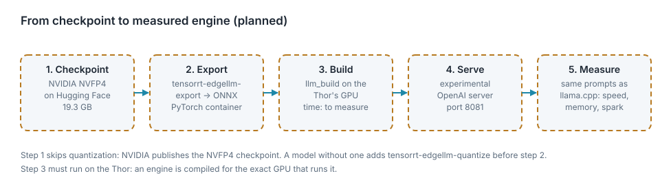

# TensorRT Edge-LLM (planned)

The Thor serves its models with llama.cpp today. NVIDIA's engine for the
Thor is TensorRT Edge-LLM. This chapter is the plan to test it against
llama.cpp, and the design for offering both engines if it wins.

**Status:** nothing is installed or built. The facts below come from
NVIDIA's documentation and release notes, read on 2026-10-06; each source is
named. The numbers to measure are listed, not guessed.

<div class="covers">

This chapter covers

- why Edge-LLM and not TensorRT-LLM
- what Edge-LLM supports on the Thor, and what is still experimental
- the system design for two engines behind one agent
- the build-and-test pipeline, step by step
- what to measure, and when Edge-LLM would replace llama.cpp
- the open questions and risks

</div>

## Why Edge-LLM

| Engine | On the Thor | Model format | Serving |
|---|---|---|---|
| llama.cpp (today) | built here from commit `8216c84` for sm_110 | GGUF (Nemotron 3 Nano Q8_0, 33.6 GB) | llama-server, OpenAI-compatible, router mode |
| TensorRT-LLM | not supported on Jetson; NVIDIA's forum points Thor users to Edge-LLM | TensorRT engines | `trtllm-serve` |
| TensorRT Edge-LLM | officially supported: JetPack 7.0/7.1 (CUDA 13.0) and 7.2 (CUDA 13.2) | TensorRT engines built on the device | experimental OpenAI-compatible server |

The Thor has TensorRT 10.16.2 and CUDA 13.2 installed (checked with `pip` and
`dpkg`). Edge-LLM isn't installed.

The reason to try it is speed. Generating a token reads every active weight
once, so speed follows the bytes read per token (chapter "Model serving",
"Estimate its speed"). NVIDIA publishes the Nano in NVFP4, a 4-bit format the
Thor's Blackwell GPU runs natively. It is 19.3 GB against 33.6 GB for our
Q8_0: about 0.61 bytes per parameter, so about 2 GB read per token for 3.2B
active. The same formula estimates about 90 tok/s against the 53.5 measured
today. That is an estimate from one calibration point, not a measurement.

The one published Thor result: in the MLPerf Inference v6.1 Edge Agentic
benchmark, Edge-LLM ran Qwen3.6-27B in NVFP4 at 52.33 output tokens/s, with
a median 247 ms to the first token, and finished 6.4 times faster than the
llama.cpp reference run (24 min 36 s against 2 h 37 min, 1,007 turns, inputs
up to about 23.5K tokens). That is a different model and workload from ours.

## What Edge-LLM supports

From the supported-models page and the release notes:

| Item | Status |
|---|---|
| Nemotron 3 Nano 30B-A3B | supported in NVFP4 (`nvidia/NVIDIA-Nemotron-3-Nano-30B-A3B-NVFP4`, 19.3 GB) since v0.7.0 |
| Nemotron 3.5 Lightning 30B-A3B | supported in NVFP4 (21.6 GB), with MTP and DFlash speculative decoding, since v0.10.0 |
| Nemotron 3 Super 120B-A12B | supported in NVFP4 |
| Mixture-of-experts and Mamba hybrids | supported for the listed models only |
| OpenAI-compatible server | experimental since v0.7.0; in-flight batching, single rank, since v0.11.0 |
| Python wheels for aarch64 | since v0.11.0 (2026-09-29), Python 3.10 to 3.12 |
| Latest release | v0.11.0, 2026-09-29 |

## System design

<figure>

<figcaption><b>Figure 16.1</b> Two engines behind one agent. Green runs today; dashed amber is planned.</figcaption>
</figure>

| Part | Today | Planned |
|---|---|---|
| `thor-tigress-agent` | one model server (`--model 127.0.0.1:8079`) | one per engine; each request goes to the engine serving the model it names; `/v1/models` merges both lists |
| llama.cpp router | `:8079`, GGUF files in `~/models/gguf/` | unchanged |
| Edge-LLM server | none | `:8081`, engines in `~/models/edge-llm/<model>/`, a systemd user service like `thor-chat` |
| `thor-tigress-serve` | llama.cpp only | `list` gets an engine column; `load NAME --engine edge-llm`; a `build` step for engines |
| memory checks | cover llama.cpp's models | cover both engines: one Thor, 122.8 GB |

Design rules:

- **Clients don't change.** The web chat, Claude Code and OpenCode keep
  sending a model name to `:8080`. Which engine serves it is the agent's
  business.
- **One model, one engine at a time.** The Nano in Q8_0 on llama.cpp (57.8 GB
  with 4 × 1M context) and the Nano in NVFP4 on Edge-LLM side by side may not
  fit. The test runs Edge-LLM with the llama.cpp Nano unloaded, at a quiet
  hour.
- **Engines are built, not downloaded.** A TensorRT engine is compiled for
  the exact GPU that runs it, so every engine is built on the Thor.

## The pipeline

<figure>

<figcaption><b>Figure 16.2</b> From checkpoint to measured engine.</figcaption>
</figure>

The commands follow the Jetson AI Lab tutorial and the Edge-LLM docs. None
were run here yet.

**1. Tools.** NVIDIA's PyTorch container for export, and the C++ runtime
built on the Thor:

```bash
docker pull nvcr.io/nvidia/pytorch:26.05-py3
git clone https://github.com/NVIDIA/TensorRT-Edge-LLM.git
cd TensorRT-Edge-LLM && git submodule update --init --recursive
mkdir build && cd build
cmake .. -DCMAKE_BUILD_TYPE=Release -DTRT_PACKAGE_DIR=/usr \
  -DCMAKE_TOOLCHAIN_FILE=cmake/aarch64_linux_toolchain.cmake \
  -DEMBEDDED_TARGET=jetson-thor -DCUDA_CTK_VERSION=13.0 -DENABLE_CUTE_DSL=ALL
make -j"$(nproc)"
```

The tutorial passes `-DCUDA_CTK_VERSION=13.0`; the Thor has CUDA 13.2.
Whether that matters is the first thing to check.

**2. Checkpoint and export.** NVIDIA publishes the Nano already in NVFP4,
so the quantize step is skipped. The export takes a checkpoint folder:

```bash
hf download nvidia/NVIDIA-Nemotron-3-Nano-30B-A3B-NVFP4 --local-dir ~/models/edge-llm/nemotron-3-nano/checkpoint
tensorrt-edgellm-export ~/models/edge-llm/nemotron-3-nano/checkpoint ~/models/edge-llm/nemotron-3-nano/onnx
```

**3. Build the engine** on the Thor:

```bash
./build/examples/llm/llm_build --onnxDir ~/models/edge-llm/nemotron-3-nano/onnx \
  --engineDir ~/models/edge-llm/nemotron-3-nano/engine
```

**4. Serve.** The experimental server, on a port of its own:

```bash
python -m experimental.server --model <engine or checkpoint> --port 8081
```

**5. Measure.** First with the C++ benchmark tool
(`./build/examples/llm/llm_bench --engineDir … --mode generation`), then
through the server with the same requests sent to llama.cpp.

## What to measure

Each with the date, the Edge-LLM version, the precision, the context size
and the number of slots, as for every number in this book.

| Measure | How | llama.cpp today |
|---|---|---|
| generation speed, one reply | the Rust prompt from chapter "Model serving", 600 tokens, thinking off | 53.5 tok/s |
| generation speed, four replies at once | four requests together; tok/s each and in total | to measure |
| time to first token | prompts of 1K and 23.5K tokens | to measure |
| memory | `MemAvailable` before and after starting the server | 57.8 GB (4 × 1M) |
| longest context that loads | raise until it fails | 1,048,576 per slot × 4 |
| answer quality | spark scores on the same 20 prompts; compile rate of the Rust answers | to measure |
| export and build time | wall clock for steps 2 and 3 | none (GGUF is downloaded as is) |
| disk | ONNX plus engine size | 33.6 GB |
| stability | the server under the chat's normal use for 24 hours | to measure the same way |

**Edge-LLM becomes the default engine for a model only if:**

- it generates at least 1.5 times faster on one reply and on four,
- spark scores and compile rates are no worse,
- it fits with at least 8 GB free at the context the chat needs,
- and its server handles thinking and tool calls (below) for 24 hours
  without a restart.

## Open questions and risks

| Question | Why it matters | How to find out |
|---|---|---|
| Does the experimental server stream `reasoning_content` and honour `chat_template_kwargs.enable_thinking`? | the chat's **Think** switch and the thinking panel depend on it | send the chat's own request and read the stream |
| Does it support tool calls? | the **Web** switch runs a `web_search` tool loop in the agent | a request with `tools` |
| How long a context can the engine hold, and at what memory cost? | the Nano is served with 1M tokens per slot | step 5, "longest context" |
| Does the server rebuild everything it serves? | an open issue (NVIDIA/TensorRT-Edge-LLM #233, v0.11.0 on a Thor) reports the server building unneeded parts for about 30 minutes, then failing | build first with `llm_build`, then point the server at the engine |
| CUDA 13.0 in the build flags, 13.2 on the Thor | a mismatch could fail the build | step 1 |
| Shared GPU | export and build are long GPU jobs on the Thor everyone's chat runs on | run in a time window the owner sets, with the Nano unloaded |

## Sources

- [TensorRT Edge-LLM supported models](https://nvidia.github.io/TensorRT-Edge-LLM/user_guide/getting_started/supported-models.html)
- [TensorRT Edge-LLM support matrix](https://nvidia.github.io/TensorRT-Edge-LLM/user_guide/getting_started/support-matrix.html)
- [TensorRT Edge-LLM releases](https://github.com/NVIDIA/TensorRT-Edge-LLM/releases)
- [Jetson AI Lab: TensorRT Edge-LLM on Jetson](https://www.jetson-ai-lab.com/tutorials/tensorrt-edge-llm/)
- [NVIDIA blog: Edge-LLM completes the MLPerf Edge Agentic benchmark 6.4× faster on Jetson AGX Thor](https://developer.nvidia.com/blog/tensorrt-edge-llm-completes-the-mlperf-edge-agentic-benchmark-6-4x-faster-on-jetson-agx-thor/)
- [Issue #233: tensorrt-edgellm-serve on Thor](https://github.com/NVIDIA/TensorRT-Edge-LLM/issues/233)
- [NVIDIA forum: TensorRT-LLM engines on Jetson Thor](https://forums.developer.nvidia.com/t/how-to-serve-tensorrt-llm-engines-with-triton-inference-server-on-jetson-thor-and-compare-inference-speed-with-vllm-container/358802)
