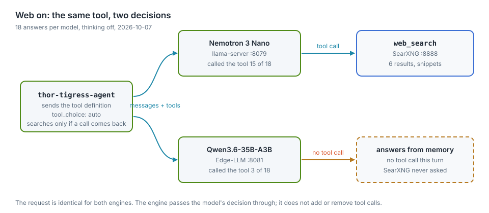
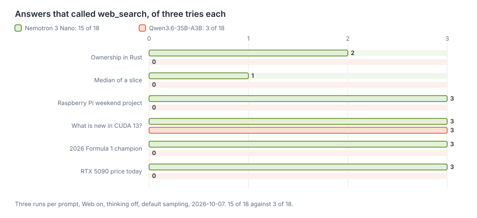

# Model comparison

The chat serves two models: Nemotron 3 Nano 30B-A3B on llama.cpp, and
Qwen3.6-35B-A3B on TensorRT Edge-LLM (chapter "TensorRT Edge-LLM"). The picker
sends whichever one the reader chose. Both get the same **Web** switch, and the
switch turns out to mean different things on the two models.

On 2026-10-07 the chat was asked the same six questions three times each, with
Web on. Nemotron called `web_search` in 15 of its 18 answers. Qwen called it in
3, all of them the same question. The rest of this chapter is that measurement,
the two answers to one question whose answer was not in either model's weights,
and what the difference means for the chat.

Status, 2026-10-07: both models are live. The difference is a property of the
models. The agent and both engines handle tool calls correctly, and the run
where Qwen did search went through end to end.

This chapter covers

- what the Web switch does, and what it does not do
- how often each model called `web_search`, over 18 answers each
- the answer to a question whose answer could not be in the weights
- a line added to ask Qwen to search, and what it changed
- what to measure before choosing the model for the chat

## The switch offers a tool

<figure>

<figcaption><b>Figure 17.1</b> Both models receive the same request; each decides for itself whether to call the tool.</figcaption>
</figure>

The page sends `thor_web_search: true`. The agent adds the `web_search`
definition to the request's `tools` and sends the request to the engine that
serves the chosen model. It does not set `tool_choice`, so that field keeps its
default, `auto`. The model answers with a tool call, or with text.

`thor-tigress-agent` runs a tool only when a tool call arrives (`search_loop` in
`crates/thor-tigress-agent/src/chat.rs`). If the model answers with text
instead, that text is streamed to the page and SearXNG is never asked. The
**Web** switch grants permission to search. It is not an instruction to search,
and it does not search on its own.

## What was measured

| Item | Value |
|---|---|
| Date | 2026-10-07, 00:52 to 01:01 PDT |
| Nemotron | 3 Nano 30B-A3B, Q8_0, llama.cpp `8216c84`, llama-server `:8079` |
| Qwen | 3.6-35B-A3B, NVFP4, TensorRT Edge-LLM 0.11.0, `:8081` |
| Request | the chat page's: stream, thinking off, `thor_web_search: true`, no token limit, default temperature |
| Runs | six prompts, three times each, per model: 18 answers per model |
| Counted | answers in which the model called `web_search` at least once |

| Prompt | Nemotron | Qwen |
|---|---:|---:|
| Explain ownership in Rust | 2 of 3 | 0 of 3 |
| Write a Rust function that returns the median of a slice | 1 of 3 | 0 of 3 |
| Plan a weekend project for a Raspberry Pi | 3 of 3 | 0 of 3 |
| What is new in CUDA 13? | 3 of 3 | 3 of 3 |
| Who won the 2026 Formula 1 World Championship? | 3 of 3 | 0 of 3 |
| What is the price of an RTX 5090 today? | 3 of 3 | 0 of 3 |
| **all six** | **15 of 18** | **3 of 18** |

<figure>

<figcaption><b>Figure 17.2</b> Answers that called `web_search`, of three tries each.</figcaption>
</figure>

Nemotron searched for most questions, including ones it could have answered from
training. Qwen searched only on the CUDA 13 question and answered the other five
from what it already knew.

The CUDA row matters for the code. It shows Qwen's half of the path is not
broken: Edge-LLM parsed the call, the agent ran it against SearXNG, and the
reply used the results. Qwen is not unable to search. It chooses not to.

## A question whose answer cannot be in the weights

"What is the price of an RTX 5090 today?" is the clearest of the six. A price
changes weekly, so neither model can have today's price in its weights. The only
way to answer it is to look.

Qwen, Web on, no search:

> The NVIDIA GeForce RTX 5090 has not been officially released yet, so there is
> no official MSRP (Manufacturer's Suggested Retail Price) or confirmed retail
> price available today. As of early 2024, the current flagship is the RTX 4090.
> Rumors and leaks suggest the RTX 50-series (codenamed "Blackwell") will likely
> launch in late 2024 or early 2025.

Nemotron, Web on, one search:

> I don't have access to real-time pricing data, and my knowledge only extends
> up to July 2024. As of that time, NVIDIA had not announced an RTX 5090 ...

Qwen wrote a confident answer about a world two years out of date; the card has
been on sale since before this chapter. Nemotron admitted its cutoff. Neither
gave the price, because Nemotron searched and then did not use what it found
well. That is a second problem with its own fix (the planned `fetch_page` tool in
chapter "Tool calling (planned)", and a task that checks whether the answer used
its sources). The first problem is here: a model that does not search cannot be
right about today, and the reader cannot tell from the answer that no search
happened.

## Asking Qwen to search

If the cause were the switch's wording, a clearer instruction would fix it. On
2026-10-07 the agent gained one system line, added only when Web is on, just
before the tool loop:

> When web search is available, use the web_search tool for anything about
> current events, releases, prices, or facts you are not certain of.

The same 18 Qwen answers were then repeated, once through the changed agent and
once through a copy of the pre-change binary on a second port:

| Qwen, Web on, 18 answers | Answers that searched |
|---|---:|
| before the line | 4 |
| after the line | 3 |

One answer in eighteen. At this sample size that is noise. A system message does
reach the model: asked through the agent, with a system message to answer with
exactly one word, `BANANA`, Qwen said `BANANA`. It follows an instruction about
the answer's form and still decides for itself whether to search. The line stays
in the agent because it is short and costs nothing per answer. It is not the fix.

The fix that is guaranteed is `tool_choice: "required"` on the first round. That
takes the decision away from the model: every Web-on answer would search,
including "explain ownership in Rust". The trade is a search on every turn, with
its latency, for a search on the turns that need one. The project did not take
it.

## It is the model, not the server

Three measurements point at the model:

- the same agent, tool schema and temperature produce 15 of 18 and 3 of 18;
- Edge-LLM honors a direct system instruction, and its `--tool-call-parser auto`
  read Qwen's calls in the CUDA runs;
- Qwen calls the tool when the user's own message makes searching the obvious
  next step, and skips it on an ordinary question.

Tool calling is learned behaviour, and models learn it unevenly. A smaller model
can be more willing to look something up; a newer, stronger model can be more
confident that it already knows. For a question about the world, that willingness
is part of the model's quality, next to speed and writing style. Nemotron lost
the speed and the Rust-task comparison in the Edge-LLM chapter, and it wins this
one.

## What it means for the chat

- The **Web** switch, as worded, reads as "search this". With a model that does
  not search, the label is misleading. The choices are to word it as a
  permission, to force the search, or to make a searching model the default.
- Model choice is not only tokens per second and code quality. Qwen is faster
  and better on the Rust tasks; the older Nano is ahead at looking things up.
  Which matters more depends on the question, and the chat has one switch for
  both.
- The evaluation task set (chapter "Evaluation design (planned)") should hold at
  least one question whose answer cannot be in the weights: a price today, a
  release after the training cutoff, a score from yesterday. A model that answers
  it without searching fails it, whatever its speed.

## Not measured

- thinking on, and a temperature below the default
- other models, and the Nano on Edge-LLM (chapter "TensorRT Edge-LLM")
- how often the search results were used in the answer, not only fetched
- several readers at once

## Sources

- `crates/thor-tigress-agent/src/chat.rs`: `Mode::Search`, `offer_tools`,
  `search_loop` and the `SEARCH_HINT` line
- chapter "Tool calling (planned)": the loop, `web_search`, and the planned
  `fetch_page`
- chapter "TensorRT Edge-LLM": the two engines, and Qwen's speed and Rust-task
  numbers
- the runs: six prompts, three times each, both models, on the Thor, 2026-10-07
