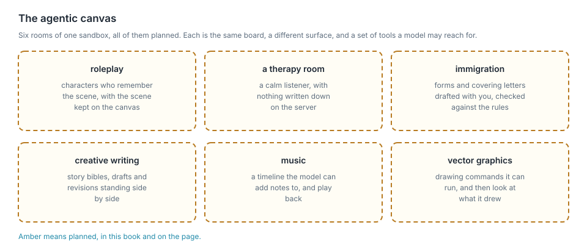

# Thor Tigress Cub

**thor-tigress-cub-junior · Haloom!**

I live in a studio apartment in Seattle, and the heating has never been generous.
Last autumn I cleared a corner of the desk for a Jetson AGX Thor: one board,
128 GB of memory shared between its processor and its graphics chip, about the
size of a hardback book. It answers at fifty-odd tokens a second. While it works
it runs warm, and I did briefly hope it would take the edge off the cold. It
does not; the room still needs the radiator. Five of these boards now run as a
cluster, which is how capacity grows here: another board, another set of windows,
the same page.

The page is at [`voltforge.tech/thor-tigress-cub`](https://voltforge.tech/thor-tigress-cub).
You open it, type a question, and watch the answer arrive word by word: the
reasoning folded into a line you can open, code blocks coloured, the speed
written underneath. It costs nothing, it asks for no account, and your
conversation stays in your own browser.

## What it becomes

The launch is close, and this is where it goes next: an **agentic canvas**, a
sandbox where a model works on a surface instead of in a chat box, with tools it
may reach for.

<figure>

<figcaption><b>Figure 24.1</b> The canvas: six rooms, all planned, all on the same board.</figcaption>
</figure>

| | |
|---|---|
| roleplay | characters who remember the scene, with the scene kept on the canvas |
| a therapy room | a calm listener, with nothing written down on the server |
| immigration | forms and covering letters drafted with you and checked against the rules |
| creative writing | story bibles, drafts and revisions standing side by side |
| music | a timeline the model can add notes to and play back |
| vector graphics | drawing commands it can run and then look at |

The book marks what exists in green and what is planned in amber. The canvas is
amber, and it is the reason the rest of this chapter exists: the chat is the
first surface, and these six are the ones I am building toward.

## What the chat does today

- **Answers and streams.** Ask in English, Rust, or whatever language you paste
  at it, and the reply arrives as it is written.
- **Searches the web** when you turn **Web** on, and lists the sources it used.
- **Thinks first** when you turn **Think** on: the reasoning appears folded above
  the answer, and you can open it.
- **Picks a model** from the ones loaded, two at a time, across two engines.
- **Works from a coding agent.** The API speaks both OpenAI's and Anthropic's
  shapes, so Claude Code, OpenCode and openbatrangs point at it with a base URL
  and a key.
- **Wears eleven themes**, from Paper and Night to Solarized, Nord, Dracula, One
  Dark, Gruvbox, Monokai and Material Deep Ocean, and follows your device until
  you choose one.
- **Fits a phone**, composer, threads and all.

<figure>

<figcaption><b>Figure 24.2</b> The first screen, in Paper.</figcaption>
</figure>

<figure>

<figcaption><b>Figure 24.3</b> A reply in Night, with the reasoning folded away, code highlighted, and the speed underneath.</figcaption>
</figure>

<figure>

<figcaption><b>Figure 24.4</b> The same page on a 390-pixel-wide phone.</figcaption>
</figure>

## Asking for a key

One key opens the chat, and each person gets their own. Leave a name and an
email on the invite screen, then send me a message:
[LinkedIn](https://www.linkedin.com/in/arpan-pathak-272341424/) or
[X](https://x.com/arpanpathak1996). I approve the request by hand and send the
key back. There is no sign-up, no password, and no company in the middle.

<figure>

<figcaption><b>Figure 24.5</b> The door: what someone without a key meets. The picture predates the name-and-email form and the DM links, which chapter "Web chat: Thor Tigress Cub" describes.</figcaption>
</figure>

Until this week a single key opened the door for everybody. Now a key can be
given and taken back one person at a time.

## What the board keeps

The conversation belongs to your browser, and it stays there. The board holds
three things:

| Where | What | Until |
|---|---|---|
| your browser | the conversation, the settings, your key | you clear site data or press **+** |
| the board's memory | the conversation a window is answering, so the next message on it is not read twice | the model process restarts or unloads |
| the board's disk | one encrypted file: the name, email, status and key from the invite screen | the record is deleted |

The chat server writes one file, the keyring, and a keyring record has no field
for a message (`crates/thor-tigress-keyring/src/store.rs`). Once an answer is
sent, the request is gone; the operating system keeps its usual short journal,
as it does for every service on the machine.

<figure>

<figcaption><b>Figure 24.6</b> The three places anything is held.</figcaption>
</figure>

The page sets no cookie of its own, carries no analytics and no advertising, and
asks for no login.

## How a key is checked

<figure>

<figcaption><b>Figure 24.7</b> The two keys, and where each one stops.</figcaption>
</figure>

1. The invite screen posts a name and an email to `POST /request`, and the
   record waits with no key.
2. `thor-tigress-serve keyring approve EMAIL` gives that person 24 random bytes
   and prints them once as 48 hex characters.
3. The page keeps the key in local storage and sends it as
   `Authorization: Bearer <key>`. Coding agents send the same header, or
   `x-api-key`.
4. `thor-tigress-agent` compares the key against every active key in the
   keyring, in constant time. A key that matches nothing leaves with `401`
   before a model is reached.
5. A request that matches travels to the model you picked under the service key,
   and the model server checks that one again. Personal keys never go that far.

The keyring itself is sealed with Argon2id and XChaCha20-Poly1305. Chapter
"Keys, and the cryptography under them" opens the file and explains both
algorithms, along with the four things they cannot protect.

## How many people it can serve

A loaded model keeps its weights and a pool of windows. The default model takes
33.6 GB of weights and about 24 GiB for four million-token windows; the two
together measured 57.8 GB while the chat was serving, against 128 GB on the
board. How that pool is cut is a setting. On one board it is cut like this:

| Windows open at once | Tokens each | Pool |
|---|---|---|
| 4 | 1,048,576 | 24 GiB |
| 8 | 524,288 | 24 GiB |
| 16 | 262,144 | 24 GiB |
| 32 | 131,072 | 24 GiB |

The arithmetic is `windows × tokens × 6 KiB`, and memory is the ceiling: ask for
longer conversations and fewer fit at once, ask for more at once and each is
shorter. One conversation can reach a million tokens, about three novels. How
many people hold a key has no limit at all, because a window belongs to a reply.
When every window is busy, the next request waits in the queue.

Beyond one board, the cluster is the answer. Five boards run here, each with its
own windows and its own loaded models, which is how the chat grows: another
board, another set of windows, the same page in front of it. Chapter "Memory,
context and slots" has the measurements behind the table.

There is no daily allowance and no per-person quota. Someone with a key can keep
a board occupied for as long as they keep asking, and the answer to that is a
revoked key. The boards run warm while they work, which in a cold studio is a
small consolation and no substitute for the radiator.

## What it is made of

`thor-tigress-serve list` prints the models on the boards:

```text
$ thor-tigress-serve list

Thor: 59.3 GB free of 122.8 GB · keeps 8 GB free · at most 2 models loaded

  key  model                                          state                 size
  1    Nemotron 3 Nano 30B A3B · Q8_0                 loaded             33.6 GB  default (nemotron)
  2    Nemotron 3.5 Lightning 30B A3B · Q8_0          on disk            35.0 GB
  3    Qwen3.6 27B · Q4_K_M                           on disk            16.8 GB
  4    Qwen3.6 35B A3B NVFP4                          loaded             23.4 GB  TensorRT Edge-LLM · :8081
```

Two of them answer today. `thor-tigress-serve load 2` brings a third into memory
when the memory allows, and the picker offers it from then on. The default, the
Nano, answers at about 53 tokens a second and holds a million tokens of
conversation; Qwen3.6 35B A3B runs on TensorRT Edge-LLM instead of llama.cpp,
and chapter "Model comparison" sets the two side by side on the same questions.

<figure>

<figcaption><b>Figure 24.8</b> How a message reaches a model. Chapter "Web chat: Thor Tigress Cub" draws the same road, and chapter "TensorRT Edge-LLM" adds the second engine.</figcaption>
</figure>

| Piece | What it does | Listens on |
|---|---|---|
| `llama-server`, router mode | one process per loaded GGUF model: the Nano, Lightning and Qwen 27B | `127.0.0.1:8079` |
| TensorRT Edge-LLM | a second engine, for Qwen3.6 35B A3B in NVFP4 and its successors | `127.0.0.1:8081` |
| `thor-tigress-agent` | the page, the model picker, the OpenAI and Anthropic APIs, the keys, the invite form | `127.0.0.1:8080` |
| SearXNG | web search, when **Web** is on | `127.0.0.1:8888` |
| Tailscale Funnel | HTTPS from the internet to port 8080, and to nothing else | public |

On a board, everything lives under `~/.config/thor-chat/`:

| File | Contents |
|---|---|
| `models.ini` | the router's list of models, written by `thor-tigress-serve` |
| `env` | `MODEL`, `USERS`, `CONTEXT`, `MODELS_MAX`, `EDGE_MODEL`, ports |
| `api-key` | the key the agent and the model servers use between themselves |
| `keyring` | who may chat, sealed |
| `keyring-passphrase` | what opens the keyring |

One command, `thor-tigress-serve`, manages all of it:

| Task | Command |
|---|---|
| find, load, unload, download a model | `list`, `list-latest`, `load KEY`, `unload KEY`, `download KEY` |
| install the services and start them at boot | `install` |
| create the keyring | `keyring-init` |
| see who asked, approve, revoke | `keyring requests`, `keyring approve EMAIL`, `keyring revoke EMAIL`, `keyring revoke-all` |
| follow the logs | `logs` |

The crates sit in the repository under Apache-2.0: `thor-tigress-agent` for the
server, `thor-tigress-keyring` for the registry, `thor-spark-safety-eval` for
the prose and code checker, `thor-hammer-trainer` for the training set,
`thor-tigress-reinforcer-frontend` for the review page, and
`thor-lasso-distiller` for conversations drawn out of books. Chapters "Model
serving", "TensorRT Edge-LLM" and "Operations: recovery and hardening" walk
through running the whole thing yourself, on this board or another one.

## Where this promise stops

- The operator can open the keyring. Whoever holds a board's account and the
  passphrase file can read every name, email and key inside it. Encryption
  protects a copy of the file that leaves the machine; on the machine itself,
  the passphrase file is the weak point.
- The invite form is open, and it can be filled with junk. A person approves
  each request by hand, so junk collects in the waiting list and goes no
  further. Every request also costs a board an Argon2id run.
- A key is a password. Anyone holding one chats as the person it was sent to,
  until the key is revoked.
- The windows serve the page and every coding agent together.
- The chat is a beta. It can be busy, offline, or out of memory, and when it is
  down the forwarding page still loads.

## Elsewhere in this book

- [Security](ch10-security.md) sets out what is exposed and what guards it.
- [Keys, and the cryptography under them](ch25-keyring-crypto.md) opens the
  keyring file byte by byte.
- [What a context window is](ch26-context-window.md) explains why a
  conversation has a limit at all.
- [Memory, context and slots](ch20-memory-and-context.md) measures that limit on
  this board.
- [Model serving](ch21-model-serving.md) lists the models, loads and unloads
  them, and explains the picker.
