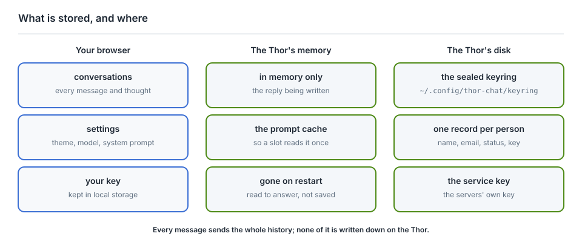
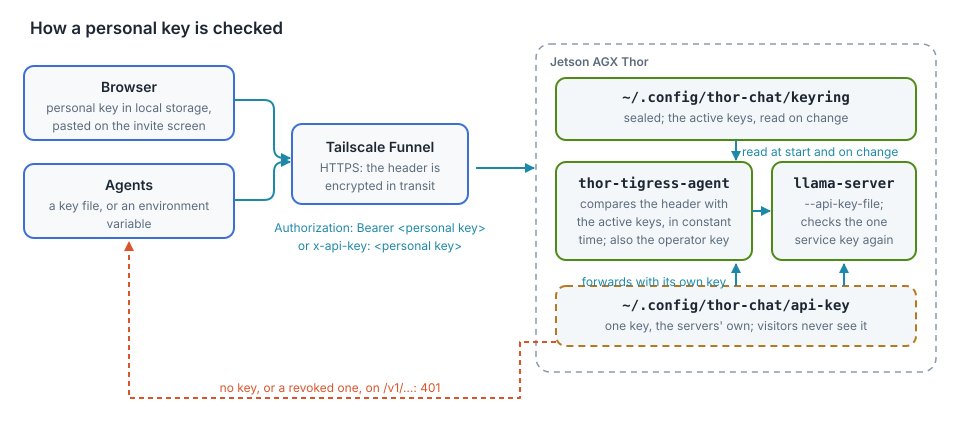

# The cub is open

A 30B model, four replies at once, served from one Jetson AGX Thor in a home.
The page is at [`voltforge.tech/thor-tigress-cub`](https://voltforge.tech/thor-tigress-cub),
which forwards to the Thor's Tailscale address.

Access is a key per person. To ask for one, leave a name and an email on the
invite screen, then send a message on
[LinkedIn](https://www.linkedin.com/in/arpan-pathak-272341424/) or
[X](https://x.com/arpanpathak1996). Keys are approved by hand and sent back. No
sign-up, no password, no third party.

<figure>

<figcaption><b>Figure 24.1</b> The path a message takes, from the link to the model. The same path is drawn in chapter "Web chat: Thor Tigress Cub".</figcaption>
</figure>

<figure>

<figcaption><b>Figure 24.2</b> The first screen, in the light Cub theme.</figcaption>
</figure>

<figure>

<figcaption><b>Figure 24.3</b> A reply, with the folded reasoning, code highlighting and the stats line.</figcaption>
</figure>

## What the Thor keeps

| Where | What | Until |
|---|---|---|
| your browser | the conversation, the settings, your key | you clear site data or press **+** |
| the Thor's memory | the conversation a slot is answering, so the next message on it is not read twice | the model server restarts |
| the Thor's disk | one encrypted file: the name, email, status and key from the invite screen | the record is deleted |

The only file the chat server writes is the keyring, and a keyring record has no
field for a message (`crates/thor-tigress-keyring/src/store.rs`). Requests are
answered and forgotten; the operating system keeps its own short journal, as it
does for every service.

<figure>

<figcaption><b>Figure 24.4</b> The three places anything is held.</figcaption>
</figure>

Not collected: cookies of this site's own, analytics, advertising, a login.

## How a key is checked

<figure>

<figcaption><b>Figure 24.5</b> Personal keys and the service key. Chapter "Security" has the same picture with the threat model around it.</figcaption>
</figure>

1. The invite screen posts a name and an email to `POST /request`; the record
   waits with no key.
2. `thor-tigress-serve keyring approve EMAIL` mints 24 random bytes, prints them
   once as 48 hex characters, and marks the record active.
3. The page keeps the key in local storage and sends it as
   `Authorization: Bearer <key>`. Agents send the same header, or `x-api-key`.
4. `thor-tigress-agent` compares it against every active key in the keyring, in
   constant time. A miss is `401` before the model is reached.
5. A match is forwarded to llama-server with the service key, which checks that
   again. Personal keys never reach llama-server.

The keyring is sealed with Argon2id and XChaCha20-Poly1305; chapter
"Keys, and the cryptography under them" walks through the file, the two
algorithms and what they do not protect.

## What it is made of

| Piece | What it does | Listens on |
|---|---|---|
| `llama-server` (llama.cpp, router mode) | Nemotron 3 Nano 30B-A3B, 8-bit, 1M-token context, four slots | `127.0.0.1:8079` |
| `thor-tigress-agent` | the page, the OpenAI and Anthropic APIs, the keys, the invite form | `127.0.0.1:8080` |
| SearXNG | web search, when **Web** is on | `127.0.0.1:8888` |
| TensorRT Edge-LLM | a second model on its own engine, when one is set | `127.0.0.1:8081` |
| Tailscale Funnel | HTTPS from the internet to port 8080, and to nothing else | public |

On the Thor, everything under `~/.config/thor-chat/`:

| File | Contents |
|---|---|
| `env` | `MODEL`, `USERS`, `CONTEXT`, `MODELS_MAX`, ports |
| `api-key` | the one key the agent and llama-server use between themselves |
| `keyring` | who may chat, sealed |
| `keyring-passphrase` | what opens the keyring |

The commands, all from `thor-tigress-serve`:

| Task | Command |
|---|---|
| load, unload, download a model | `list`, `list-latest`, `load KEY`, `unload KEY`, `download KEY` |
| install the services, start at boot | `install` |
| make the keyring | `keyring-init` |
| who asked, approve, revoke | `keyring requests`, `keyring approve EMAIL`, `keyring revoke EMAIL`, `keyring revoke-all` |
| follow both logs | `logs` |

The crates are in the repository, Apache-2.0: `thor-tigress-agent` (this
server), `thor-tigress-keyring` (the registry), `thor-spark-safety-eval` (the
prose and code checker), `thor-hammer-trainer` (the training set),
`thor-tigress-reinforcer-frontend` (the review page) and `thor-lasso-distiller`
(conversations from books). Chapters "Access and syncing", "Model serving" and
"Operations: recovery and hardening" cover running it: the model server, the
agent, the services, and what to do when something breaks.

## No rate limits

One Thor answers four replies at the same moment. When all four are busy the
next request waits in the queue, and nothing is refused for being busy. There
is no daily allowance, no per-person quota and no token accounting: the point
of a public beta is to use it hard and find where it breaks.

One person with a key can keep the Thor busy. The limits are social. If it
becomes a problem, a key is revoked.

The machine runs warm while it works, which in a cold room is a small
consolation.

## Where this promise stops

- The operator can read the keyring. Whoever has the Thor's account and the
  passphrase file can open the file and see the names, emails and keys.
  Encryption protects a copy of the file that is carried away; on the machine
  itself, the passphrase file is the weak point.
- The invite form is open. Anyone can post a name and an email; it can be
  filled with junk. A person approves each request by hand, so junk reaches the
  waiting list and nothing else. Each request costs an Argon2id run.
- A key is a password. Anyone holding one uses the chat as the person it was
  sent to. It stops working the moment it is revoked.
- Four slots serve everyone, the web chat and every agent together.
- One machine: it can be offline, busy, or out of memory, and when it is down
  the forwarding page still loads.

## Getting a key

Give a name and an email on the invite screen, then send a message:

- [DM on LinkedIn](https://www.linkedin.com/in/arpan-pathak-272341424/)
- [DM on X](https://x.com/arpanpathak1996)

The key that comes back is 48 characters, sent once, and kept private.

## Elsewhere in this book

- [Security](ch10-security.md): what is exposed, and what protects it.
- [Keys, and the cryptography under them](ch25-keyring-crypto.md): the file and
  the two algorithms, byte by byte.
- [What a context window is](ch26-context-window.md): why a conversation has a
  limit at all.
- [Memory, context and slots](ch20-memory-and-context.md): the measured
  numbers behind that limit.
