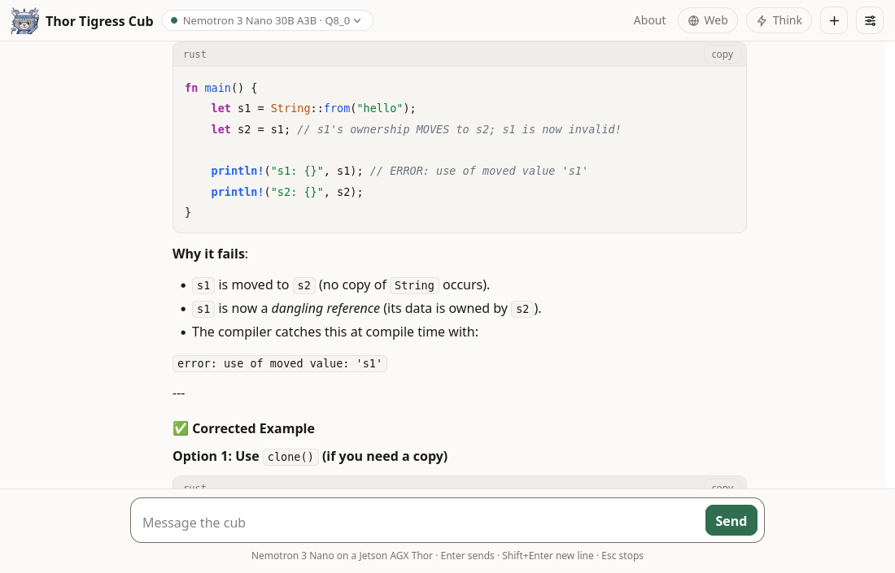
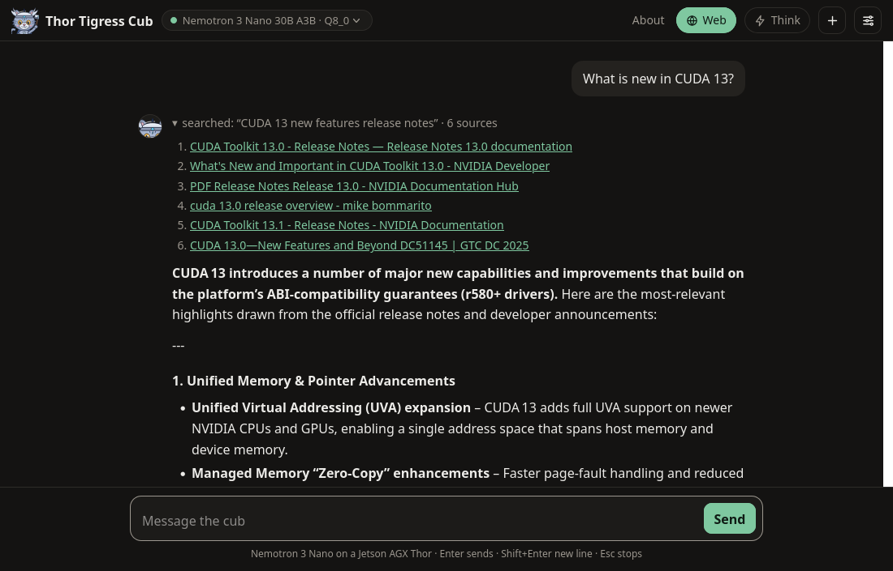

# Thor Tigress Cub

**thor-tigress-cub-junior · Haloom!**

I am typing this from a studio apartment in Seattle. The Thor sits in the
corner, humming like a low-grade heater that barely warms the place. What it
really does is run a 30-billion-parameter model on a single board and spit out
about 53 tokens a second. Five of these boards can be stacked into a cluster,
so the capacity grows one board at a time.

The page is at
[`voltforge.tech/thor-tigress-cub`](https://voltforge.tech/thor-tigress-cub).
You open it, type a question, and watch the answer crawl out word by word. You
can unfold the folded reasoning line, see colour-coded code blocks, and a little
speed counter sits underneath. It costs nothing, it asks for no account, and
your conversation lives only in your browser.

Two models answer today, and both live behind the same `thor-tigress-serve`
process. **Nemotron 3 Nano 30B A3B**, the default, runs on llama.cpp at about 53
tokens a second. **Qwen3.6 35B A3B** runs on TensorRT Edge-LLM at about 78 tokens
a second when it is loaded. The picker can spin up two of them at once, across
the two engine back-ends.

## Where it is headed: the agentic canvas

The launch is just around the corner, and the next step is an **agentic canvas
sandbox**: a place where a model can reach for tools and work on a visual
canvas.

<figure>

<figcaption><b>Figure 24.1</b> The canvas, and the 6 uses it is being built for. All 6 are planned.</figcaption>
</figure>

| Planned use | What it means |
|---|---|
| Role-play | characters that remember the scene, with the scene kept on the canvas |
| A therapist | a calm listener, with nothing written down on the server |
| Immigration | forms and covering letters drafted with you and checked against the rules |
| Creative writing | story bibles, drafts and revisions standing side by side |
| Music generation | a timeline the model can add notes to and play back |
| Vector graphics | drawing commands it can run and then look at |

The book marks what is live in green and what is planned in amber. The canvas is
amber, and it is the reason the rest of this chapter exists: the chat is the
surface that runs today, and these six are the ones I am building toward.

## What the chat does right now

- **Streams the answer.** Ask in English, Rust, or whatever language you paste
  at it, and the reply streams out as it is written.
- **Searches the web** when you turn **Web** on: the built-in SearXNG engine
  fetches results and lists the sources it used.
- **Reasons before it answers** when you turn **Think** on: the reasoning
  appears folded above the answer, ready to be expanded.
- **Picks a model** from the ones loaded, two at a time, across the two engine
  back-ends.
- **Works from a coding agent.** The API speaks the OpenAI and Anthropic shapes,
  so Claude Code, OpenCode and openbatrangs point at it with a base URL and a
  key.
- **Wears 11 themes**, from Paper and Night to Solarized, Nord, Dracula, One
  Dark, Gruvbox, Monokai and Material Deep Ocean, and it follows your device
  until you pick a favourite.
- **Fits a phone**, composer, threads and all, down to a 390-pixel-wide screen.

<figure>

<figcaption><b>Figure 24.2</b> The opening screen, in Paper.</figcaption>
</figure>

<figure>

<figcaption><b>Figure 24.3</b> A reply in Night, with the reasoning folded away, code highlighted, and the speed underneath.</figcaption>
</figure>

<figure>

<figcaption><b>Figure 24.4</b> The same page on a 390-pixel-wide phone.</figcaption>
</figure>

<!-- Captures to come. Record them, drop the files into book/src/figures/, then
     delete these comment markers and renumber the figures that follow.

<figure>

<figcaption><b>Figure 24.4</b> Idiomatic Rust, answered in the page.</figcaption>
</figure>

<figure>

<figcaption><b>Figure 24.5</b> A question with Web on, and the sources it used.</figcaption>
</figure>

<figure>
<video controls poster="figures/cub-demo-poster.png" width="960">
  <source src="figures/cub-demo.mp4" type="video/mp4">
</video>
<figcaption><b>Video 24.1</b> The page in use: a coding question with a long reply, then the same question with Web on.</figcaption>
</figure>

-->

## Getting a key

Each person gets a personal key of their own. Leave a name and an email on the
invite screen, then send me a message:
[LinkedIn](https://www.linkedin.com/in/arpan-pathak-272341424/) or
[X](https://x.com/arpanpathak1996). I approve the request by hand and send the
key back, a single 48-hex string. There is no sign-up, no password, and no
company in the middle.

<figure>

<figcaption><b>Figure 24.5</b> The door: what someone without a key meets. The picture predates the name-and-email form and the DM links, which chapter "Web chat: Thor Tigress Cub" describes.</figcaption>
</figure>

Until recently a single shared key opened the door for everybody. Now each key
can be granted or revoked one person at a time.

## What the board actually stores

The conversation belongs to your browser, and it stays there. The board holds
three things:

| Where | What is stored | Until |
|---|---|---|
| Your browser | the full conversation, the UI settings, your key | you clear site data or press **+** |
| The board's memory | the reply being written, and a small prompt cache | the model process restarts or unloads |
| The board's disk | one encrypted file: name, email, status and the key | the record is deleted |

<figure>

<figcaption><b>Figure 24.6</b> The 3 places anything is held.</figcaption>
</figure>

The chat server writes one file, the keyring, and a keyring record has no field
for a message (`crates/thor-tigress-keyring/src/store.rs`). No raw chat text is
ever written down. Once an answer is sent, the request is gone; the operating
system keeps its usual short journal, as it does for every service on the
machine. The page sets no cookie of its own, carries no analytics and no
advertising, and asks for no login.

## How a key is checked

<figure>

<figcaption><b>Figure 24.7</b> The 2 keys, and where each key stops.</figcaption>
</figure>

1. The browser, or an agent, sends the personal key in an
   `Authorization: Bearer <key>` header over HTTPS, through Tailscale Funnel.
2. The invite screen posts a name and an email to `POST /request`, and the
   record waits with no key.
3. `thor-tigress-serve keyring approve EMAIL` gives that person 24 random bytes
   and prints them once as 48 hex characters.
4. The page keeps the key in local storage and sends it as
   `Authorization: Bearer <key>`. Coding agents send the same header, or
   `x-api-key`.
5. `thor-tigress-agent` compares the key against every active key in the
   keyring, in constant time. A key that matches nothing leaves with `401`
   before a model is reached. A request that matches travels to the model you
   picked under the service key from `api-key`, and the model server checks that
   key again. Personal keys never go that far.

The keyring itself is sealed with Argon2id and XChaCha20-Poly1305. Chapter
["Keys, and the cryptography under them"](ch25-keyring-crypto.md) opens the file
byte by byte and explains the two algorithms, along with the four things they
cannot protect.

## Scaling: how many people can play?

A loaded model keeps its weights and a pool of windows (context slots). The
default Nano takes 33.6 GB of weights and about 24 GiB for a 4-million-token
window. With two models loaded, the chat measured 57.8 GB of RAM while it was
serving, against 128 GB on the board. How the pool is cut is a setting, and on
one board it is cut like this:

| Windows open at once | Tokens per window | Pool |
|---|---|---|
| 4 | 1,048,576 | 24 GiB |
| 8 | 524,288 | 24 GiB |
| 16 | 262,144 | 24 GiB |
| 32 | 131,072 | 24 GiB |

The arithmetic is `windows × tokens × 6 KiB`, and memory is the ceiling. Want
longer conversations? Fewer windows fit. Want more windows? Each one gets
shorter. One conversation can stretch to 1 million tokens, roughly three
novels.

There is no per-person quota. Someone with a key can keep a board busy for as
long as they keep asking, and the only way to stop them is to revoke the key.
The boards stay warm while they work, which in Seattle is a small consolation.

## Inside the machine

`thor-tigress-serve list` prints the models on the boards:

```text
$ thor-tigress-serve list

Thor: 59.3 GB free of 122.8 GB · keeps 8 GB free · at most 2 models loaded

  key  model                                          state                 size
  1    Nemotron 3 Nano 30B A3B · Q8_0                 loaded             33.6 GB  default (nemotron)
  2    Nemotron 3.5 Lightning 30B A3B · Q8_0          on disk            35.0 GB
  3    Qwen3.6 27B · Q4_K_M                           on disk            16.8 GB
  4    Qwen3.6 35B A3B NVFP4                          loaded             23.4 GB  TensorRT Edge-LLM · :8081
```

<figure>

<figcaption><b>Figure 24.8</b> How a message reaches a model, on either engine.</figcaption>
</figure>

| Piece | What it does | Listens on |
|---|---|---|
| `llama-server`, router mode | 1 process per loaded GGUF model: the Nano, Lightning and Qwen 27B | `127.0.0.1:8079` |
| TensorRT Edge-LLM | the Edge-LLM engine, for Qwen3.6 35B A3B in NVFP4 and its successors | `127.0.0.1:8081` |
| `thor-tigress-agent` | the page, the model picker, the OpenAI and Anthropic APIs, the keys, the invite form | `127.0.0.1:8080` |
| SearXNG | web search, when **Web** is on | `127.0.0.1:8888` |
| Tailscale Funnel | HTTPS from the internet to port 8080, and to nothing else | public |

Everything lives under `~/.config/thor-chat/`:

| File | Contents |
|---|---|
| `models.ini` | the router's list of models, written by `thor-tigress-serve` |
| `env` | `MODEL`, `USERS`, `CONTEXT`, `MODELS_MAX`, `EDGE_MODEL`, ports |
| `api-key` | the internal key the agent and the model servers share |
| `keyring` | who may chat, sealed |
| `keyring-passphrase` | what opens the keyring |

One command, `thor-tigress-serve`, manages all of it:

| Task | Command |
|---|---|
| find, load, unload, download a model | `list`, `list-latest`, `load KEY`, `unload KEY`, `download KEY` |
| install the services and start them at boot | `install` |
| create the keyring | `keyring-init` |
| see who asked, approve, revoke | `keyring requests`, `keyring approve EMAIL`, `keyring revoke EMAIL`, `keyring revoke-all` |
| follow the logs | `logs` |

The crates sit in the repository under Apache-2.0: `thor-tigress-agent` for the
server, `thor-tigress-keyring` for the registry, `thor-spark-safety-eval` for
the prose and code checker, `thor-hammer-trainer` for the training set,
`thor-tigress-reinforcer-frontend` for the review page, and
`thor-lasso-distiller` for conversations drawn out of books. Chapters "Model
serving", "TensorRT Edge-LLM" and "Operations: recovery and hardening" walk
through running the whole thing yourself, on this board or another.

## Where the promise hits its limits

- The operator can open the keyring. Whoever holds a board's account and the
  passphrase file can read every name, email and key inside it. Encryption
  protects a copy of the file that leaves the machine; on the machine itself,
  the passphrase file is the weak point.
- The invite form is open, and it can be filled with junk. A person approves
  each request by hand, so junk collects in the waiting list and goes no
  further. Every request also costs a board an Argon2id run.
- A key is a password. Anyone holding one chats as the person it was sent to,
  until the key is revoked.
- The windows serve the page and every coding agent together.
- The chat is a beta. It can be busy, offline, or out of memory, and when it is
  down the forwarding page still loads.

## The rest of the book

- [Security](ch10-security.md) sets out what gets exposed and what guards it.
- [Keys, and the cryptography under them](ch25-keyring-crypto.md) opens the
  keyring file byte by byte.
- [What a context window is](ch26-context-window.md) explains why a conversation
  has a limit at all.
- [Memory, context and slots](ch20-memory-and-context.md) measures that limit on
  this board.
- [Model serving](ch21-model-serving.md) lists the models, loads and unloads
  them, and explains the picker.
- [TensorRT Edge-LLM](ch22-edge-llm.md) covers the engine that runs the Qwen
  35B model at about 78 tokens a second.
- [Operations: recovery and hardening](ch18-operations.md) runs the whole stack
  on this board or another.
