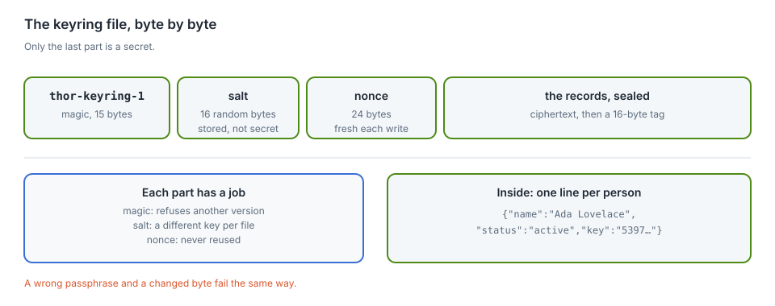
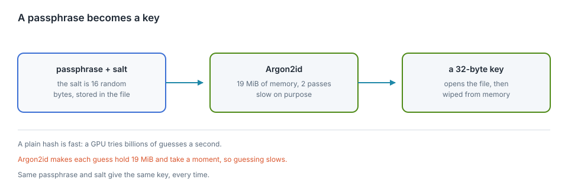
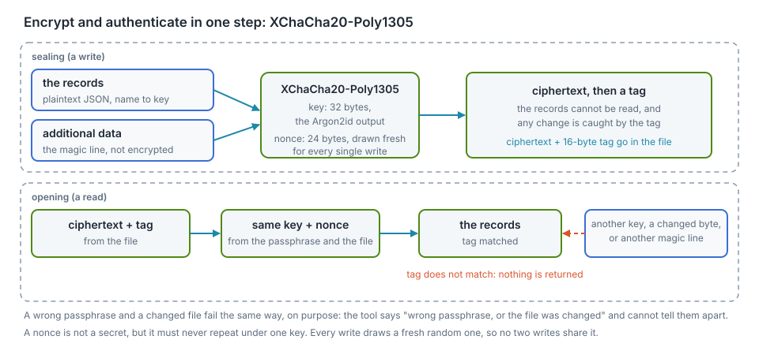
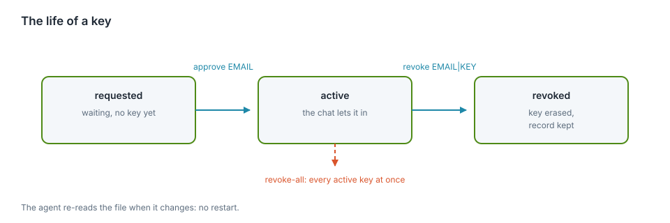

# Keys, and the cryptography under them

The chat used to run on one shared key. Everyone pasted the same string, and
the only way to remove one person was to change the key for everybody. This
chapter is about the replacement: an encrypted registry, one key per person,
and the four cryptographic ideas it stands on.

<div class="covers">

This chapter covers

- why one shared key was replaced, and what the registry looks like
- Argon2id: why a passphrase is stretched into a key
- XChaCha20-Poly1305: encryption that also notices a change
- the habits that matter as much as the algorithms: a fresh nonce, a
  constant-time compare, wiping memory, writing the file whole
- what this protects, and the four things it does not

</div>

## Why not one key

A shared key has two problems. It cannot be taken back from one person: ending
one person's access ends everyone's. And it says nothing about who is who, so
there is no list to check and no record to keep.

The replacement is a **keyring**: one encrypted file, `~/.config/thor-chat/
keyring`, holding a record per person. Each record has a name, an email, a
status and a key. The chat server keeps the active keys in memory and lets in a
request that carries one of them.

## The file

<figure>

<figcaption><b>Figure 25.1</b> The keyring file, byte by byte. Only the last part is a secret.</figcaption>
</figure>

The first three parts are plain and short. The **magic** line names the format
and its version, so a file from a later version is refused rather than
misread. The **salt** is random and public. The **nonce** is random and public.
Everything private is inside the last part, which is unreadable without the
passphrase.

## From a passphrase to a key

Encryption needs a key of an exact size, and people give passphrases. Turning
one into the other is the job of a **key derivation function**, KDF. The one
here is **Argon2id**, the winner of the 2015 Password Hashing Competition and
the current default in most toolchains.

<figure>

<figcaption><b>Figure 25.2</b> A passphrase becomes a key. Each guess at the passphrase costs a moment and 19 MiB of memory.</figcaption>
</figure>

### Why not just a hash

A hash such as SHA-256 is built to be fast. That is right for checking a file,
and wrong for a passphrase. A password draws from a small space: a human picks a
few thousand words, while a key draws from 2^256 values. An attacker who has the
file can guess passphrases and check each guess with the same fast hash,
billions of times a second on a graphics card.

Argon2id makes each guess expensive in two ways at once:

- **Time**: it is deliberately slow, and the number of passes is a parameter.
- **Memory**: it fills megabytes of memory and walks through them. A GPU has
  thousands of threads but little memory per thread, so it cannot run as many
  guesses in parallel.

The cost multiplies against the attacker, and barely matters against you: a
human waits a moment once, at the keyboard.

### The salt

The salt is 16 random bytes stored in the file. It does two jobs:

- **Two files do not share a key.** The same passphrase on two keyrings gives
  two different keys.
- **Precomputed tables do not apply.** An attacker cannot prepare answers for
  common passphrases in advance; each new salt forces the work to be redone.

The salt stays public, and it only has to be unique.

### The parameters here

| Setting | Value | Effect |
|---|---|---|
| memory | 19,456 KiB (19 MiB) | the size of the work area; raises the cost of parallelism |
| passes | 2 | how many times that area is walked |
| lanes | 1 | one thread of work; the agent's writes are rare, so this keeps it simple |
| output | 32 bytes | the key XChaCha20-Poly1305 takes |

These are the Argon2id defaults in the RustCrypto crate, and a reasonable
starting point; they make no claim to be optimal. Raising memory is the usual
first move; the parameters live in
`crates/thor-tigress-keyring/src/crypto.rs` as named
constants, so a change is one line and its consequences are visible.

## Sealing, and noticing a change

The file is encrypted with **XChaCha20-Poly1305**. The long name is worth
unpacking because each part earns its place.

- **ChaCha20** is a stream cipher: it turns a key and a nonce into a stream of
  bytes, and XORs them with the message. It is fast in software, which matters
  on the Thor's ARM cores.
- **Poly1305** is a message authentication code. It computes a short **tag**
  over the ciphertext.
- **AEAD** means *authenticated encryption with associated data*: one
  operation gives confidentiality (nobody can read it) and integrity (nobody
  can change it without the tag failing).

<figure title="seal and open">

<figcaption><b>Figure 25.3</b> One operation for secrecy and for catching changes.</figcaption>
</figure>

### A nonce is a one-time number

A nonce is not secret, but it must never repeat under the same key. If the same
key and the same nonce encrypt two messages, XORing the two ciphertexts cancels
the stream and exposes both plaintexts. The keyring draws a **fresh random
24-byte nonce on every write**. At 24 random bytes, a repeat is not something
to plan around.

### The associated data

The magic line is passed as **associated data**: it is authenticated but not
encrypted, so it stays readable while any change to it is caught. This binds
the format to the ciphertext. A file with the right key but a wrong or later
version fails, instead of being read as if it were this version.

### One message for two mistakes

A wrong passphrase and a changed file both fail the same tag check, and the
tool says the same thing for both:

```text
wrong passphrase, or the file was changed
```

That is on purpose. Telling the two apart would tell an attacker which guess
produced a valid file.

## The keys themselves

A person's key is **24 random bytes, written as 48 lowercase hex characters**,
made by the operating system's random source. It is the same shape as the
single key `thor-tigress-serve key` makes, so the tools line up.

Two habits protect keys while they are in use:

- **Compare in constant time.** `key == expected` stops at the first differing
  byte, and the time it takes leaks how long a shared prefix was. The server
  compares every byte and ORs the differences, so the time depends on the
  length alone.
- **Wipe when done.** The derived key and the passphrase sit in memory while
  the command runs. Both are wrapped in a type that overwrites them on drop,
  so a crash dump or a swapped page is less likely to hold them.

Neither is visible in normal use. Both are the kind of detail that decides
whether an attack is theoretical or practical.

## Writing the file safely

Every change follows the same three steps:

1. **Seal the whole file** with a fresh nonce.
2. **Write a temporary file** next to the real one, with permissions that let
   only the owner read it (`600`).
3. **Rename it over the old one.** A rename is atomic: a reader sees either the
   old file or the new one, never half of each.

So a crash while approving someone leaves the previous keyring whole. The cost
is that the whole file is rewritten on every change, which suits a registry of
hundreds of people; millions of events would outgrow it.

## The life of a key

<figure>

<figcaption><b>Figure 25.4</b> Three states, two directions, and one command that stops everyone.</figcaption>
</figure>

| Command | What it does |
|---|---|
| `request NAME EMAIL` | records someone as waiting; asking twice changes nothing |
| `approve EMAIL` | mints a key, marks the person active, prints the key once |
| `revoke EMAIL\|KEY` | erases the key, keeps the record |
| `revoke-all` | erases every active key at once |
| `keys` | lists everyone; keys are shown as `53976da2…` |
| `show EMAIL` | prints one person's key in full |

The chat server holds the active keys in memory and re-reads the file when its
timestamp changes. A revoke takes effect on the **next request**: no restart,
and no reply in progress is cut off.

## What this does not protect

The honest list, in the order it matters.

- **The machine.** Whoever has the Thor's user account can read the running
  server's memory, and can read the passphrase file if the services were set up
  with one. Encryption protects a copy of the file that is carried away, not
  the machine it lives on.
- **A weak passphrase.** Argon2id raises the cost of each guess; it cannot
  rescue a passphrase made of one word. Use several.
- **Old copies.** There is no forward secrecy here. A backup of the file and
  the passphrase open every record that was in it when the copy was taken.
  Rotating the passphrase means making a new keyring.
- **The registration form.** It accepts a name and an email from anyone, and
  each request makes the server do Argon2 work. It can be spammed, and the
  work can be used to keep the CPU busy. Approval is by hand, so spam reaches
  the waiting list and nothing else. A rate limit on that one route is the
  obvious next hardening step.

## The code, and its dependencies

The registry is one small crate, `crates/thor-tigress-keyring`:

| File | Contents |
|---|---|
| `crypto.rs` | Argon2id, the seal and the open, the sizes and parameters |
| `store.rs` | the records, the file format, the atomic write |
| `cli.rs` | the commands, the passphrase sources |
| `error.rs` | the one error type |

It uses four crates from [RustCrypto](https://github.com/RustCrypto), named here
because a reader should not have to guess where the cryptography comes from:
`argon2`, `chacha20poly1305`, `getrandom` and `zeroize`. Everything those
crates do is audited, widely used and pure Rust, so the book can explain the
bytes rather than pointing at a black box.

The chat server's half is in `crates/thor-tigress-agent/src/config.rs`, in the
`People` type: it opens the keyring, keeps the active keys, reloads on change,
and records what the invite form posts.
