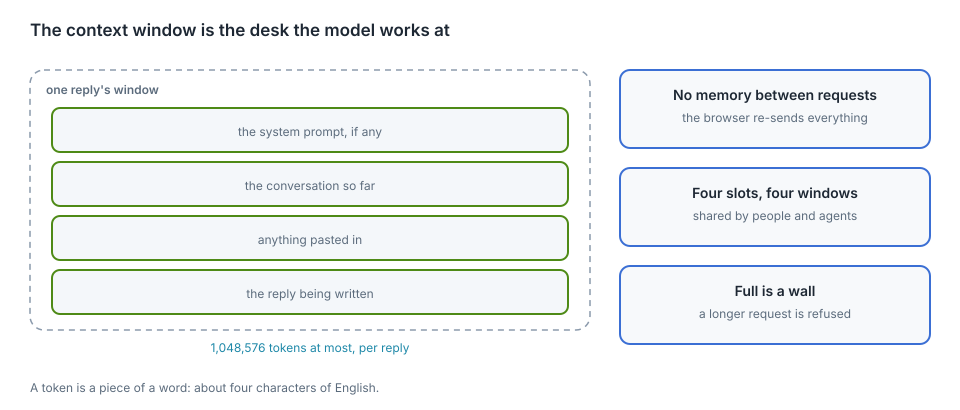
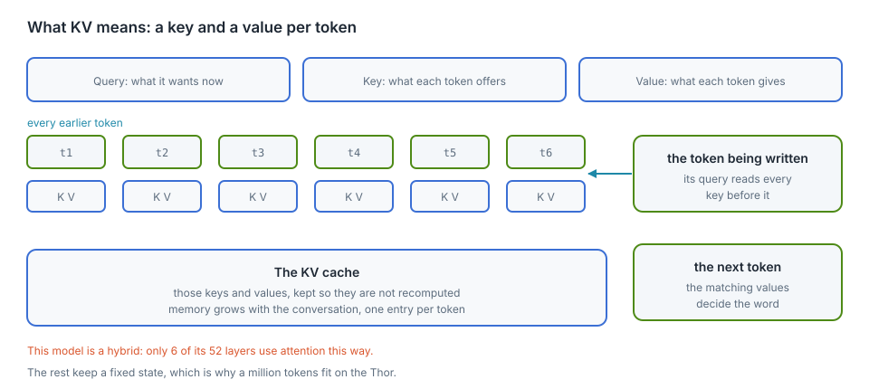

# What a context window is

Chapter "Memory, context and slots" has the arithmetic: 6 KiB of keys and values
per token, a pool of 24 GiB holding the windows, and about 1,050 tokens a
second spent reading a prompt. This chapter is the same subject without the
arithmetic: what fills one window, why the model reads everything again for each
message, and what happens when a conversation reaches the end of it.

This chapter covers

- the five things that fill one reply's window
- why the model holds nothing between requests
- keys and values, the part that grows with the conversation
- what a full window does, and the four ways to work within it

## One budget per reply

<figure>

<figcaption><b>Figure 26.1</b> Everything one reply may hold.</figcaption>
</figure>

A token is a piece of a word: about four characters of English, a little less
for code. One reply may hold 1,048,576 of them. Everything in the table counts
against that number.

| Fills the window | Counts as |
|---|---|
| the system prompt, if the page sets one | tokens at the start of every request |
| every earlier message in the conversation | tokens, whole, every time |
| anything pasted: a log, a file, an error | tokens, in full |
| the reasoning, while **Think** is on | tokens, kept in the history after the answer |
| the reply being written | one token at a time, as it is generated |

## Every message reads the conversation again

The model holds nothing between requests. The browser keeps the conversation and
sends the whole of it with every message; the server reads from the start. On a
long conversation, that reading is where the pause before the first word comes
from.

A slot keeps the conversation it read last, which llama-server calls the prompt
cache. If the same conversation comes back to the same slot, the part already
read is not read again. The cache lives in memory and goes away when the server
restarts.

## The part that grows: keys and values

<figure>

<figcaption><b>Figure 26.2</b> The keys and values the model keeps for the tokens it has already read.</figcaption>
</figure>

To write the next token, the attention layers compare it with every token before
it. Each earlier token leaves two short vectors behind, a **key** and a
**value**, and keeping them instead of recomputing them is the **KV cache**. It
grows with the conversation, one entry per token per attention layer. The sum is
in chapter "Memory, context and slots": 6 KiB per token, 6 GiB for a window of a
million tokens, and 24 GiB for the pool of them.

Nemotron 3 Nano is a hybrid. Six of its 52 layers work by attention; the rest
carry one state of fixed size, however long the conversation runs. A model built
from attention layers alone would need about 128 GiB for a single million-token
conversation — Llama 3 8B is the example in that chapter — and the Thor has 128
GB in total.

## Reading time before the first word

Measured on the Thor on 2026-10-06, reading runs at about **1,050 to 1,100
tokens per second**:

| Conversation | Wait before the first word |
|---|---|
| 10,000 tokens | about 9 s (measured) |
| 100,000 tokens | about 1.5 minutes |
| 1,048,576 tokens | about 16 minutes, and likely more, since reading slows as the context grows |

## When the window is full

The server refuses the request. Nothing is cut short and nothing is dropped
quietly; the page shows the error. Four ways out:

1. Start a new conversation with **+**. The old one stays in the browser.
2. Paste less: name the file and the line instead of the whole file.
3. Turn **Think** off for routine questions, so the reasoning does not stay in
   the history.
4. Raise `CONTEXT`, which memory pays for: `USERS × CONTEXT × 6 KiB`.

Some clients have a fifth: a sliding window, where the browser sends only the
last messages. That trades the start of the conversation for room at the end.

## How many replies run at once

A window belongs to a reply. Every reply that runs at the same time needs a
window of its own, and all of them come out of one pool of memory. The count is
therefore a setting, and memory sets its ceiling: four windows of a million
tokens each take 24 GiB, and the same 24 GiB also pays for eight windows of
524,288 or sixteen of 262,144. Requests beyond that number wait in the queue.
The windows are shared by the page and by every coding agent using the API, and
chapter "Memory, context and slots" has the table of shapes and the measured
numbers behind it.
