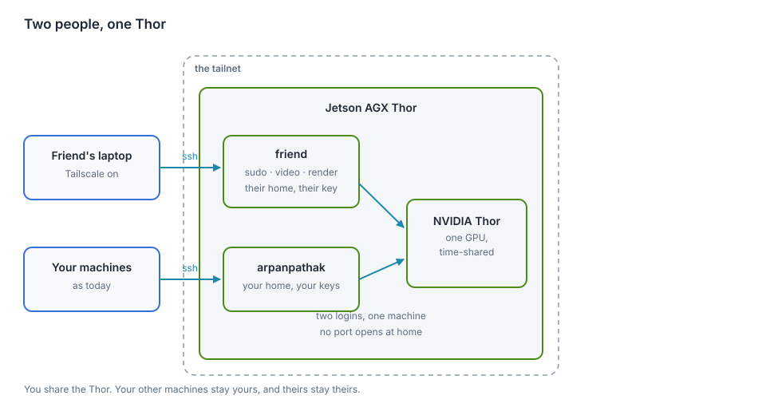
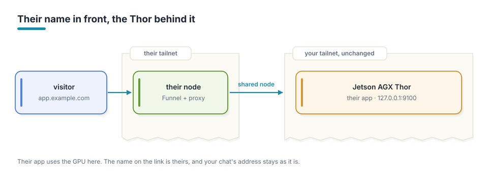
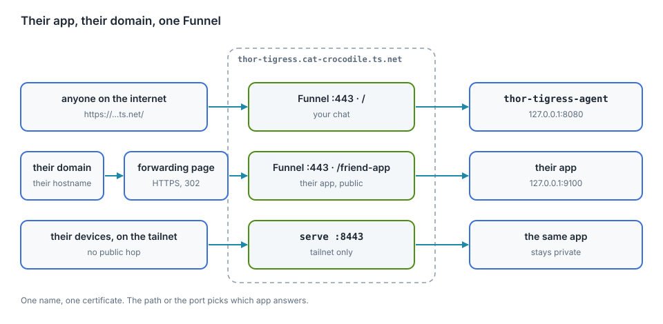

# Sharing is caring

A friend wants time on the Thor's GPU and somewhere to host the small apps they
write, with their own domain. This chapter is the design. None of it is built
yet. When we build it, the work is an afternoon.

<div class="covers">

This chapter covers

- the name a visitor sees in the address bar, and the two ways to change it
- two logins on one machine, and what sudo gives a second person here
- sharing the node over Tailscale
- one Tailscale name carrying several apps, through paths and ports
- why their domain cannot point at Funnel directly
- the one GPU, shared with the models
- what tends to go wrong, and the order to do the work in

</div>

## The shape of it

Your friend gets a login on the Thor. They reach it over the tailnet, the
network your own machines use, so no port is opened at home. Their apps run as
them, from their home directory, on ports from a range the two of you agree on.
Public apps go out through Tailscale Funnel; private ones stay on the tailnet.

<figure>

<figcaption><b>Figure 1</b> One machine, two logins, one GPU.</figcaption>
</figure>

## The name a visitor sees

The node is called `arpanpathak` because that is the Thor's hostname, and Funnel
serves the name the node has. An app published on Funnel gets that name in its
address.

Both parts of the name can be changed:

- **The machine name**, the `arpanpathak` part. Admin console → Machines → the
  Thor → **Edit machine name**. Untick "Auto-generate from OS hostname" so it
  stays fixed, then type the new name. From the CLI,
  `sudo tailscale set --hostname=thor-tigress`. It has to be unique in the
  tailnet.
- **The tailnet name**, the `taildb9a39` part, shared by every device you own.
  Admin console → DNS → **Tailnet DNS name** → **Rename tailnet**. Tailscale
  offers randomly generated names such as `cat-crocodile`, so this part cannot be
  typed. After a random name has issued certificates you can switch between it
  and the original string, and no further.

Changing the machine name moves every service on the node. The chat answers at
`arpanpathak.taildb9a39.ts.net`, the forwarding page at `voltforge.tech` sends
visitors there, the Claude Code and openBatarangs aliases use it, and
`about.html`, `jetson-thor/README.md` and this book quote it. After a rename the
old address stops answering, Funnel has to be brought up again on the new name,
the certificate is reissued, and saved links and `--openai-url` values need
updating. Chapter "Operations" has the steps and a script that carries the
change through the forwarding page and this repository. Do the rename when you
want a neutral name for the whole platform, and while no app of theirs is on the
node.

### A node of their own

If only their links need a name that is not yours, put a second node in front of
their apps. Funnel runs on that node. Their app keeps running on the Thor, which
that node reaches over the tailnet as a shared node.

Two ways to have it:

- **A machine of theirs**: an always-on box or a small VPS, signed into their own
  Tailscale account. Their tailnet, their Funnel, their certificates, their
  domain. It runs a short proxy to the Thor and does not use the GPU.
- **A second node on the Thor**: a container or a small VM with its own
  `tailscaled`, signed into their account. No extra hardware, but two Tailscale
  instances on one host is more to keep working.

<figure>

<figcaption><b>Figure 2</b> Their node in front, the Thor behind it.</figcaption>
</figure>

| A visitor sees | What it costs | What changes here |
|---|---|---|
| `app.example.com`, or the ts.net name of their node | a machine of theirs, or a container on the Thor | nothing |
| `thor-tigress.…ts.net/friend-app` | free | the node is renamed; the chat's address and saved links move |
| `app.example.com`, then your ts.net name after the redirect | free | nothing; the address bar shows your name after the redirect |

## Two logins

They get their own Unix user: their home, their SSH key, their files. No shared
password, no shared home directory. They also get `sudo` and the `video` and
`render` groups, which CUDA needs before it will see the GPU.

With sudo they can read every file on the machine, stop any service and install
anything. On this box that means:

| Thing | With sudo |
|---|---|
| `~/Projects`, `~/models` | readable |
| `~/.config/thor-chat/api-key` | readable; file permissions are the only protection |
| `~/.ssh/id_ed25519` | readable, unless the key has a passphrase |
| `~/.config/thor-chat/keyring` | readable, but the records inside need your passphrase |
| `thor-chat`, `thor-edge-llm`, `thor-tigress-agent`, `searxng` | they can stop or restart them |

The SSH key is worth settling first. If it has no passphrase and other machines
trust it, a copy of the file is a copy of your access to those machines. Adding a
passphrase, or generating a separate key for the Thor, takes ten minutes.

The keyring needs your passphrase to open, so the records inside it stay yours.
Nothing in this design puts their apps in front of your services.

## Reaching it

Tailscale shares one node with another account. In the admin console the Thor's
row has a Share button; the invite link goes to their Tailscale account. They
accept it and the Thor appears in their machine list, marked as shared. They get
the Thor and nothing else: not your other machines, and you do not see theirs.

The node answers at `100.84.254.65`, which is `arpanpathak` in the tailnet's DNS
today. The build steps change that name before any of their apps exist.

```bash
ssh friend@100.84.254.65
```

sshd is already listening on 22, and the tailnet is the way in. If the tailnet
has an ACL file that restricts who may reach this node, add a rule for the
sharing relationship and test it before handing over the key.

One setting saves both of you password prompts:

```bash
sudo tailscale set --operator=friend
```

After that, `tailscale serve` and `tailscale funnel` work for their user and
yours.

## Their apps, and the paths they live on

The node has one Tailscale name and one certificate for it. Funnel answers on
that name, on the three ports it may use: 443, 8443 and 10000. Your chat holds
the root path on 443.

Their app listening on `127.0.0.1:9100` becomes reachable as

```bash
tailscale serve --bg --https=8443 9100              # their tailnet only
tailscale funnel --bg --set-path=/friend-app 9100   # public, on 443
```

The first stays private, to devices allowed to reach this node. The second is
open to anyone with the address. The path or the port chooses the app. Each
command replaces the node's whole serve config, so check before changing it:

```bash
tailscale serve status
```

A change made without looking can drop the other person's path.

<figure>

<figcaption><b>Figure 3</b> One name, one certificate; the path or the port picks the app.</figcaption>
</figure>

Two more details. Their apps bind to `127.0.0.1` rather than `0.0.0.0`, so the
tailnet and Funnel remain the only ways in. And a `systemctl --user` unit stops
when they log out unless someone runs

```bash
sudo loginctl enable-linger friend
```

once.

## Their domain

A CNAME from `app.example.com` to `thor-tigress.cat-crocodile.ts.net` does not
work. The browser asks for `app.example.com`, Funnel answers with a certificate
for `thor-tigress.cat-crocodile.ts.net`, and the names do not match. Funnel
serves the node's own name and no other.

If they run a node of their own, their domain points at that node and the
question does not arise. Otherwise there are two options:

| Option | Address bar | Notes |
|---|---|---|
| forwarding page on a public host | their domain, then the ts.net name after the redirect | free; the bar changes on the way |
| a small public proxy of theirs, with the Thor behind it | their domain throughout | a machine to patch, and it sees their traffic |

Chapter "Bring your own domain" has the Namecheap and GitHub steps for the
forwarding page, and the same ones work for them.

## The one GPU

There is one NVIDIA Thor GPU in the box, 128 GB of unified memory. The chat
keeps a large part of it warm: `thor-chat` is llama-server with Nemotron, and
`thor-edge-llm` is Qwen. This hardware has no MIG, so the GPU is shared by time
rather than partitioned.

- `nvidia-smi` shows who holds memory.
- `sudo systemctl stop thor-chat thor-edge-llm` frees the GPU, and `start`
  brings the chat back in about a minute. They can do both, so agree on when.
- The power mode and `jetson_clocks` are machine-wide and affect both of you.
- Disk is shared. 742 GB is free now, and one dataset can fill most of it.

## What can go wrong

- They reboot the Thor while the chat is serving. The services come back; the
  requests in flight do not.
- You both edit `tailscale serve`, and one path disappears.
- An app bound to `0.0.0.0` is reachable from places neither of you intended.
- A public Funnel path is public. If their app has a login, that login is on the
  internet.
- GPU memory runs out under one process because the other took it.

## The order we would do it

0. Settle the name. A node of theirs leaves your addresses alone; renaming the
   machine moves every service on it. If you rename, do it while no app of theirs
   is on the node.
1. `sudo adduser --disabled-password friend`; add them to `sudo`, `video` and
   `render`; put their public key in `~/.ssh/authorized_keys`, with `.ssh` at
   mode 700 and the file at 600.
2. `sudo tailscale set --operator=friend` and `sudo loginctl enable-linger friend`.
3. Share the Thor with their Tailscale account from the admin console. They
   accept and try `ssh friend@100.84.254.65`.
4. They write one small app, bind it to `127.0.0.1:9100`, and run it from a
   `systemctl --user` unit.
5. `tailscale serve --bg --https=8443 9100` first, so it is reachable and
   private. Funnel when they want it public.
6. Their own node or proxy, if the address matters, then the DNS record.
7. Write the result back into this chapter: the commands that worked, the ports,
   the name, and the numbers.

Settle the SSH key question before step 1.
