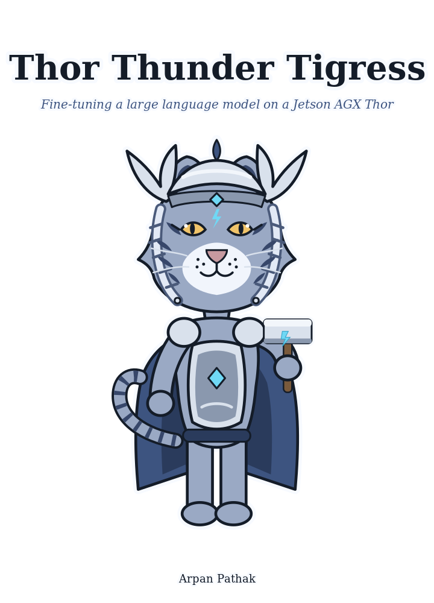

# Introduction



Thor Thunder Tigress fine-tunes a local language model on an NVIDIA Jetson so it
stops writing AI slop, in prose and in Rust.

## What exists

| Part | State |
|---|---|
| `spark`: scores answers for slop and five Rust rules | built |
| `thor-hammer-trainer`: builds the training set | built |
| `reinforcer`: review page for the training set | built |
| `lasso`: conversations from books, questions by a teacher model | built; pilot run: 60 conversations |
| Jetson Thor: SSH, sync, Nemotron 3 Nano served by llama-server | running |
| Thor Tigress Cub: shared web chat, web search, API for coding agents | running, invite-only |
| Fine-tuning and before/after scoring | planned |

## Meet the cub


The tigress on the cover is the project. The cub is the part people talk to:
the chat page and API that put Nemotron 3 Nano on the Thor in front of anyone
with an invite. Chapters "Web chat: Thor Tigress Cub", "Bring your own agent"
and "Bring your own domain" are its manual.

| | |
|---|---|
| Model | Nemotron 3 Nano 30B-A3B, 8-bit (Q8_0), 1M-token context |
| Speed | about 53 tokens/s per reply; first token 0.2 s on a short prompt |
| At once | four replies; 57.8 GB of GPU memory with all four at 1M context |
| Machine | Jetson AGX Thor developer kit, 128 GB unified memory, 273 GB/s |
| Addresses | `voltforge.tech/thor-tigress-cub/` (page), the Thor's `.ts.net` address (API) |

## Repositories

| Repository | Contents |
|---|---|
| [thor-thunder-tigress-platform](https://github.com/arpanpathak/thor-thunder-tigress-platform) | the crates, this book, `jetson-thor/` |
| [local-copilot-codebuddy](https://github.com/arpanpathak/local-copilot-codebuddy) | terminal coding assistant |
| [openbatrangs](https://github.com/arpanpathak/openbatrangs) | agentic coding CLI for Ollama or Nemotron on the Thor |
| [thor-sync](https://github.com/arpanpathak/thor-sync) | keeps project folders copied to the Jetson |

## Reading this book locally

```bash
mdbook serve book    # http://localhost:3000
```
